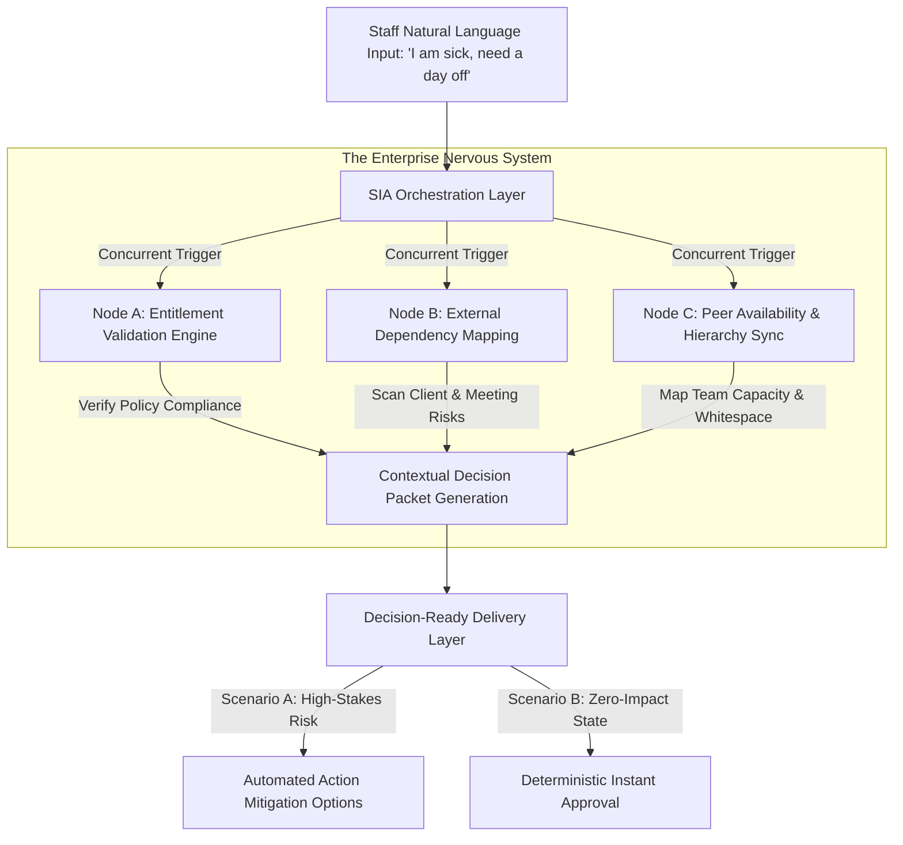

# Enterprise Operational Resilience: Mitigating Information Blindness through Multi-Node Leave Orchestration
Ref: SIA_Manifesto_76.pdf / Pillar 3_76.pdf

> **Attribution Notice**
> This document was structured with the help of AI, and curated by SanaM.
> 
> *Statement:* This project framework and strategic governance model was conceived by me, and accelerated in collaboration with Advanced AI tools for rapid prototyping and clean Markdown publication.

---

## 1. Executive Summary & Problem Space
Traditional Human Resource Information Systems (HRIS) treat operational events, such as unplanned sick leave, as static data entry tasks. Forcing an employee's situational reality into rigid, pre-defined selection boxes results in a **"Silent Failure"**—a state where database transactional records remain technically accurate, but the underlying operational truth and its systemic impact are completely erased.

When an unplanned absence occurs, managers default to counter-productive operational pressure (e.g., asking a sick employee to join a critical meeting anyway). This reaction is not a failure of management capability, but a direct symptom of **Information Blindness**. Because the manager has zero visibility into real-time operational dependencies, team calendars, and immediate peer availability, they default to defensive escalation. 

This case study demonstrates how Sovereign Infrastructure Architecture (SIA) transitions workforce management from a rigid collection format into a reactive, deterministic **Enterprise Nervous System**.

---

## 2. Parallel Impact Engine (Logic Flow)
Instead of executing linear batch scripts, the architecture utilizes multi-node concurrent orchestration to decode natural language intent and map its downstream impact before notifying the decision-maker.

## 3. The Three Functional Nodes of the SIA Architecture
I. Entitlement Validation Engine (Policy & Compliance Guardrail)
The Operation: The moment an unstructured input is received, the architecture concurrently evaluates individual contract parameters, accrued balances, and local labor law compliance frameworks.
The Objective: Establishes the structural and legal validity of the request autonomously, preventing non-compliant administrative routing from escalating through organizational hierarchies.
II. External Dependency Mapping (Service Continuity Scan)
The Operation: The node cross-references the individual's live operational footprint, isolating high-risk third-party commitments (e.g., critical client syncs, production deployments) from low-impact internal solo focus blocks.
The Objective: Pinpoints the exact operational service gap that typically induces managerial panic, isolating risk parameters into clear, addressable data blocks.
III. Peer Availability & Hierarchy Sync (Resource Visibility Mapping)
The Operation: The engine interrogates the real-time scheduling capacity and immediate task distribution profiles of neighboring teammates within the same organizational node.
The Objective: Provides absolute operational visibility without enforcing automated or unvetted work delegation. It reveals organizational resilience buffers, identifying exact parameters of who could assist without creating immediate burnout loops.

## 4. Contextual Outcomes & Decision Matrices

| Live Environmental Context | Systemic Diagnostic Output | Actionable Resolution Path |
| :--- | :--- | :--- |
| **Scenario A: High-Stakes Day** *(External Client Dependencies Detected)* | **Risk Identified:** Unwell staff has a 2:00 PM critical Client Sync. **System Verification:** 3 qualified teammates are available with calendar whitespace. | **Managerial Decision Packet Generated:** 1. **[Reschedule]:** System drafts a polite postponement email template. 2. **[Delegate]:** One-click routing to notify the 3 available backups. 3. **[Takeover]:** Auto-syncs full meeting context directly to the manager's calendar. |
| **Scenario B: Zero-Impact Day** *(Internal Operational Isolation)* | **Risk Identified:** None. **System Verification:** Today's schedule consists exclusively of internal solo tasks. No client liabilities exist. | **Instant Safe Execution:** System bypasses tactical decision loops, issues an immediate autonomous approval alert, logs the records to the HR ledger, and prompts the manager with a single confirmation: **[Approve Leave]**. |
