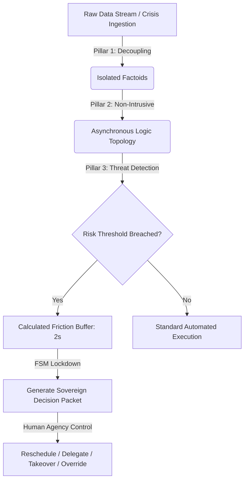

# Sovereign Infrastructure Architecture (SIA) — Dynamic Sandbox

SIA (Sovereign Infrastructure Architecture) is an enterprise-grade governance layer designed to protect human agency and corporate integrity from the systemic risks of unchecked, frictionless digital automation. 

This repository contains the functional prototype and dynamic sandbox used to validate the deterministic boundaries of the SIA framework against real-world operational anomalies.

🚀 **Live Interactive Demo:** [Insert your Vercel App URL here]

---

## The Systemic Problem: The Trust Gap
Modern enterprise AI transformations frequently fail at the Logic Layer by forcing advanced probabilistic intelligence into rigid, centralized legacy architectures. When a system becomes a completely frictionless "Black Box," it loses its contextual anchor, turning hallucinations and operational anomalies into catastrophic systemic risks.

SIA addresses this by converting institutional rules and risk thresholds into a measurable, deterministic operational layer.

---

## Architectural Pillars Enforced in this Sandbox

### Pillar 1: Strategic Decoupling & Semantic Granularity
* **Mechanism:** The system rejects rigid, over-coupled database tables that cause context gaps. 
* **Execution:** Raw, chaotic operational data streams are ingested and immediately smashed into the smallest possible independent units of "Factoids" (e.g., `[Factoid: CFO on Leave]`, `[Factoid: Transfer Requested]`). This establishes semantic sovereignty and isolates data to eliminate noise contamination.

### Pillar 2: Non-Intrusive Implementation & Logic Topology
* **Mechanism:** SIA shadows legacy infrastructure rather than replacing it, avoiding multi-million dollar schema overhauls.
* **Execution:** The sandbox utilizes an asynchronous relational layer that sits seamlessly above physical storage. It maps multi-dimensional logic predicates (e.g., *Entity A influences Entity B under Condition C*) without altering production rows.

### Pillar 3: Resource Entropy & Reasoning Orchestration
* **Mechanism:** Preventing linear AI bots from blindly executing high-risk requests by enforcing absolute legal and operational boundaries.
* **Execution:** When risk thresholds are breached, a Finite State Machine (FSM) triggers a strict `LOCKDOWN` state. Probabilistic execution is halted to introduce **Calculated Friction**—a strategic buffer allowing multi-hop GraphRAG reasoning to compile the chaotic context into a clean, immutable **Decision Packet** for human intervention.

---

## System Logic Flow

How to Test the Sandbox
Navigate to the live Vercel deployment link.
Ingest a high-stakes corporate anomaly into the input terminal (e.g., unexpected executive resignation during a critical ledger migration).
Click "RUN SIA GOVERNANCE SCAN".
Observe the real-time visual deconstruction of data into isolated factoids, the activation of the tactical friction window, the transition of the state machine into containment mode, and the final compilation of the actionable human-centric control matrix.
This document was structured with the help of AI, and curated by Sana.M
