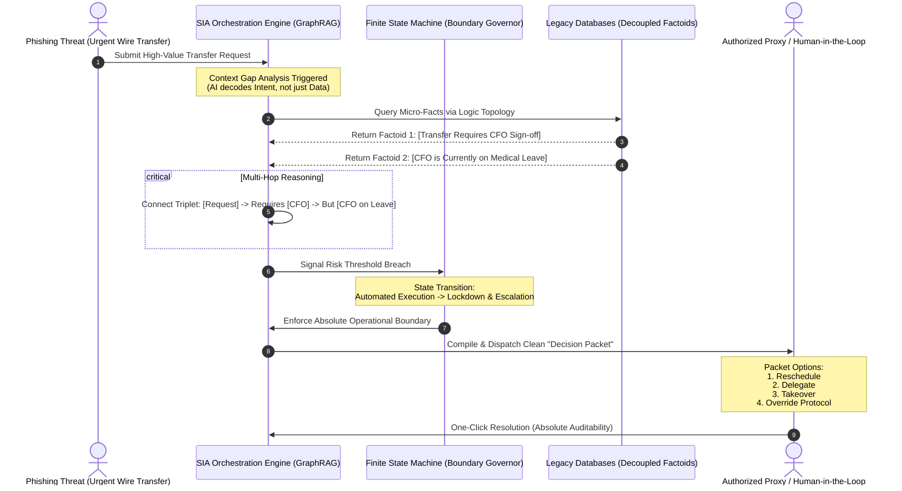

# Sovereign Infrastructure Architecture (SIA) for Enterprise Agentic AI

AI Efficiency is a Myth. Trust Infrastructure is the Reality.

The global rush toward 100% digital automation is driving enterprises into a dangerous "Trust Gap." When autonomous systems operate as frictionless "Black Boxes," they lose their physical anchors. A single systemic hallucination or downstream fraud can collapse an entire digital utopia into a multi-million dollar liability.

**Sovereign Infrastructure Architecture (SIA)** is not an AI tool; it is a deterministic governance layer engineered to protect human agency, enforce compliance, and secure corporate integrity within multi-agent environments. 

*   **Architectural Thesis:** For a deeper analysis of the core philosophy, read the full [Architecture-First Manifesto](docs/architecture-first-manifesto.md) (Cross-referenced with *SIA_Manifesto_9.pdf*).

---

## The Three Pillars of SIA

SIA structures enterprise systems into a reliable, measurable operational layer through three decoupled phases (Detailed technical references are maintained in *Pillar 1-3_9.pdf*).

### Pillar 1: Strategic Decoupling (Semantic Granularity)
Traditional enterprise AI transformations fail at the Logic Layer because they force fluid, advanced intelligence into rigid, centralized legacy architectures. Over-coupled data creates catastrophic **Context Gaps**. 

*   **The Solution:** Smash rigid database tables into the smallest atomic units of independent facts, known as **Factoids** (e.g., `[CFO is on leave]`, `[Transaction X exceeds threshold]`).
*   **Semantic Sovereignty:** Isolate every data point to eliminate noise contamination. This pristine baseline prevents data-linking disasters and removes the "Manual Tax" of chaotic internal information hunts during operational anomalies.

### Pillar 2: Non-Intrusive Implementation (Logic Topology)
Overhauling core production schemas in massive organizational ecosystems—such as global airports or luxury retail operations—is a multi-million dollar gamble that introduces operational paralysis and severe vendor lock-in.

*   **The Solution:** SIA implements **Asynchronous Relationship Extraction & Triplet Formation**. 
*   **Logic Topology:** Instead of hard-coding rigid API pipelines, Large Language Models are deployed non-intrusively to scan isolated Factoids and extract predicates (relationships). This multi-dimensional Knowledge Graph sits seamlessly *above* legacy systems, mapping the logic (e.g., `Entity A influences Entity B under Condition C`) without altering a single row of your production storage tables.

### Pillar 3: Reasoning Orchestration & Resource Entropy
This is where the entire decoupled architecture dynamically compiles to deliver absolute corporate governance against operational entropy.

*   **The Solution:** The system integrates **GraphRAG Multi-Hop Reasoning** with **Finite State Machines (FSM)**.
*   **Deterministic Governance:** Rather than relying on a linear script or probabilistic guessing, the engine cross-references real-time actions with the Logic Topology. The moment a risk threshold is breached, the FSM enforces rigid legal and operational boundaries, transitioning the environment from "Automated Execution" to a "Lockdown and Escalation" state.

---

## Stress Test Scenario: CFO Phishing Counter-Measures

To validate SIA's resilience against advanced external threats, the system is subjected to an urgent, high-value wire transfer request initiated by a sophisticated phishing scheme. Linear AI bots execute blindly based on surface credentials. SIA counters deterministically:

```mermaid
sequenceDiagram
    autonumber
    actor Attacker as Phishing Threat (Urgent Wire Transfer)
    participant SIA as SIA Orchestration Engine (GraphRAG)
    participant FSM as Finite State Machine (Boundary Governor)
    participant DB as Legacy Databases (Decoupled Factoids)
    actor Executive as Authorized Proxy / Human-in-the-Loop

    Attacker->>SIA: Submit High-Value Transfer Request
    Note over SIA: Context Gap Analysis Triggered<br/>(AI decodes Intent, not just Data)
    SIA->>DB: Query Micro-Facts via Logic Topology
    DB-->>SIA: Return Factoid 1: [Transfer Requires CFO Sign-off]
    DB-->>SIA: Return Factoid 2: [CFO is Currently on Medical Leave]
    
    critical Multi-Hop Reasoning
        SIA->>SIA: Connect Triplet: [Request] -> Requires [CFO] -> But [CFO on Leave]
    end
    
    SIA->>FSM: Signal Risk Threshold Breach
    Note over FSM: State Transition:<br/>Automated Execution -> Lockdown & Escalation
    FSM->>SIA: Enforce Absolute Operational Boundary
    
    SIA->>Executive: Compile & Dispatch Clean "Decision Packet"
    Note over Executive: Packet Options:<br/>1. Reschedule<br/>2. Delegate<br/>3. Takeover<br/>4. Override Protocol
    
    Executive->>SIA: One-Click Resolution (Absolute Auditability)
```

## From Chaos to the "Decision Packet":
Instead of forcing technical management to hunt down information across siloed infrastructure, the system resolves the context gap instantly. The authorized proxy or executive receives a structured, frictionless Decision Packet presenting a clear choice: Reschedule, Delegate, Takeover, or Approve with Override Protocol. Speed serves governance; truth is preserved.

# Global Visibility Index

This repository highlights key themes and focus areas for enterprise AI and systemic design.

## Tags
- ai-architecture  
- enterprise-ai  
- sovereign-infrastructure  
- risk-mitigation  
- graphrag  
- data-sovereignty  
- finite-state-machines  
- digital-trust  
- enterprise-architecture  
- systemic-design  
- systemic-thinking  
- human-centric-design  
- agentic-ai  
- governance  

---

## Repository Optimization Note
To achieve maximum platform discoverability for global technical management, copy the tags above and paste them directly into the **Topics** section inside the *About* settings on the right-hand panel of this GitHub repository page.

This document was structured with the help of AI, and curated by Sana.M
