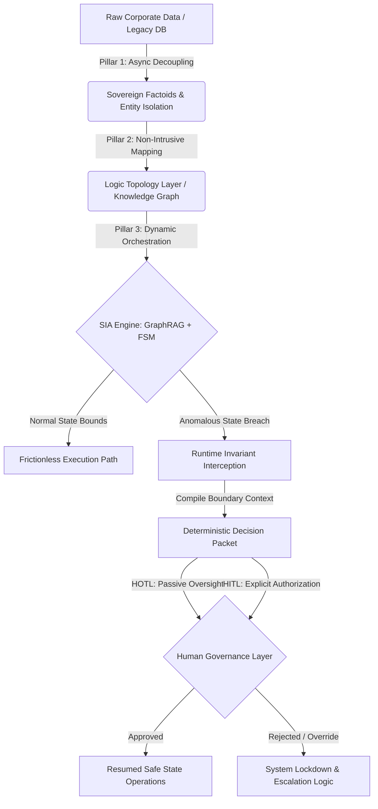

# Sovereign Infrastructure Architecture (SIA) 2.0: Core Governance Engine

Enterprise AI transformations routinely fail because organizations force advanced, probabilistic intelligence into rigid, centralized legacy systems. This repository houses the conceptual and technical system architecture for **SIA 2.0**—a non-intrusive, runtime interception framework designed to decouple logical context from physical storage, enforcing absolute data sovereignty and deterministic governance without disrupting production legacy infrastructures.

---

## 🏛️ Executive Summary

SIA 2.0 addresses a critical vulnerability in modern digital transformation: systemic risk driven by unconstrained autonomous agents. By replacing linear script constraints with runtime state boundaries, this architecture ensures that multi-agent operations remain strictly aligned with enterprise risk mandates. 

The core engine operates on a zero-trust model where original enterprise data remains stationary. Instead of moving records, the system maps logical context via an abstracted metadata layer, utilizing Finite State Machines (FSM) and GraphRAG multi-hop reasoning to capture anomalies, enforce boundaries, and inject human verification before operational friction occurs.

---

## 🔄 System Architecture & Human-Control Workflow

The engine establishes a non-intrusive abstraction layer above legacy databases. It continuously monitors relational data shifts, structures raw items into isolated fact patterns, maps them into a logical mesh, and triggers deterministic governance blocks when state boundaries are crossed.

```mermaid
graph TD
    %% Data & Layer Layer
    A[Raw Corporate Data / Legacy DB] -->|Pillar 1: Async Decoupling| B(Sovereign Factoids & Entity Isolation)
    B -->|Pillar 2: Non-Intrusive Mapping| C(Logic Topology Layer / Knowledge Graph)
    
    %% Engine Processing
    C -->|Pillar 3: Dynamic Orchestration| D{SIA Engine: GraphRAG + FSM}
    
    %% Governance Path & Logic
    D -->|Normal State Bounds| F[Frictionless Execution Path]
    D -->|Anomalous State Breach| E[Runtime Invariant Interception]
    
    %% Human Control Nodes
    E -->|Compile Boundary Context| G[Deterministic Decision Packet]
    G -->|HOTL: Passive Oversight| H{Human Governance Layer}
    G -->|HITL: Explicit Authorization| H
    
    %% System Resolution
    H -->|Approved| I[Resumed Safe State Operations]
    H -->|Rejected / Override| J[System Lockdown & Escalation Logic]

```

# 🛠️ The 3 Core Execution Pillars

## Pillar 1: Strategic Decoupling (Semantic Granularity)
**The Invariant:**  
Physical enterprise data must never be directly exposed to probabilistic large language models.  

**Mechanism:**  
- Smashes rigid, centralized database rows into autonomous, independent units of fundamental facts ("Factoids").  
- This isolation eliminates semantic noise, cross-contamination, and data leakage vectors directly at the physical storage layer.  

---

## Pillar 2: Non-Intrusive Mapping (Logic Topology)
**The Invariant:**  
System architecture must not alter or pollute existing legacy production schemas.  

**Mechanism:**  
- Uses asynchronous background operations to scan isolated Factoids and construct an abstracted, multi-dimensional knowledge graph.  
- This relational logic network shadows production environments (e.g., global logistics networks, enterprise resource databases) while maintaining zero structural impact on legacy codebases.  

---

## Pillar 3: Deterministic Orchestration & Human Control Boundaries
**The Invariant:**  
Absolute automation without a physical or human anchor creates catastrophic systemic vulnerabilities.  

**Mechanism:**  
- Fuses GraphRAG multi-hop reasoning with strict Finite State Machines (FSM) to govern agent behaviors.  
- When complex cross-boundary anomalies or high-stakes risk triggers are detected:  
  - The engine immediately overrides linear scripts and freezes autonomous processing.  
  - It translates complex system telemetry into a clean, auditable "Decision Packet" tailored for executive oversight.  
  - It enforces Human-in-the-Loop (HITL) and Human-on-the-Loop (HOTL) boundaries, anchoring the system's ultimate authority to human intent rather than algorithmic guesswork.  

---

# 🎯 Target Audience & Strategic Alignment
- **Chief Technology Officers (CTOs):** Deployable blueprinted frameworks for secure, cross-department multi-agent orchestration.  
- **Chief Risk Officers (CROs) & Governance Leads:** Auditable, human-anchored guardrails that turn probabilistic risk into predictable, safe state boundaries.  
- **Enterprise Architects:** Scalable metadata logic patterns capable of wrapping legacy applications without downtime or structural rewrites.  

---

# 🔖 Topics
`#ai-governance` `#human-in-the-loop` `#zero-trust` `#enterprise-architecture`  
`#finite-state-machines` `#graphrag` `#systemic-design` `#fractional-cto`

---

📌 *This document was structured with the help of AI, and curated by Sana.M.*
