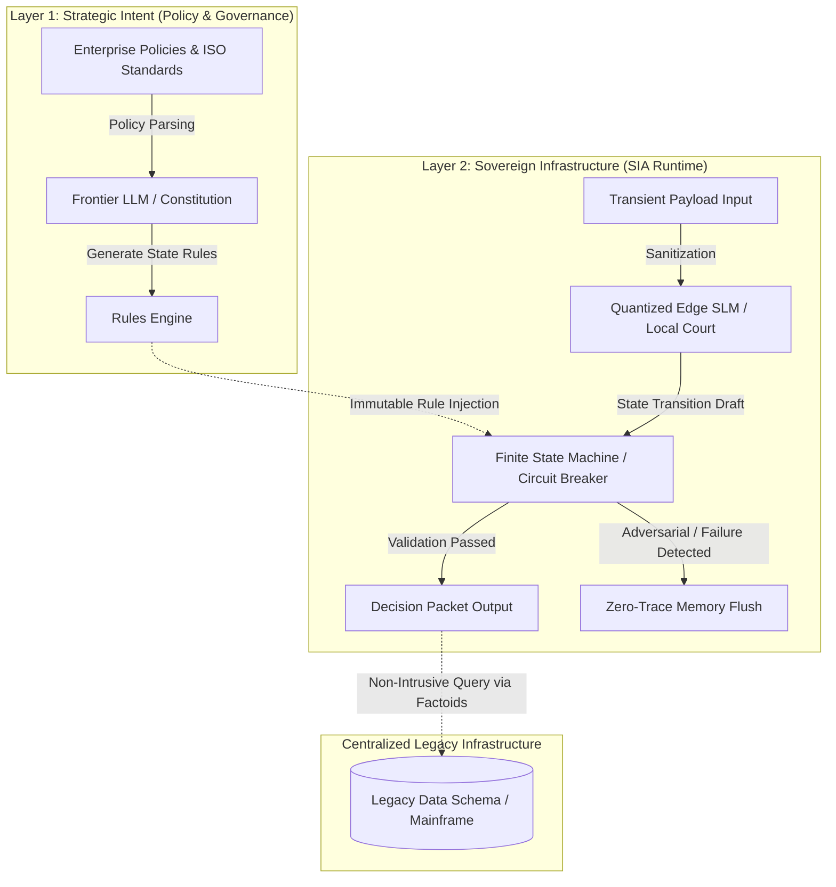

# Sovereign Infrastructure Architecture (SIA) Engine
> **Deterministic Zero-Trust Middleware for Agentic AI & Enterprise Governance**

[](https://github.com/26200602/SIA-Agentic-AI-Architecture/tree/main)
[](https://github.com/26200602/SIA-Agentic-AI-Architecture)
[](https://github.com/26200602/SIA-Agentic-AI-Architecture)
[](https://opensource.org/licenses/Apache-2.0)

---
---

## Executive Summary

Enterprise AI integration is fundamentally broken. Plugging probabilistic Large Language Models (LLMs) directly into legacy, centralized data architectures forces organizations to inherit massive **Legacy Data Debt** and severe **Context Gaps**. 

The **Strategic Intent Architecture (SIA)** decouples corporate logic from raw data assets. By introducing a non-intrusive, zero-trust middleware layer, SIA transforms unstructured, risk-laden databases into deterministic **Decision Packets** without altering a single schema row in production.

---

## System Topology: Hybrid AI Execution

SIA strictly separates **Strategic Reasoning (Offline/High-Reasoning Layer)** from **Runtime Execution (Deterministic Edge Layer)**.

* **LLM as the Constitution**: High-reasoning models parse organizational policy, legal bounds, and complex context offline to construct immutable execution boundaries.
* **SLM as Local Courts**: Edge-deployed Small Language Models (quantized 4-bit/8-bit) process localized, transient domain tasks with sub-second latency and zero API call bloat.
* **FSM as Circuit Breaker**: Deterministic Finite State Machines dynamically evaluate state transitions. Any adversarial prompt injection or operational drift instantly triggers a hard execution break.


```mermaid
graph TD
    subgraph OfflineReasoningLayer ["Layer 1: Strategic Intent (Policy & Governance)"]
        Policy[Enterprise Policies & ISO Standards] -->|Policy Parsing| LLM[Frontier LLM / Constitution]
        LLM -->|Generate State Rules| RulesEngine[Rules Engine]
    end

    subgraph RuntimeExecutionLayer ["Layer 2: Sovereign Infrastructure (SIA Runtime)"]
        Input[Transient Payload Input] -->|Sanitization| SLM[Quantized Edge SLM / Local Court]
        RulesEngine -.->|Immutable Rule Injection| FSM
        SLM -->|State Transition Draft| FSM[Finite State Machine / Circuit Breaker]
        
        FSM -->|Validation Passed| Exec[Decision Packet Output]
        FSM -->|Adversarial / Failure Detected| Flush[Zero-Trace Memory Flush]
    end

    subgraph LegacyCore ["Centralized Legacy Infrastructure"]
        Exec -.->|Non-Intrusive Query via Factoids| ShadowDB[(Legacy Data Schema / Mainframe)]
    end

```

## Core Architectural Pillars

### 1. Strategic Decoupling (Entity & Semantic Isolation)
Raw enterprise data is disintegrated into granular, context-rich Factoids. This breaks the "Islands of Data, Bundles of Risk" dynamic by ensuring models never operate directly on unified, multi-tenant databases.

### 2. Non-Intrusive Integration (Shadowing Legacy Schemas)
SIA operates as a non-intrusive logical middleware. It shadows legacy databases using Asynchronous Relationship Extraction and Knowledge Graphing, achieving full operational modernization with zero database restructuring cost.

### 3. Resource Entropy & Transient Memory
To guarantee absolute data sovereignty, all execution payloads are strictly transient.
* **Ephemeral Memory:** Payload data resides in memory only during state evaluation and is completely flushed post-transaction.
* **Zero Text Logs:** Only Cryptographic State Hashes are persisted for audit trails, satisfying strict GDPR and ISO 42001 requirements.

---

## Repository Structure & SimPoC Implementation
```text
.
├── docs/
│   ├── SIA_WHITE_PAPER.md        # Complete C-Suite Strategic Architecture Paper
│   └── THREAT_MODEL.md           # Adversarial Guardrails & Threat Analysis
├── simpoc/
│   ├── fsm_circuit_breaker.py    # Deterministic FSM State Validation Logic
│   ├── slm_runtime_cage.py       # Quantized Local SLM Execution Engine
│   └── transient_memory.py       # Memory Flush & Cryptographic Hash Logger
└── README.md                     # Executive Portal
```


## Governance & Compliance Standard
SIA provides structural immunity against Adversarial Context Injection and Prompt Injection. By isolating the probabilistic text generation within an externally controlled, deterministic sandbox, enterprise intent is maintained regardless of input anomalies.
* **ISO 42001 Aligned:** AI Management System compliance built into the topology.
* **Zero Permanent Footprint:** No sensitive text stored in vector indices or runtime caches.

## Getting Started
To explore the Proof-of-Concept sandbox benchmarks and state machine execution logs, review the `/simpoc` directory or consult the complete architectural specification in `docs/SIA_WHITE_PAPER.md`.
