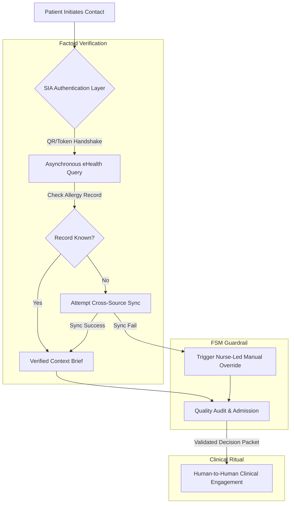

# Zero-Survey Context Orchestration: Clinical Handshake Architecture
Ref: SIA_Manifesto_120.pdf (The Trust Anchor Principle)

> **Attribution Notice**
> This document was structured with the help of AI, and curated by SanaM.
> 
> *Statement:* This project framework and architectural model was conceived by me, and accelerated in collaboration with Advanced AI tools for rapid prototyping and clean Markdown publication.

---

## 1. Executive Summary & Problem Space
Healthcare infrastructure is currently failing under the weight of "Pseudo-Digitalisation." By prioritizing speed-to-entry over data integrity, institutions have created a "Trust Gap"[cite: 1] where systemic risk is hidden behind frictionless, black-box automated questionnaires. 

For high-stakes clinical environments, relying on patient-inputted data is an architectural liability. Project Clinic utilizes the SIA 2.0 framework to replace manual survey-based onboarding with a deterministic, API-orchestrated handshake. By utilizing asynchronous verification and Finite State Machines (FSM), we transform patient onboarding into a secure, human-centric ritual.

---

## 2. System Architecture & Clinical Handshake Flow
The logic topology shadows existing legacy infrastructure, performing cross-source verification before the patient reaches a physical point of contact.

## 3. Core Architectural Specifications
I. Semantic Granularity (The Factoid Layer)
Operation: Deconstructs legacy patient records into isolated "Factoids" (e.g., Allergy_Status, Verified_Identity, Last_Visit_Timestamp).  
PDF
Objective: Prevents the data-linking disasters that cause system-wide hallucinations.  
PDF
II. Asynchronous Logic Topology
Operation: The SIA layer sits above the legacy database, performing non-intrusive relationship extraction between the patient’s eHealth record and the local clinic database.  
PDF
Objective: Achieve true agility without requiring a multi-million dollar overhaul of legacy schemas.  
PDF
III. Deterministic FSM Guardrails
Operation: Governs the onboarding process via a Finite State Machine (FSM) to ensure absolute compliance with medical safety boundaries.  
PDF
Objective: Automatically shifts from "Automated Execution" to "Lockdown and Escalation Logic" if any state-check results in an anomaly.

## 4. Operational Resilience & Governance
| State Transition | Systemic Diagnostic Telemetry | Governance & Resolution Path |
| :--- | :--- | :--- |
| **Allergy Record Verified** | Logic topology successfully bridges local record with eHealth external hash. | **Seamless Admission:** System bypasses manual input requirements; directs staff to clinical assessment. |
| **Cross-Source Sync Failure** | Automated query yields null result or schema mismatch at the logic bridge layer. | **Calculated Friction:** Automated workflow halts; triggers "Nurse-Led Setup" flag in staff decision packet[cite: 2]. |
| **High-Risk Anomaly Detected** | FSM detects a breach of clinical safety threshold or critical identity mismatch. | **Deterministic Lockdown:** System terminates automation; routes to human-in-the-loop escalation[cite: 1, 2]. |

Core Architectural Axiom: Institutional empathy requires that we never ask the patient to perform data entry that the system is technically capable of verifying itself.
