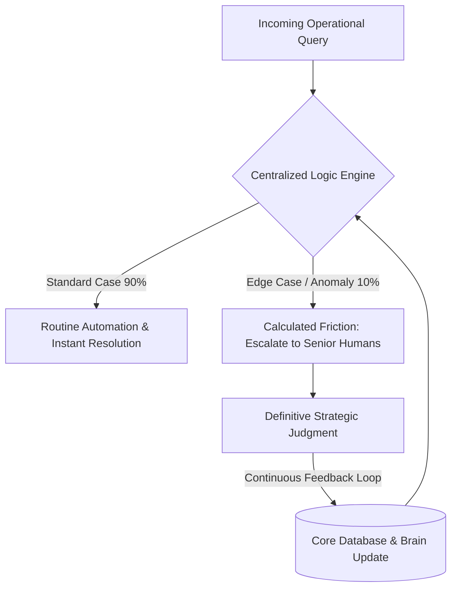

# Strategic Whitepaper: From Static Storage to Strategic Intelligence

**Ref:** SIA_Manifesto_57.pdf / Pillar 1-3_57.pdf

**Attribution Notice**  
This document was structured with the help of AI, and curated by SanaM.  
*Statement:* This project framework and strategic governance model was conceived by me, and accelerated in collaboration with Advanced AI tools for rapid prototyping and clean Markdown publication.

**Disclaimer:** This document is for architectural study and professional portfolio presentation purposes only. The frameworks, cognitive models, and system components described herein represent conceptual architecture engineered to demonstrate Sovereign Infrastructure Architecture (SIA) principles. They do not constitute specific corporate data disclosures or binding IT procurement specifications.

---

## 1. The Friction Audit: The Illusion of Cloud Governance

### Cloud Storage Solved Your Files. It Didn't Solve Your Friction.
In the post-lunar organizational landscape, a systemic vulnerability persists across premium brands: confusing standard cloud document storage with active institutional governance. Uploading corporate guidelines, PDF policies, and operational manuals to a cloud folder does not equate to governance. Executives remain drained by repetitive operational drift, and execution teams remain paralyzed by ambiguity.

### The Core Pain Points (The Reality Check):
* **The "Unique Case" Illusion:** Local execution teams continuously assume their specific operational scenario is an unprecedented exception, bypassing established guidelines.
* **The "Traffic Police" Burden:** Highly compensated leadership capital is systematically wasted on endlessly repeating and clarifying the same baseline compliance rules.
* **Cognitive Friction:** Corporate data exists abundantly within static cloud infrastructure, yet its structural application during real-time operational execution consistently fails.

> **Architect's Insight:** *Storage keeps data; Logic solves friction. Rules are static, but consistency requires dynamic intelligence.*

---

## 2. The Solution Architecture: The Living Brand Brain

### Activating Institutional Knowledge through AI Orchestration
SIA (Sovereign Infrastructure Architecture) remediates this logic gap by transitioning corporate assets from a fragmented cloud topology into a centralized, active reasoning layer known as **The Living Brand Brain**.

### The Logic Infrastructure Layers:
* **Deep Ingestion Layer:** Advanced AI architectures ingest core brand principles and operational guidelines, comprehending semantic dependencies rather than merely parsing literal keywords.
* **Contextual Metadata Layer:** Implements intelligent classification systems to interpret the end-user's underlying intent, shifting the paradigm from static categories to live contextual mapping.
* **Dynamic Single Source of Truth:** Establishes an interactive cognitive layer that actively guides execution teams, replacing non-responsive, passive document repositories.

---

## 3. Human-in-the-Loop & System Orchestration Flow

### Balancing Deterministic Automation with Human Expertise
The architecture enforces strict operational boundaries to maximize resource efficiency while safeguarding brand integrity through human-centric oversight.

### The Governance Protocol:
1. **Routine Automation (90%):** The Centralized Logic Engine autonomously processes and resolves standard, repetitive operational compliance queries.
2. **Calculated Friction (10%):** Complex edge cases or high-risk anomalies are instantly flagged and routed to senior human stakeholders for definitive strategic judgment.
3. **Continuous Asset Growth:** Every human decision made on a flagged edge case is instantly fed back into the core database, permanently strengthening and updating the intelligence matrix of the Brand Brain.

---

## 4. Strategic Business Impact

### Transitioning from Operational Noise to Measurable Return
* **Operational Relief:** Drastic, measurable reduction in repetitive managerial clarifications, liberating critical human focus for high-value strategic growth.
* **Brand Assurance:** Complete elimination of local guesswork and subjective interpretation during global or regional brand execution.
* **Intelligent Asset Accumulation:** Transforming compliance costs into a compounding asset; every individual user query and human override recursively makes the organizational intelligence core smarter.

---

## 5. Architectural Conclusion & Vision

### Are You Managing Folders, or Orchestrating Intelligence?
AI possesses the architectural capacity to make previously impossible operational scales achievable. However, AI remains strictly a force multiplier for efficiency. Only precise human logic and deterministic architectural design ensure structural accuracy.

### The Core Principles of SIA Governance:
* AI provides rapid answers, yet human leadership remains entirely responsible for posing the correct architectural questions.
* AI does not inherently make an institution smarter; it strategically buys human capital the operational time required to pursue continuous learning.
* Deployed without an underlying logic framework and a clear goal, AI will only accelerate and multiply systemic organizational mistakes.

> **Core Philosophy:** *"We don't build AI to automate data folders; we build SIA to activate institutional truth and empower human judgment."*
