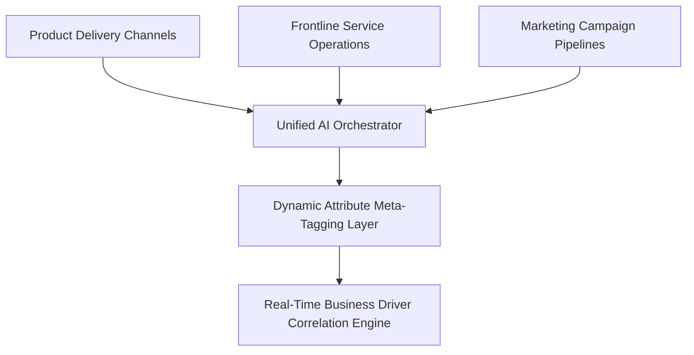
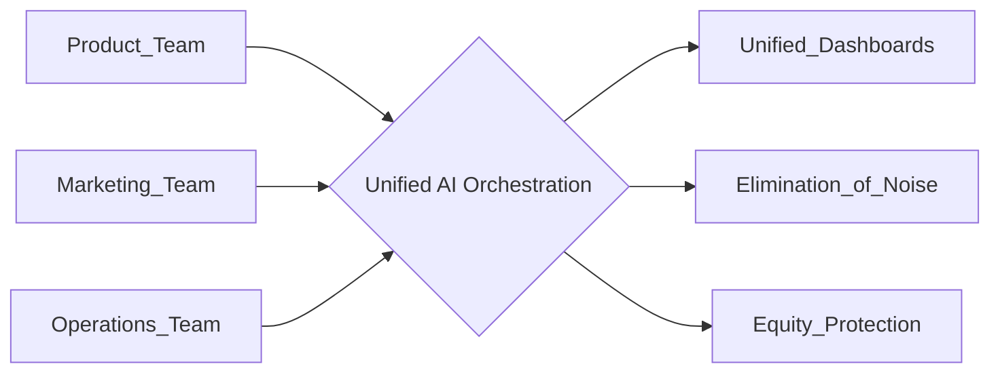

# Strategic Whitepaper: The ROI of Logic — Mapping Attributes to Growth

**Ref:** SIA_Manifesto_63.pdf / Pillar 1-3_63.pdf

**Attribution Notice**  
This document was structured with the help of AI, and curated by MSK.  
*Statement:* This project framework and strategic governance model was conceived by me, and accelerated in collaboration with Advanced AI tools for rapid prototyping and clean Markdown publication.

**Disclaimer:** This document is for strategic study and professional portfolio presentation purposes only. The case studies, architectural diagnosis, and logic models described herein represent conceptual frameworks engineered to demonstrate Sovereign Infrastructure Architecture (SIA) principles within enterprise environments. They do not represent specific corporate disclosures or legally binding compliance audits.

---

## 1. The Correlation Gap (The High Cost of Fragmented Insights)

### Why Brand Awareness Fails to Translate into Direct Sales
Boards frequently demand to know why high upper-funnel brand awareness fails to translate into bottom-funnel conversion. The root cause is a structural failure: brand strategy and business execution operate in disconnected functional silos. Legacy metrics—such as passive awareness tracking or isolated customer satisfaction scores—fail to isolate or explain the mechanistic variables that cause a target consumer to execute a transaction.

### The Symptom Framework:
* **Siloed KPIs:** Disconnected corporate departments compete for budget utilization using localized, unlinked performance metrics.
* **Conversion Collapse:** Enterprise marketing data reflects optimal perception metrics, while live channel conversion rates remain critically stagnant.
* **Attribute Decoupling:** Core brand identity attributes are entirely disconnected from live macroeconomic business drivers, forcing the organization to optimize for vanity indicators.

---

## 2. The Solution Architecture: Attribute Logic

### From Static Perception to Dynamic Meta-Tags
SIA (Sovereign Infrastructure Architecture) resolves this metric disconnect by converting subjective brand attributes into an objective, data-driven reasoning layer that directly influences capital allocation.

### The Implementation Blueprint:
1. **Define the Logic Core:** Isolate and parameterize the core brand attributes that dictate the baseline organization.
2. **Map Every Touchpoint:** Asynchronously scan, evaluate, and tag every operational interaction—across product interfaces, customer service events, and media ads—to these specific attributes.
3. **Identify Real Correlation:** Run real-time analytical loops to verify mathematically whether a specific capital expenditure strengthens systemic equity or actively liquidates brand value.

---

## 3. Breaking Silos via the Logic Bridge

### Cross-Functional Resource Orchestration
By shifting enterprise infrastructure from fragmented legacy databases to an active reasoning topology, the organization builds an immutable Logic Bridge across historically isolated divisions.

* **Unified Dashboards:** AI orchestration provides real-time visibility into the exact operational actions and touchpoints that verifiably drive sustainable corporate growth.
* **Elimination of Noise:** Shifting executive focus away from raw data accumulation toward structured correlation parameters.
* **Equity Protection:** Instantly flag operational processes or frontline behaviors that deviate from the defined brand governance framework, mitigating localized brand decay before it scales globally.

---

## 4. Precision Resource Allocation & Strategic Impact

### Transitioning from Operational Noise to Measurable Return
* **Algorithmic Defunding:** Systematically audit and reduce funding for cross-functional activities that demonstrate low or negative correlation with core brand attributes.
* **Sovereign Feedback Loops:** Deploy real-time feedback loops during regional product launches to achieve immediate visibility into execution consistency across distributed networks.
* **Engineered Conversions:** Ensure every single operational dollar expended is structurally aligned with the specific operational attributes that move the needle on customer conversion.

---

## 5. Architectural Conclusion & Vision

### Is Your Brand a Feeling or a Logic System?
AI possesses the raw processing capacity to deliver high-efficiency operational answers. However, without rigorous human architectural design and cross-functional team orchestration, unchecked automation merely accelerates systemic misalignment.

> **The Core Paradigm:** *"Data is noise; Correlation is return."* True agentic optimization is not about inflating an arbitrary perception score—it is about establishing an absolute deterministic correlation between structural brand attributes and sustainable enterprise conversion.

## Footer
© 2026 GitHub, Inc.
