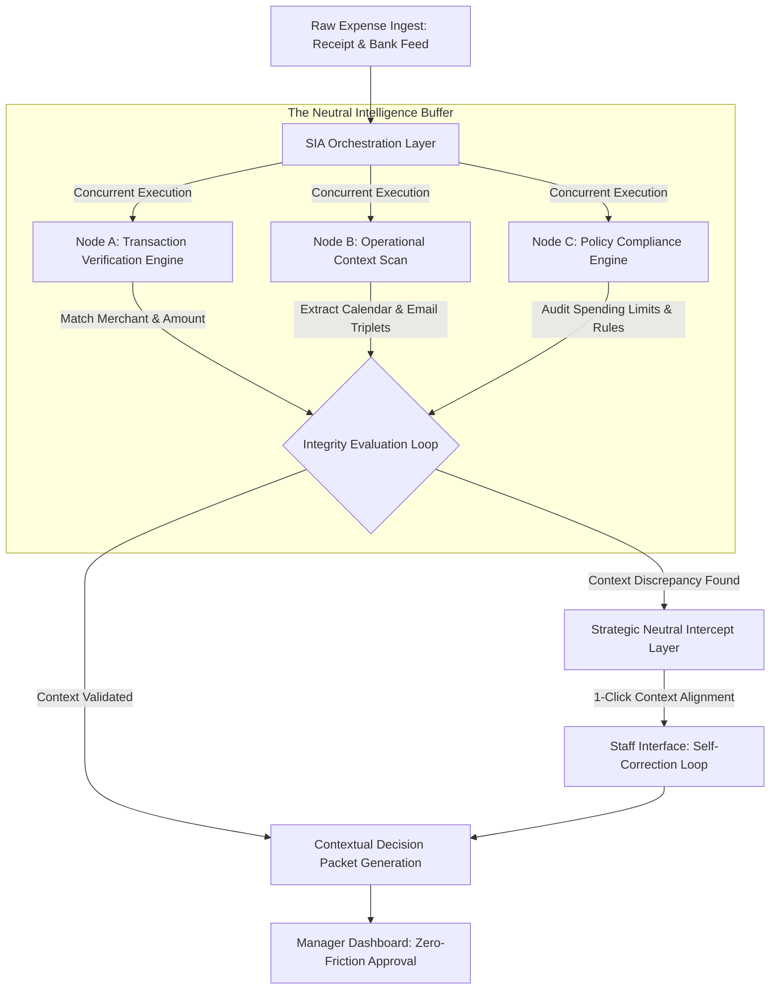

# Enterprise Financial Governance: Eliminating Organizational 'Trust Tax' via Multi-Node Expense Orchestration
Ref: SIA_Manifesto_90.pdf / Pillar 3_90.pdf

> **Attribution Notice**
> This document was structured with the help of AI, and curated by SanaM.
> 
> *Statement:* This project framework and strategic governance model was conceived by me, and accelerated in collaboration with Advanced AI tools for rapid prototyping and clean Markdown publication.

---

## 1. Executive Summary & Problem Space
Traditional expense management automation focuses exclusively on Optical Character Recognition (OCR) to ingest receipt amounts and merchants. This covers less than 10% of financial governance. The remaining 90% relies on auditing the underlying **Business Intent** behind the transaction. 

When automation engine loops are blind to organizational context, they introduce an institutional **"Trust Tax"**—a continuous cycle of manual back-and-forth, audit friction, and emotional resentment between Finance teams and frontline staff. Every unmatched claim is treated as a potential policy breach, defaulting the infrastructure into an intrusive surveillance mechanism rather than a business enabler.

This case study introduces a multi-node agentic orchestration layer that acts as a **Neutral Intelligence Buffer**. By decoupling relationship mapping from rigid database records, the system autonomously intercepts contextual anomalies and resolves data gaps prior to managerial escalation, replacing structural surveillance with deterministic compliance.

---

## 2. Multi-Node Agentic Architecture (Logic Flow)
The architecture abandons linear verification scripts, utilizing parallel multi-threading to validate transactions across disconnected legacy data silos simultaneously.

## 3. The Orchestration Engine Specifications
I. Transaction Verification Engine (Finance Node)
Operation: Concurrently ingests real-time banking telemetry and corporate credit card APIs to verify the raw transaction parameters (exact timestamp, currency, merchant profile, and amount matched).
Objective: Validates physical ledger truth instantly without manual statement reconciliation.
II. Operational Context Scan (Operations Node)
Operation: Scans peripheral structured and unstructured communication networks (enterprise calendar invites, client emails, project milestones) to extract semantic triplets mapping the "Why" behind the transaction.
Objective: Builds an autonomous circumstantial record to prove the business validity of historical spending records.
III. Policy Compliance Engine (Guardrail Node)
Operation: Evaluates the transaction against static corporate policy boundaries, cross-referencing expenditure types against local tax compliance, project budgets, and employee level allowance matrices.
Objective: Standardizes regulatory constraints before any notification is routed downstream.

## 4. Operational Implementation Matrix & Fail-Safe Paths

| Live Transaction State | Systemic Diagnostic Output | Actionable Resolution Path |
| :--- | :--- | :--- |
| **Contextual Discrepancy** *(e.g., Weekend transaction, missing calendar alignment)* | **State Detected:** Amount and merchant valid; zero peripheral contextual validation found within active communication loops. | **Strategic Neutral Intercept:** AI isolates the claim and prompts the employee directly:  `"Context missing for policy alignment. Please link the corresponding project directory or email thread to proceed."` *Escalation is frozen to protect internal culture.* |
| **Resolved / Validated State** *(Context mapped successfully)* | **State Detected:** Transaction validated against external dependencies (e.g., Client dinner confirmed via email ref). | **Decision-Ready Outcome:** The manager receives a comprehensive Contextual Decision Packet requiring zero information hunting:  `"Expense Validated. Sunday dinner confirmed with Client X (Ref: Email Sync). Approve?"` |

## 5. Architectural Implementation Blueprint (Deterministic Execution)
// PHASE 1: SIMULTANEOUS EXTRACTION (Agentic Multi-threading)
EXECUTE_PARALLEL {
    FETCH(Bank_Transaction_API);       // Verification of Merchant / Amount
    SCAN(User_Calendar_Context);       // Verification of Business Purpose
    CHECK(Company_Policy_Engine);      // Verification of Spending Limits
}

// PHASE 2: INTEGRITY VALIDATION & NEUTRAL INTERCEPT
IF (Amount_Matched && !Context_Found) {
    // Strategic Intercept: Eliminate Emotional Friction and Information Hunting
    INITIATE_NEUTRAL_INQUIRY(User_ID, "Context missing for Policy alignment. Please link Email/Project.");
    SUSPEND_ESCALATION();              // Freeze downstream reporting to maintain trust
}

// PHASE 3: THE DECISION PACKET (Outcome Generation)
IF (Context_Resolved) {
    GENERATE_DECISION_PACKET(Manager_ID);
    MESSAGE: "Expense Validated. Sunday dinner confirmed with Client X (Email ref attached). Approve?";
}
Core Architectural Axiom: We do not seek to automate suspicion or replace the corporate auditor; we build SIA to eliminate the manual information hunt that erodes institutional velocity.
