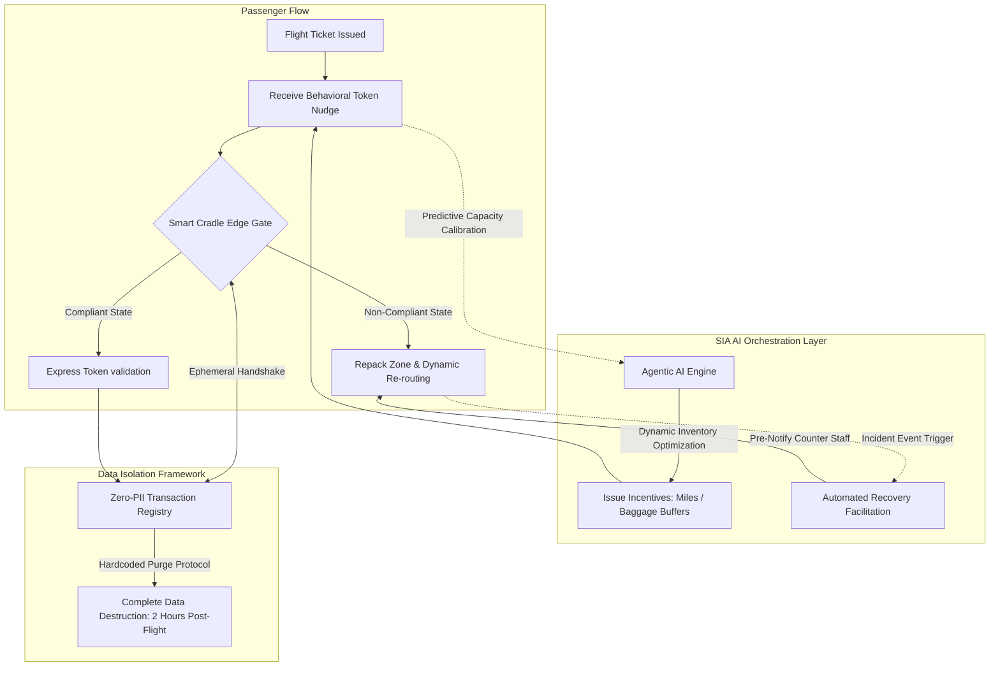

# Sovereign Infrastructure Architecture (SIA): Agentic AI Governance Framework

## Executive Summary
Traditional enterprise automation frameworks struggle with a fatal structural flaw: they force probabilistic AI models into rigid, centralized legacy architectures, or rely heavily on invasive biometric tracking at the edge. When a system operates as a frictionless "Black Box" without a physical anchor, any minor hallucination or operational exception collapses into a cascading systemic risk.

The **SIA Framework (Sovereign Infrastructure Architecture)** shifts the paradigm from *perception* to *governance*. Rather than continuously moving or copying core data tables, SIA establishes an orchestration layer that enforces deterministic boundaries at the edge. This repository demonstrates the practical implementation of SIA via a high-traffic, multi-stakeholder case study: **Airport Behavioral Orchestration**.

---

## Core System Architecture

The SIA framework coordinates real-time telemetry, probabilistic AI orchestration, and deterministic hardware enforcement without centralizing or moving core passenger datasets.

## 🛠️ Architectural Pillars

### Pillar 1: Load Smoothing via Incentives
- **Concept:** Instead of building excess infrastructure to react to queue accumulation at peak hours, the framework manipulates the arrival curve proactively by governing human behavior.  
- **Mechanism:** The system issues tokenized *Behavioral Nudges* (e.g., targeted flight miles or a +2kg baggage weight buffer) to passengers booking *Early Bird* slots. This digests high-friction, non-compliant passengers before the peak operational window hits.

### Pillar 2: Data Decoupling for Privacy
- **Concept:** Total isolation of Operational Identity (anonymous tokenized transaction slots) from Personal Identity (core airline passenger records).  
- **Mechanism:** Rather than centralizing biometric templates or full passenger profiles at the airport edge, the system processes temporary, localized tokens (e.g., Slot #123). This eliminates centralized target data pools for identity theft and satisfies cross-border compliance.

### Pillar 3: Deterministic Edge Governance
- **Concept:** Utilizing immutable physical checkpoints (*Smart Cradles*) to enforce operational parameters objectively through Finite State Machines (FSM).  
- **Mechanism:** Compliance validation is moved completely away from human discretion. If the physical sensor package detects an over-weight or out-of-slot state, the hardware boundary enforces the operational constraint deterministically.

---

## ⚙️ Technical Specifications & Resilience

### 1. Data Decoupling & Tokenization
- **PII Mapping:** Maintained entirely within the airline's proprietary, siloed relational database; never exposed to or stored within the runtime operational layer.  
- **Data Lifespan:** Hard-coded data purging protocols execute exactly 2 hours post-flight, completely removing transactional metadata from the operational environment.

### 2. High-Availability & Graceful Degradation
- **Offline Caching:** Edge nodes maintain a localized, cryptographically signed ledger of tokens valid for the current flight window.  
- **Fail-Safe Mechanism:** In the event of a total network or infrastructure outage, the system *gracefully degrades* to traditional manual queuing methodologies without corrupting or lock-blocking the core airline databases.

### 3. Frontline De-escalation Mechanics
- **Accountability Shift:** Enforcement accountability moves from human staff to hardware boundaries (*The Machine says No*).  
- **Real-Time Alerts:** Automated routing alerts pre-notify airline counter personnel of non-compliant exceptions before the passenger arrives, transforming staff from targets of verbal abuse into recovery facilitators.

---

## 🚀 Implementation Roadmap
The framework is structured into a phased, low-risk rollout designed to validate behavioral compliance metrics before capital expenditure on physical infrastructure occurs.

```mermaid
gantt
    title Framework Implementation Roadmap (Relative Days Timeline)
    dateFormat  X
    axisFormat %d
    
    section Phase 1
    Digital Soft Launch (Interface Deployment) :active, p1, 0, 30
    
    section Phase 2
    Operational Hardening (Edge Infrastructure) : p2, 30, 60
    
    section Phase 3
    Ecosystem Integration (Retail & Commercial) : p3, 60, 90

```

## Phase 1: Soft Launch (Digital Only)
- **Scope:** Deploy user interfaces for slot booking and distribute mileage/weight rewards programmatically via tokenized applications.  
- **Dependency:** Leverages existing legacy check-in counters with zero immediate physical hardware modification.  
- **Key KPI:** Passive passenger shift rate to early off-peak slots.  

## Phase 2: Operational Hardening (Infrastructure)
- **Scope:** Deploy physical Smart Cradles and automated governance barriers at designated express lanes.  
- **Dependency:** Real-time data integration between physical weight sensors and the edge token validation layer.  
- **Key KPI:** Reduction in average processing time within the 15-minute express channels.  

## Phase 3: Ecosystem Integration (Full Scale)
- **Scope:** Scale AI-driven real-time disruption handling (e.g., automated retail or lounge vouchers during mechanical delays) and cross-industry loyalty engine syncs.  
- **Dependency:** API exposure to authorized airport commercial and retail tenants.  
- **Key KPI:** Maximization of non-aeronautical retail revenue via optimized *Found Time*.  

---

## 📚 References & Foundational Artifacts
For an exhaustive breakdown of the architectural rules and semantic data structures driving this framework, please refer to the following internal documentation:

- **SIA_Manifesto.pdf** — Outlines the socio-technical foundations, intent-based calibration, and risk mitigation strategies of Sovereign Infrastructure Architecture.  
- **Pillar 1-3.pdf** — Detailed engineering documentation regarding Strategic Decoupling, Semantic Granularity, and multi-hop reasoning orchestration via GraphRAG.  

---

📌 This document was structured with the help of AI, and curated by **Sana.M**.

