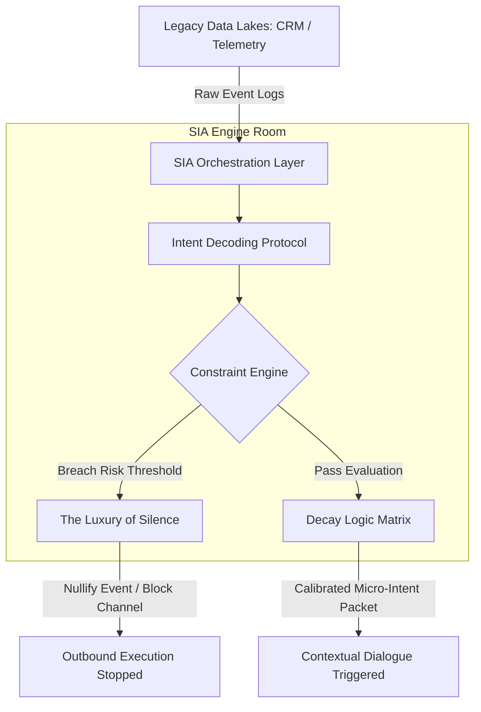

# Brand Asset Governance: Mitigating High-Velocity Resource Entropy through Intent-Based Calibration
Ref: SIA_Manifesto_76.pdf / Pillar 3_76.pdf

> **Attribution Notice**
> This document was structured with the help of AI, and curated by MSK.
> 
> *Statement:* This project framework and strategic governance model was conceived by me, and accelerated in collaboration with Advanced AI tools for rapid prototyping and clean Markdown publication.

---

## 1. Executive Summary & Problem Space
In enterprise environments, the misapplication of Generative AI to automate outbound marketing creates severe brand equity erosion and high operational entropy. Organizations possess extensive structural data lakes (e.g., identity records, transaction histories, real-time telemetry) yet fail to synthesize these inputs into real-time context. 

The resulting systemic vulnerability is the **"Data Silo" Paradox**: utilizing high-speed automation engines to blast probabilistic, low-logic promotions to users without cross-referencing their active state. This operational failure reduces conversion metrics to an unsustainable fractional baseline (~0.01%) while systematically degrading the organization's macro brand equity.

---

## 2. Theoretical Architecture Framework
To remediate this failure, the enterprise must transition from linear content generation to deterministic contextual orchestration. This requires inserting an operational layer between legacy CRM data storage and outbound execution loops.

3. The Three Pillars of SIA Brand Governance
I. Intent-Based Calibration (Context Over Content)
Instead of tracking static historical database tables, the architecture dynamically decodes immediate human state and operational context.
The Context Gap: Tracking individual behavior tags (e.g., "User clicked Destination X") causes severe hallucinations if the user's operational state has already shifted (e.g., "User just completed travel from Destination X").
SIA Resolution: Raw telemetry metrics are continually ingested and deconstructed into decoupled micro-facts, allowing real-time multi-hop reasoning via an operational topology before any outbound action is compiled.
II. The Luxury of Silence (Deterministic Constraints)
Traditional automation systems operate on positive execution triggers (if data exists, execute send). SIA mandates the implementation of explicit, deterministic boundary constraints.
Calculated Friction: The architecture enforces a governance layer that calculatedly halts automated flows based on situational risk thresholds.
Defensive Silence: Protecting customer attention and minimizing noise traffic functions as a core security boundary, preventing the system from falling into operational chaos or automated brand harassment.
III. Dynamic Resource Orchestration (Asset Translation)
Shifting enterprise technology from an instrument of mass volume distribution to a precise logic engine directly optimizes bottom-funnel business conversion.
Noise Traffic Reduction: Halting non-contextual automated output preserves critical cloud server, network bandwidth, and application-layer processing resources.
Precision Capital Allocation: Restructuring low-logic communication models into highly restricted, deterministic, high-intent dialogues transforms scattered, fragmented enterprise data into a compounding strategic asset.
4. Operational Implementation Matrix
Tactical Symptom	Root Cause (Broken Orchestration)	SIA Deterministic Correction	Strategic ROI Metric
High-Velocity Harassment: Automated junk promotions sent to active or recently completed transaction users.	Isolated Silos: CRM database schemas and execution loops are isolated; tables cannot reason together in a shared linguistic layer.	Semantic Granularity: Deconstruct transaction and telemetry tables into sovereign factual components to verify ongoing state.	Brand Equity Protection: Immediate mitigation of customer attrition and opt-out spikes.
Probabilistic Guessing: System tracks surface clicks but misinterprets underlying intent.	Missing Constraint Layer: Lack of active decay logic filters to invalidate stale behavioural historical logs.	Logic Topology: Overlay a flexible network graph determining relationship validity conditions (e.g., Active Travel state invalidates Offer X).	Conversion Optimization: Higher yield per dialogue instance (1 high-intent event over 1000 low-logic iterations).
Resource Dispersal: Over-allocation of marketing infrastructure to low-yield campaigns.	Linear Scripting: Downstream execution applications operate autonomously without centralized governance tracking systemic risk.	Finite State Machines (FSM): Enforce absolute operational boundaries that shift systems to "Lockdown and Silence" upon pattern anomaly.	Infrastructure Cost Savings: Massive reductions in outbound messaging overhead and computational wastage.
