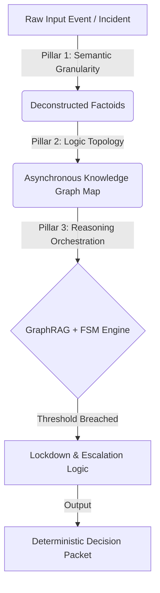

# SIA Risk Governor Demo Template

This interactive dashboard demonstrates the core mechanics of **Sovereign Infrastructure Architecture (SIA)**. It simulates how an enterprise governance layer preemptively de-escalates systemic risks by shifting from probabilistic AI execution to deterministic governance[cite: 1, 2].

*This document was structured with the help of AI, and curated by MSK.*

---

## 🛠️ Architecture Blueprint

The demo visualizes the execution of the 3 Pillars of SIA when processing high-stakes enterprise scenarios.

🎯 Core Features to Implement in Demo
1. Pillar 1: Semantic Granularity Sandbox
Input UI: A text area to paste raw corporate events (e.g., "Emergency sick leave request at 8:15 AM" or "Urgent wire transfer request").  
PDF
Visualization: A component that simulates decomposing rigid database tables into isolated entity chips (Factoids) to clear out noise contamination.  
PDF
2. Pillar 2: Non-Intrusive Logic Topology Map
Visualization: A lightweight, interactive node-link graph (using libraries like reactflow or d3).
Mechanism: Shows how logical relationships (predicates) are asynchronously mapped as a multidimensional knowledge graph above legacy systems without altering backend production tables.  
PDF
Example: [Transfer Request] → Requires [CFO Approval] → But [CFO is on Leave].  
PDF
3. Pillar 3: FSM Lockdown & Decision Packet Issuer
Status Indicator: A Finite State Machine status bar showing deterministic transitions: [Automated Flow] → [Risk Detected] → [System Lockdown].  
PDF
Action Center: Renders the final Decision Packet UI with 4 actionable protocols:  
PDF
🔄 Reschedule
  
PDF
👥 Delegate
  
PDF
🛑 Takeover
[cite: 2]
⚠️ Approved (with Override Protocol)
[cite: 2]
🚀 How to Run this Demo
Option A: Bolt.new (Instant Dev Environment)
Go to Bolt.new.
Connect your GitHub repository containing this project template.
Prompt Bolt: "Build a React + Tailwind dashboard based on the SIA Risk Governor design in the README.md."
Option B: Vercel (Deployment)
Initialize a Next.js / Vite project locally.
Push the codebase to GitHub.
Import the repository into the Vercel Dashboard for instant edge deployment.
📝 Compliance & Guardrails
Calculated Friction: The UI must intentionally include "strategic buffers" (e.g., a 2-second confirmation hold or secondary approval prompt) rather than frictionless single-clicks to honor SIA governance principles.
