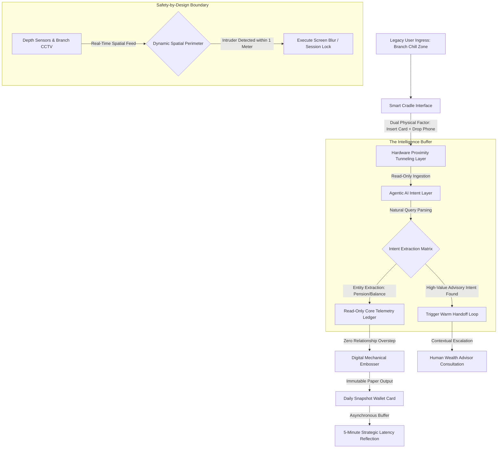

# The Digital-Physical Passbook Anchor: Bridging the $100B Legacy Friction in Global Banking
Ref: SIA_Manifesto_87.pdf (The Human-Centric Transition Layer)

> **Attribution Notice**
> This document was structured with the help of AI, and curated by Sana.M.
> 
> *Statement:* This project framework and strategic governance model was conceived by me, and accelerated in collaboration with Advanced AI tools for rapid prototyping and clean Markdown publication.

---

## 1. Executive Summary & Problem Space
Global retail banking faces a severe structural contradiction: the aggressive drive toward 100% digital migration to slash branch operational expenses, contrasted against millions of high-value legacy users who rely strictly on **"Physical Certainty"** and tangible ledger rituals. Abrupt "Mobile-Only" shifts frequently trigger severe brand erosion, systemic elderly exclusion, and catastrophic operational bottlenecks at physical branch counters.

Traditional digital transformation strategies treat the physical passbook as an obsolete tool to be eliminated. This architecture reframes it as a fundamental **Trust Anchor**. 

Project **[The Digital-Physical Anchor]** introduces a low-CapEx, non-invasive middleware transition layer designed for over 1.8M legacy accounts globally. By combining hardware-mediated proximity tunneling with dynamic space orchestration, the system captures natural user intent, protects client data sovereignty, and downizes institutional operational costs while upscaling human dignity.

---

## 2. Interaction Architecture & Intent Flow
The system bypasses traditional application login fatigue, utilizing parallel hardware authentication loops and spatial computer vision to orchestrate a high-trust, low-stress environment.

## 3. Core Architectural Specifications
I. Hardware-Mediated Proximity Tunneling
Operation: Deployed within a dedicated branch ecosystem ("The Chill Zone") under full CCTV coverage. Users completely bypass complex credentials or biometric enrollment, instead executing a dual-factor physical handshake: placing their mobile device onto an isolated "Smart Cradle" while inserting their standard ATM debit card.
Objective: Instantly establishes a secure, time-bound, read-only data tunnel via local NFC relays, minimizing cognitive friction for elder users.
II. Non-Invasive Read-Only Middleware
Operation: The agentic AI operates exclusively as a decoupled semantic interpreter, completely bypassing deep core system database modifications. It ingests the transactional string to extract clean entities (e.g., verifying if a pension payout has settled).
Objective: Prevents relationship overstepping or automated cross-selling, preserving strict data isolation and privacy boundaries.
III. Immutable Physical Output (The Snapshot Anchor)
Operation: Upon successful validation, the system drives a high-precision Digital Mechanical Embosser to issue a physical, pocket-sized, tamper-proof "Daily Snapshot Card".
Objective: Replaces temporary thermal paper with tactile ledger certainty, fully satisfying the psychological requirement for physical permanence.

## 4. Operational Resilience, Spatial Security & Strategic Latency
The system operates under strict Safety-by-Design parameters, extending cybersecurity defenses into the physical geometries of the branch floor.

| Environmental State | Systemic Diagnostic Telemetry | Actionable Operational Resolution Path |
| :--- | :--- | :--- |
| **Secure Autonomous Session** *(Standard Ritual Flow)* | **State Detected:** Proximity tunnel active; spatial perimeter clear of peripheral unauthorized moving targets. | **Asynchronous Psychological Buffering:** System completes execution and enters **"Strategic Latency"** mode—a 5-minute reflection period. Subtle environmental lighting guides the user to review their printed Snapshot Card in a secure, zero-pressure sanctuary. |
| **Physical Perimeter Breach** *(Intruder / Shoulder-Surfing)* | **State Detected:** Integrated depth sensors detect an unauthorized entity encroaching within a 1-meter radius of the Smart Cradle. | **Dynamic Spatial Defense:** AI instantaneously blurs the graphical interface, suspends the active data transmission loop, and holds the printed card payload until the perimeter is clear. |
| **High-Value Intent Detection** *(Commercial Conversion Path)* | **State Detected:** Semantic engine identifies complex long-tail queries (e.g., legacy asset transfers or fixed-term inquiries). | **The Warm Handoff Protocol:** The AI suppresses the automated interface and triggers an asynchronous notification to branch staff, routing the user to a private consultation lounge with a **Human Wealth Advisor**. |

## 5. Implementation Blueprint (Dynamic Spatial Perimeter & Ingestion Loop)
# =============================================================================
# HUMAN-CENTRIC BANKING ENGINES: INTERACTION ORCHESTRATOR
# Core Intent Filtering & Spatial Boundary Enforcement under SIA
# =============================================================================

def monitor_banking_session(user_cradle_id, telemetry_stream, spatial_sensor):
    """
    Enforces deterministic spatial defense and read-only entity extraction.
    Protects user psychological buffers via structural strategic latency loops.
    """
    session_active = True
    
    while session_active:
        # Phase 1: Spatial Security Audit (Dynamic Perimeter Enforcement)
        proximity_metrics = spatial_sensor.get_current_perimeter_metrics()
        if proximity_metrics.has_violation(radius_meters=1.0):
            execute_instant_screen_blur(user_cradle_id)
            log_security_event("Spatial Boundary Compromised: Shoulder-Surfing Alert")
            continue
            
        # Phase 2: Non-Invasive Semantic Intent Parsing
        raw_query = telemetry_stream.capture_natural_language_input()
        intent_profile = semantic_engine.parse_intent(raw_query)
        
        if intent_profile.classification == "COMPLEX_ADVISORY_INTENT":
            # Execute Immediate Human Synergy Integration
            trigger_warm_handoff_protocol(user_cradle_id, intent_profile.context)
            session_active = False
            return SESSION_TERMINATED_HANDOFF
            
        elif intent_profile.classification == "STANDARD_LEDGER_ROUTINE":
            # Safe Execution: Restrict Processing strictly to Read-Only Entities
            transaction_history = core_ledger_api.fetch_snapshot(intent_profile.entity_id)
            digital_embosser.print_daily_snapshot(transaction_history)
            
            # Enforce the Asynchronous Psychological Buffer Engine
            execute_strategic_latency_loop(user_cradle_id, duration_seconds=300)
            session_active = False
            return SESSION_COMPLETED_SUCCESSFULLY
            #

Core Architectural Axiom: Enterprise digital transformation must never be executed as an ideological war against historical human rituals; we build SIA to convert physical requirements into high-value operational gateways.
