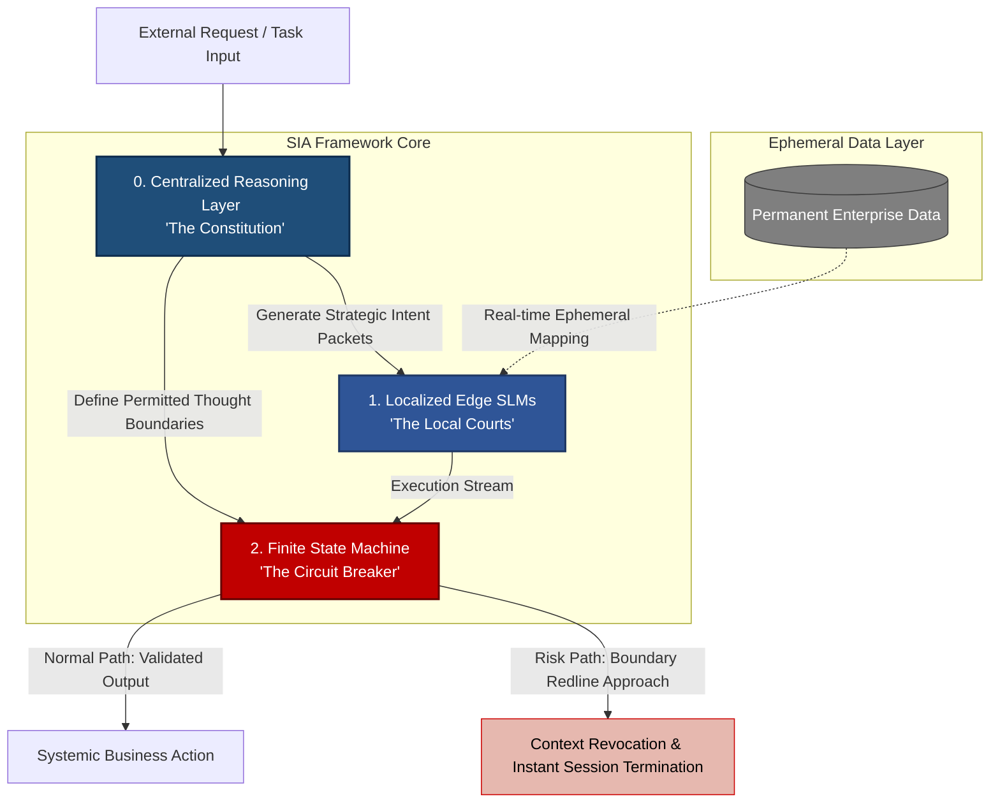

# Why 90% of Enterprise AI Stagnates at the Edge (And the Missing Link to Core Value)

When Microsoft recently warned enterprises to "not use frontier models for non-frontier problems," it exposed a hard economic truth: organisations are conflating model performance with architectural maturity. We are currently seeing massive capital deployment into GenAI, yet the ROI remains trapped in peripheral productivity tasks—summarisation and basic assistance. It has yet to penetrate the core of systemic business value.

The bottleneck is not a lack of computing power or model intelligence. It is an evolutionary gap in enterprise architecture.

Integrating probabilistic LLMs directly into legacy systems creates a "Legacy Data Debt." Fine-tuning models or applying surface-level prompt filters treats the symptom, not the structural cause. To move beyond this, we require a disciplined architectural approach—one that separates strategic intent from execution.

Within the **SIA (Sovereign Infrastructure Architecture)** framework, this challenge is resolved by shifting from a "model-centric" to an "orchestration-centric" design:

---

## The Sovereign Infrastructure Architecture (SIA) Governance Paradigm

## 0️⃣ Strategic Intent vs. Probabilistic Drift
Business governance must be embedded as a **System of Laws** within the foundational core, rather than relying on brittle, post-hoc output filters.  
A centralised reasoning layer should analyse organisational logic before execution is triggered, effectively defining the boundaries of what the system is permitted to *think*.

## 1️⃣ Decoupling Execution from Data Liability
To manage structural risk and compute costs, execution must be pushed to the edge via localised, hyper-focused **Small Language Models (SLMs)**.  
By using **ephemeral mapping**—where facts are presented to the model in real-time without moving or duplicating permanent data—we move away from the *Islands of Data, Bundles of Risk* paradigm.

## 2️⃣ Deterministic Governance
True enterprise readiness requires a **Finite State Machine (FSM)** acting as a hard circuit breaker.  
If an operational or regulatory red line is approached, the system must be capable of revoking context instantly, terminating the session before a hallucination manifests as a liability.

---

## 🔹 The Bottom Line
A single *perfect* model cannot replace a disciplined structure.  
If your AI strategy relies solely on model capacity without an orchestration layer, you aren't scaling intelligence—you are merely scaling risk.  

The shift from *testing AI* to *deploying architecture* is where the real value is hidden.  
Ultimately, a resilient framework treats:
- The **LLM** as the *Constitution*
- The **SLM** as the *Local Courts*
- The **FSM** as the *Circuit Breaker*

---

## ❓ Key Question
Are you scaling **INTELLIGENCE** — or just scaling **RISK**?

---

### Document Notes
This document was structured with the help of AI, and curated by **Sana.M**.
