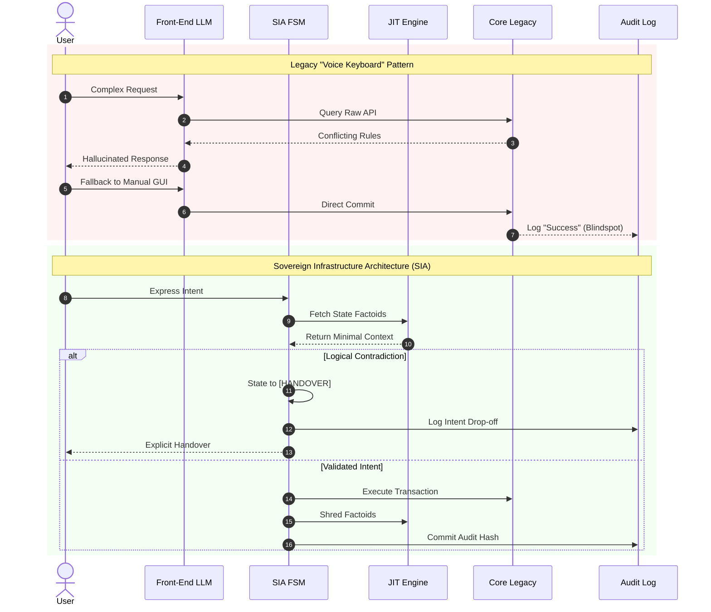

# The Multi-Million Dollar "Voice Keyboard": Telemetry Blindspots & Deterministic Governance

## Executive Summary

A growing number of enterprise organizations are aggressively deploying Large Language Model (LLM) interfaces at the customer front end to signal digital transformation. On the surface, these implementations present as seamless Agentic Commerce. In reality, most enterprises have merely built an extraordinarily expensive "voice keyboard" superimposed over deep-seated operational decay.

Deploying probabilistic models over fragmented product matrices, contradictory promotional logic, and chaotic legacy APIs does not create intelligence—it automates and scales systemic entropy.

---

## Structural Operational Debt vs. Probabilistic Illusion

The fundamental point of failure in current enterprise AI strategy is not prompt engineering or model context capacity; it is **Structural Operational Debt**.

When underlying business logic is undefined or corrupted, forcing a probabilistic model to infer intent and execute actions yields predictable failure modes:

* **Token Hemorrhage**: Dumping chaotic legacy data debt into context windows inflates compute costs exponentially without improving response accuracy.
* **Compounding Friction**: Users are forced to navigate conversational hallucinations generated by underlying system contradictions.
* **False Digital Modernization**: Front-end polish masks backend brittleness, deferring necessary architectural refactoring.

AI cannot remediate fundamentally broken business logic.

---

## The Telemetry Blindspot & The Zero-Learning Loop

The CapEx commitment to front-end wrappers persists primarily due to an enterprise measurement anomaly: **The Telemetry Blindspot**.

Legacy analytics engines are architected to measure transactional completions, not conversational or semantic failures.

[User Expresses Complex Intent]│▼[LLM Misunderstands / Fails] ──> (Silent Fallback to Traditional GUI)│▼[User Completes Transaction Manually] ──> [Analytics Log: "AI-Driven Success"]

1. **Silent Fallback**: When an LLM fails to process a non-linear request, the UI quietly defaults to standard manual menus.
2. **False Success Attribution**: The user completes the transaction manually, yet vanity telemetry logs the entire session as a successful AI engagement.
3. **Zero-Learning Loop**: Enterprise leadership observes high "AI utilization" while customer friction compounds and compute budgets scale 10x without operational yield.

---

## SIA Architectural Counter-Measures

To transition from costly front-end wrappers to resilient agentic execution, Sovereign Infrastructure Architecture (SIA) enforces deterministic backend governance prior to model exposure:

### 1. Decouple Logic from Probability
LLMs must operate strictly as intent classifiers, never as direct execution engines or state holders on legacy backends.

### 2. Deterministic Guardrails via FSM Boundary
Hard-coded Finite State Machines (FSM) strictly govern operational boundaries. When edge cases or business logic contradictions emerge, the FSM instantly revokes execution rights or triggers a deterministic handover.

### 3. Just-In-Time (JIT) Dynamic State Factoids
Rather than flooding prompt windows with static database dumps, SIA extracts localized, execution-only "state factoids" dynamically. These transient artifacts exist solely for the duration of the transaction and are shredded immediately upon completion.

---

## Architectural Comparison: Legacy Fallback vs. SIA Governance

---

## Conclusion

If the core operational engine is systemic chaos, an LLM cannot infer logic that was never defined. Enterprise capital must pivot from subsidizing front-end illusions to enforcing backend governance.

_This document was structured with the help of AI, and curated by Sana.M_

