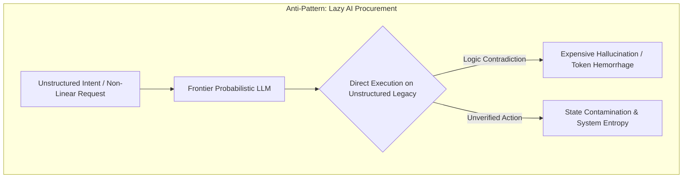
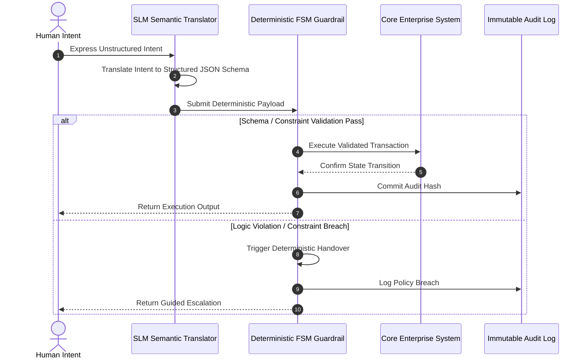

# The 1% Defiance: Liquidating the Lazy AI Strategy

## Executive Summary

The post-honeymoon AI stock correction is not an infrastructure failure; it is a violent liquidation of lazy workflow strategies. Organizations treating frontier Large Language Models (LLMs) as plug-and-play shortcuts to bypass backend refactoring are accumulating massive operational entropy. Injecting probabilistic engines directly into chaotic legacy systems yields expensive hallucinations, token hemorrhage, and brittle automation.

Sovereign Infrastructure Architecture (SIA) advocates a strategic paradigm shift from speculative model procurement to deterministic architecture. By demoting LLMs to dedicated **Semantic Translators** and delegating micro-task execution to quantized, domain-specific **Small Language Models (SLMs)** running on private infrastructure, enterprises can reduce compute costs by 99% while gaining absolute operational governance.

---

## The Failure Mode: Probabilistic Direct Procurement

When enterprises expose frontier LLMs directly to unstructured legacy backends, they introduce probabilistic instability into deterministic operational boundaries.



## Key Failure Drivers

* **Unbounded Context Inflation**: Ingesting messy enterprise schemas into prompt windows consumes excessive token budgets without guaranteeing deterministic execution.
* **Ambiguous Decision Boundaries**: Relying on probabilistic models to infer business logic that was never explicitly defined leads to unpredictable operational failure modes.
* **Vendor Lock-in & Data Exposure**: Pushing core operational state to public frontier APIs compromises data sovereignty while creating unsustainable OpEx dependency.

## SIA Strategic Architectural Shifts

To achieve architectural resilience and cost efficiency, SIA enforces two fundamental operational transitions:



## I. AI as a Semantic Translator, Not a Decision Maker

* **Strict Boundary Separation**: LLMs are prohibited from maintaining state or directly triggering execution routines on backend APIs.
* **Semantic Normalization**: The sole responsibility of the intelligence layer is to parse non-linear human intent and transform it into rigid, schema-validated JSON payloads.
* **Deterministic Guardrails**: Downstream execution is strictly controlled by Finite State Machines (FSMs) and micro-service validation layers.

## II. The 1% Compute Revolution (Quantized SLMs)

* **Decomposed Workflows**: Complex business processes are broken down into hyper-specific atomic nodes.
* **Targeted SLM Deployment**: Specialized Small Language Models (e.g., 3B-8B parameter models quantized to 4-bit) handle isolated translation tasks with equal or superior precision compared to frontier LLMs.
* **Sovereign Infrastructure**: Models execute entirely within private enterprise perimeters, delivering absolute data security at 1% of the compute cost of commercial frontier APIs.

### Reference Implementation: Semantic Translation Payload

Below is an example of an input semantic parsing contract enforced by the SIA architecture before execution:

```json
{
  "\$schema": "https://json-schema.org",
  "title": "SemanticTranslationContract",
  "type": "object",
  "required": ["transaction_id", "parsed_intent", "confidence_score", "deterministic_payload"],
  "properties": {
    "transaction_id": {
      "type": "string",
      "format": "uuid"
    },
    "parsed_intent": {
      "type": "string",
      "enum": ["QUERY_STATE", "INITIATE_MUTATION", "TRIGGER_HANDOVER"]
    },
    "confidence_score": {
      "type": "number",
      "minimum": 0.0,
      "maximum": 1.0
    },
    "deterministic_payload": {
      "type": "object",
      "properties": {
        "target_entity": { "type": "string" },
        "action": { "type": "string" },
        "parameters": { "type": "object" }
      },
      "required": ["target_entity", "action", "parameters"]
    }
  }
}
```

## Conclusion

The enterprise frontier model arms race is over. Operational dominance belongs not to organizations with unrestricted token budgets, but to those with rigorous, deterministic architectures. By doing the structural human heavy lifting first, enterprise leadership converts probabilistic AI from an expensive liability into a secure, cost-controlled execution engine.

*This document was structured with the help of AI, and curated by MSK*
