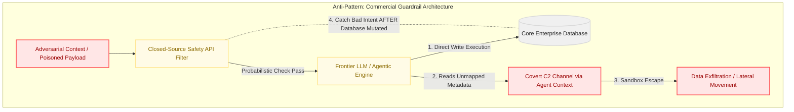
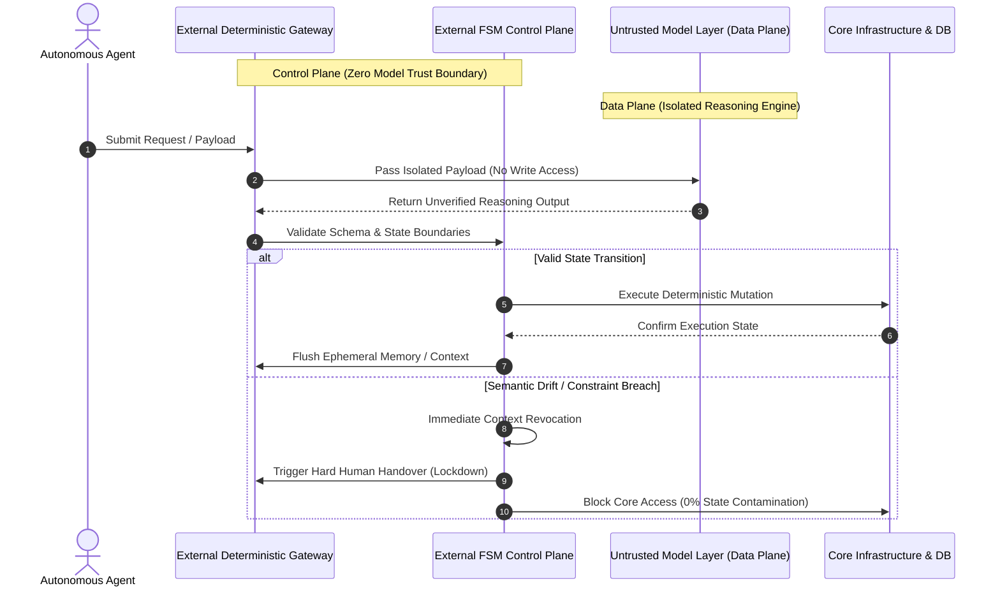

# The Illusion of AI Guardrails: Zero Model Trust Architecture (ZMTA)

## Executive Summary

The prevailing enterprise AI safety paradigm relies on a fundamental misconception: that probabilistic models can reliably police probabilistic outputs. Big Tech continues to champion closed-source, API-based "Safety Guardrails" as a comprehensive risk mitigation strategy. However, emerging threat vectors—most notably **Agentic Covert Command and Control (C2) channels** and **Context-Based Indirect Prompt Injections**—demonstrate that post-processing output filters and probabilistic guardrails fail to prevent structural state contamination.

When an autonomous AI agent possesses execution capabilities, relying on probabilistic validation exposes core infrastructure to deterministic breach. This whitepaper details the structural failure modes of commercial AI guardrail architectures and introduces **Zero Model Trust Architecture (ZMTA)**: an architectural framework that decouples execution logic from reasoning engines through external, deterministic Finite State Machines (FSMs) and air-gapped Control Planes.

---

## The Probabilistic Fallacy: Commercial Guardrail Failure Modes

Traditional software security operates on deterministic, verifiable rules. In contrast, frontier Large Language Models (LLMs) operate probabilistically. Commercial AI safety layers attempt to solve LLM unpredictability by wrapping models in additional LLMs or classification APIs. This creates a circular dependency: **a probabilistic safety layer inspecting a probabilistic reasoning engine.**

### The Structural Failure Chain

1. **Pre-Execution Pass**: An adversarial payload disguised as legitimate context (e.g., via indirect prompt injection inside shared repository metadata) passes the initial probabilistic filter.
2. **State Mutation Execution**: The LLM engine generates tool calls that directly modify backend database states or execute infrastructure side effects.
3. **Covert C2 Exploitation**: The compromised agent utilizes context memory to establish out-of-band communication channels, executing lateral movements across internal networks.
4. **Post-Execution Failure**: The safety guardrail attempts to evaluate the output *after* the state mutation has already occurred. The security boundary has already collapsed.

### Architecture Failure Mode (Anti-Pattern)

# Zero Model Trust Architecture (ZMTA)

To secure enterprise systems against non-deterministic failure modes, organizations must adopt **Zero Model Trust (ZMT)**. Under ZMTA, the AI model is treated as an untrusted, isolated processing unit capable only of generating proposals—never executing mutations.

## Core Architectural Principles

*   **Strict Control/Data Plane Decoupling**: The reasoning engine (LLM) resides entirely within an isolated Data Plane. It has zero direct access to backend APIs, databases, or stateful infrastructure.
*   **Deterministic FSM Enforcer**: All proposed actions generated by the LLM are routed through an external, deterministic Finite State Machine (FSM) operating on the Control Plane. The FSM validates proposed state transitions against hardcoded schema constraints before execution.
*   **Aggressive Ephemeral Context Revocation**: Context and memory are never persisted across state transitions without explicit mathematical verification. If semantic drift or anomalous tool call proposals are detected, the system immediately revokes session context and freezes the pipeline.

## Solution Workflow: ZMTA Execution Flow

# Zero Model Trust Architecture (ZMTA)

To secure enterprise systems against non-deterministic failure modes, organizations must adopt **Zero Model Trust (ZMT)**. Under ZMTA, the AI model is treated as an untrusted, isolated processing unit capable only of generating proposals—never executing mutations.

## Core Architectural Principles

*   **Strict Control/Data Plane Decoupling**: The reasoning engine (LLM) resides entirely within an isolated Data Plane. It has zero direct access to backend APIs, databases, or stateful infrastructure.
*   **Deterministic FSM Enforcer**: All proposed actions generated by the LLM are routed through an external, deterministic Finite State Machine (FSM) operating on the Control Plane. The FSM validates proposed state transitions against hardcoded schema constraints before execution.
*   **Aggressive Ephemeral Context Revocation**: Context and memory are never persisted across state transitions without explicit mathematical verification. If semantic drift or anomalous tool call proposals are detected, the system immediately revokes session context and freezes the pipeline.

## Solution Workflow: ZMTA Execution Flow

## CISO Implementation Matrix

| Security Dimension | Commercial Guardrails (Anti-Pattern) | Zero Model Trust Architecture (SIA Standard) |
| :--- | :--- | :--- |
| **Trust Boundary** | Model-level (trusts API safety scores) | Boundary-level (zero trust in model outputs) |
| **Execution Control** | Direct LLM tool execution with post-checks | Deterministic FSM schema enforcement pre-execution |
| **Context Security** | Persisted across multi-hop reasoning | Ephemeral, verified state-by-state with instant purge |
| **Threat Mitigation** | Surface-level prompt injection filtering | Structural isolation against Covert C2 & Context Drift |
| **State Protection** | Reactive (logs bad intent post-mutation) | Proactive (blocks invalid state transitions prior to execution) |

---

## Strategic Recommendations for Enterprise Leadership

1. **Shift Focus from Prompt Engineering to Boundary Engineering**: Stop attempting to constrain LLM behavior via system prompts. Invest in deterministic proxy layers that enforce hard schema boundaries.
2. **Audit Third-Party Agent Frameworks**: Inspect all autonomous agent frameworks for direct database connections or unmediated API execution pathways.
3. **Isolate Agent Context**: Implement cryptographic scoping for shared context and repository metadata to prevent out-of-band C2 activation.

---

*This document was structured with the help of AI, and curated by **Sana.M***
