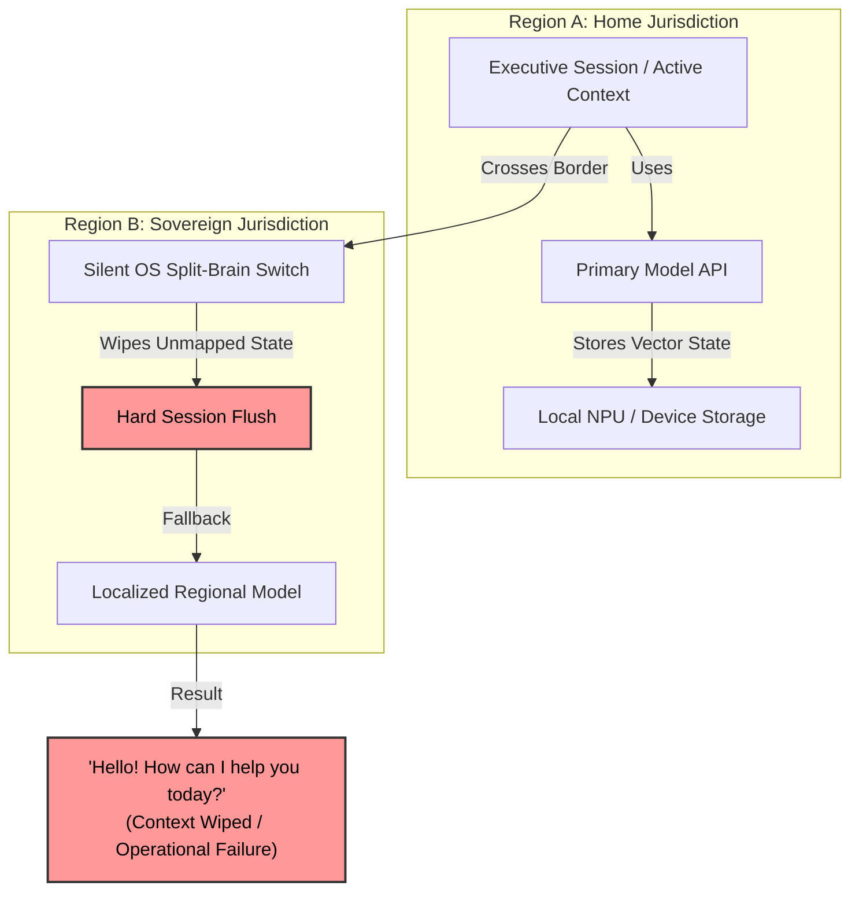
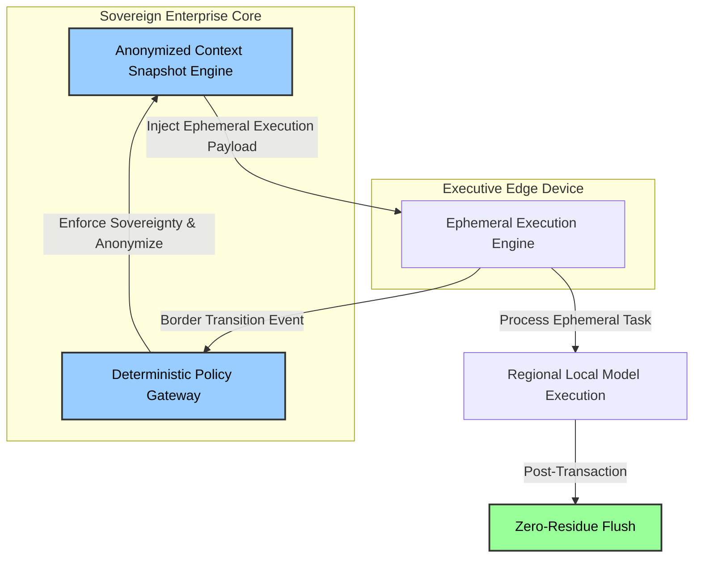

# Geopolitical Edge Context Gateway

> Addressing "Geopolitical Amnesia" and "Split-Brain OS" Failures in Cross-Border Enterprise Edge AI Deployments.

---

## Executive Summary

As Big Tech pushes "On-Device AI" for enterprise mobility, multinationals face an unaddressed operational vulnerability: **Geopolitical Context Evaporation**.

When executives cross international borders (e.g., entering regions with strict data residency regimes like mainland China or the EU), modern mobile OS architectures silently trigger a "split-brain" shift. To maintain legal compliance, the operating system swaps underlying foundation model endpoints from Western cloud APIs to localized regional models.

Because these models utilize disparate vector spaces and system prompt schemas, active session context cannot be mapped across the border. The device executes an unmanaged **Hard Flush**—silently erasing executive session memory, strategic negotiation context, and operational history.

This repository defines the architecture for a **Deterministic Sovereign Context Gateway** that decouples session state from local hardware and vendor-locked model layers.

---

## Architecture Overview

### Traditional Edge AI: The Split-Brain Context Evaporation Problem

## SIA Sovereign Gateway Architecture: Decoupled & Ephemeral State

---

# Project Architecture & Deployment Roadmap

This repository outlines the core technical architectural principles and deployment roadmap for ensuring secure, decoupled, and compliant state management.

---

## 🏗️ Technical Architectural Principles

### 1. Decoupled Context Snapshots
Context state must never be baked directly into local hardware weights or regional vector stores. Instead, active sessions are preserved as neutral, anonymized, and sovereign state snapshots managed at the enterprise backend layer.

### 2. Transient Execution & Ephemeral Ingestion
Edge devices must act purely as stateless execution nodes. 
* Temporarily ingest minimal, execution-only "state factoids" required for immediate task completion.
* Execute a mandatory **Zero-Residue Flush** immediately post-transaction.

### 3. Deterministic Sovereignty Gateways
Boundary transit and model calls must be governed by an external deterministic gateway. Compliance, data residency verification, and prompt anonymization occur before any local or regional API interaction is authorized.

---

## 🗺️ Deployment & Verification Roadmap

- [ ] **Policy Matrix Definition:** Map regional regulatory restrictions against enterprise data classifications.
- [ ] **Gateway Schema Design:** Implement OpenAPI / gRPC interfaces for the Deterministic Sovereignty Gateway.
- [ ] **Session Re-hydration Test:** Simulate cross-border payload transitions ensuring continuous context retrieval without local state retention.

---

> 📝 ***This document was structured with the help of AI, and curated by **Sana.M**.***
