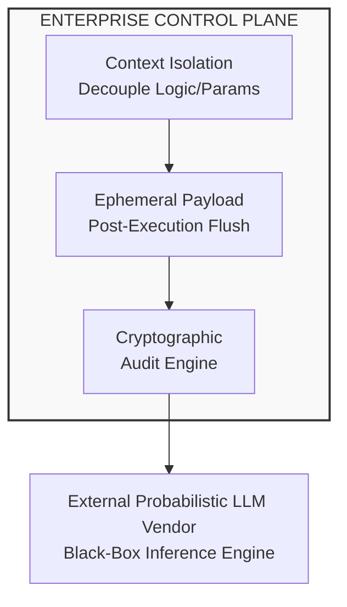
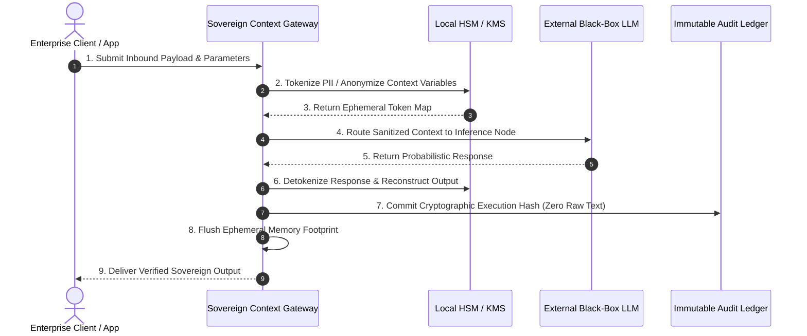
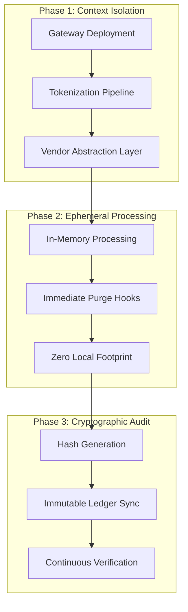

# 08: Sovereign Traceability & Anti-Black-Box Audit Engine

## Executive Overview

Multinationals pouring capital into closed-source AI models and enterprise private clouds often operate under the illusion of bulletproof regulatory compliance. As global AI regulations (e.g., EU AI Act, cross-border data transfer mandates) harden toward 2027, C-suites face a critical vulnerability: **Contractual Cover is not Operational Sovereignty.**

Standard AI vendor contracts guarantee data privacy at rest, but fail during execution. When cross-border inference pipelines shuttle unsanitized context parameters between distributed cloud nodes, paper guarantees offer zero audit protection. 

This repository specifies the architecture for an **Anti-Black-Box Audit Engine**—a zero-trust, vendor-agnostic control plane engineered to enforce **Sovereign Traceability** directly within enterprise execution pipelines.



---

## The 2027 Compliance Mirage

### 1. The Contractual Compliance Fallacy
* **Balance Sheet Exposure**: Closed models conceal raw training provenance and internal reasoning. When regulatory arbitrage triggers an investigation, third-party terms of service cannot shield the enterprise balance sheet from severe liability.
* **The Black-Box Audit Trap**: You cannot audit a black box post-hoc. Traditional compliance attempts to retroactively log probabilistic outputs, leaving raw text footprints vulnerable to external discovery.

### 2. The Fallback Delusion & Asymmetric Threats
* **Legacy Atrophy**: Enterprises assuming a fallback to manual workflows during cross-border compliance lockouts face crippling operational friction. Legacy capabilities have been hollowed out by generative automation.
* **Operational Disruption**: Unplanned system downgrades degrade client SLA trust and erode brand equity while adversaries leverage automated, AI-driven exploitation protocols.

---

## Architectural Principles

To achieve true **Operational Sovereignty**, compliance must be engineered into the backend pipeline architecture rather than applied as a post-execution layer.



### Core Capabilities

* **Vendor-Agnostic Context Isolation**
  * Decouples deterministic business logic and sensitive context from external probabilistic models.
  * Ensures model providers never ingest unencrypted organizational state.

* **Ephemeral Payload Processing**
  * Enforces real-time memory purging.
  * Sanitizes and flushes all transactional payloads and intermediate context states post-execution, eliminating permanent text trails.

* **Cryptographic State Auditing**
  * Generates deterministic, immutable execution hashes for automated model decisions.
  * Verifies compliance without exposing underlying sensitive text payloads to third-party auditors.

---

## Technical Specifications

### Ephemeral Payload Processing Specification
The engine sanitizes context payloads prior to external transmission. Below is a representative JSON configuration enforcing zero-footprint memory flushing.

```json
{
  "\$schema": "https://json-schema.org/draft/2020-12/schema",
  "title": "EphemeralPayloadConfig",
  "type": "object",
  "properties": {
    "executionId": {
      "type": "string",
      "format": "uuid"
    },
    "sovereignDomain": {
      "type": "string",
      "enum": ["APAC-SG", "EU-DE", "US-EAST"]
    },
    "contextIsolation": {
      "type": "object",
      "properties": {
        "stripPii": { "type": "boolean", "default": true },
        "anonymizationProtocol": { "type": "string", "default": "SHA256-HMAC-SALTED" }
      },
      "required": ["stripPii", "anonymizationProtocol"]
    },
    "ephemeralPolicy": {
      "type": "object",
      "properties": {
        "retentionTimeMs": { "type": "integer", "const": 0 },
        "forceMemoryPurge": { "type": "boolean", "const": true }
      },
      "required": ["retentionTimeMs", "forceMemoryPurge"]
    },
    "cryptographicAudit": {
      "type": "object",
      "properties": {
        "emitExecutionHash": { "type": "boolean", "const": true },
        "hashAlgorithm": { "type": "string", "default": "BLAKE3" }
      },
      "required": ["emitExecutionHash", "hashAlgorithm"]
    }
  },
  "required": [
    "executionId",
    "sovereignDomain",
    "contextIsolation",
    "ephemeralPolicy",
    "cryptographicAudit"
  ]
}
```

## Implementation Roadmap



## Deployment Phases & Execution

### ⬜ Phase 1: Context Isolation Gateway
* **Action Item**: Deploy an inline proxy to interdict, tokenize, and sanitize all outbound context parameters.
* **Objective**: Ensure all parameters are sanitized before they reach external inference endpoints.

### ⬜ Phase 2: Ephemeral Execution Control
* **Action Item**: Configure runtime environment variables.
* **Objective**: Enforce zero-disk write policies and automated memory zeroization hooks post-inference.

### ⬜ Phase 3: Cryptographic Ledger Sync
* **Action Item**: Connect execution pipelines to an immutable, append-only cryptographic logging system.
* **Objective**: Generate tamper-evident execution proofs for full auditability.

*This document was structured with the help of AI and curated by **Sana.M**.*
