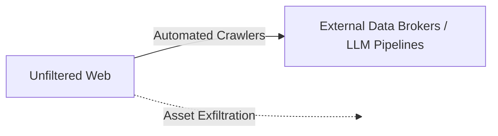
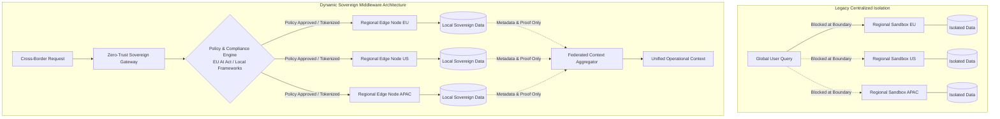
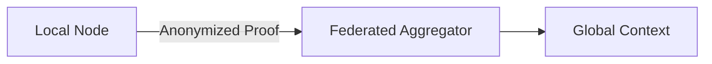

# Architectural Brief: The Fragmentation of Global Platform Rails and Sovereign Containment

**Document ID:** ARCH-2026-09-01  
**Target Audience:** C-Suite, Enterprise Architects, VPs of Engineering  
**Scope:** Regional Data Isolation, AI Crawling Mitigations, Cross-Border Compliance  

---

## 1. Executive Summary

Global platform architecture is undergoing a fundamental shift from open, borderless rails to localized, sovereign sandboxes. Driven by aggressive AI crawler data exfiltration and expanding cross-border regulatory frameworks, major digital platforms are actively enforcing dynamic geographic isolation.

For enterprise systems, this architectural containment introduces critical operational risks:
* **Context Evaporation:** Cross-border operational contexts and talent graphs are fractured across regional boundaries.
* **Shifted Liability:** Compliance and auditing burdens are dumped directly onto client backend architectures.
* **Operational Latency:** Legacy centralized identity and search engines fail under localized compliance constraints.

This brief outlines the technical drivers behind this migration and provides an architectural mitigation model to maintain dynamic, sovereign cross-border operations.

## 2. Technical Drivers & Operational Risks

### 2.1 The AI Scraping Arms Race & Resource Entropy Control
Automated crawler bots and commercial data brokers continuously scrape relational graph data to supply underlying LLM training sets. Beyond basic network traffic, this represents systematic asset exfiltration.

To counter this, platform engineering teams enforce **regional isolation**—a brute-force pattern of *Resource Entropy Control*. By locking search indices into regional sub-domains, platforms:
* Exponentially increase scraping compute costs.
* Establish clear sovereign boundaries.

### 2.2 Cross-Border Liability & Regulatory Shifting
Dynamic compliance mandates (such as the *EU AI Act*) make cross-border candidate profiling without local data governance a severe legal vector. 

* **Legacy Monolith Limitations:** Centralized platform architectures cannot execute real-time, dynamic compliance policy evaluation across conflicting jurisdiction rules.
* **Corporate Risk Delegation:** Platforms respond by restricting global visibility behind enterprise-grade gates. The legal risk and audit burdens are offloaded directly onto corporate subscribers.

### 2.3 Context Evaporation at the Sovereign Boundary
When platform architectures enforce hard regional boundaries, functional business context breaks down during cross-border operations.

* **Operational Friction:** Data isolation eliminates historical and cross-functional context during international talent searches and executive workflows.
* **Brand Degradation:** Cross-border stakeholders experience systemic delays and fragmented interfaces, damaging corporate reputational capital.

## 4. Strategic Architectural Mitigations

### 4.1 Dynamic Edge Compliance Mediation
To circumvent hard regional access blocks, backend architectures must transition from centralized routing to distributed edge mediation.

* **Localized Context Gateways:** Deploy zero-trust edge proxies within target geographic zones to evaluate access control and regulatory constraints locally before payload dispatch.
* **Metadata Abstraction Layers:** Decouple identifiable primary payload data from query indexes. Expose tokenized metadata endpoints to cross-border requests while maintaining underlying sovereign storage integrity.

### 4.2 Federated Context Integration
Rather than raw data synchronization across borders, implement federated verification patterns.

* **Zero-Knowledge Attestation:** Validate user qualifications, compliance states, and system attributes across sovereign boundaries without transferring sensitive raw profile data.
* **Dynamic Policy Evaluation Engines:** Utilize runtime policy engines (e.g., Open Policy Agent) to dynamically allow or sanitize data fields based on originating and destination jurisdiction rules.

---

## 5. Implementation Roadmap

* **Phase 1 (Days 1–30):** Audit existing cross-border platform dependencies and map data flow vulnerabilities across regional boundaries.
* **Phase 2 (Days 31–60):** Implement localized metadata abstraction and zero-trust proxy layers for cross-border query pathways.
* **Phase 3 (Days 61–90):** Deploy federated policy evaluation engines to dynamically enforce cross-border compliance rules in real time.

---

*This document was structured with the help of AI, and curated by **Sana.M**.*

