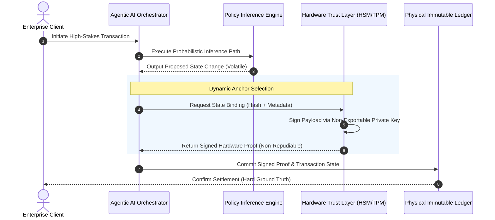
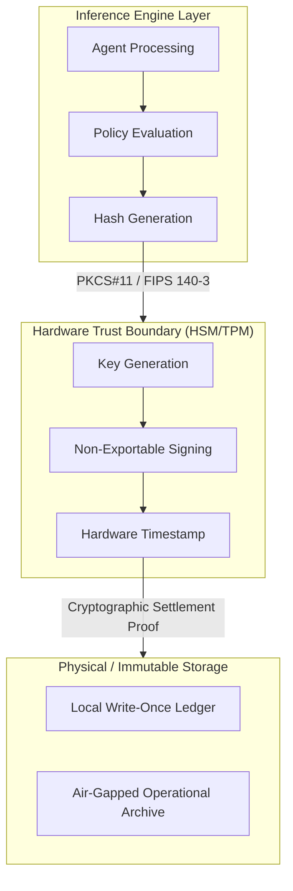

# RFC-002: Physical-Anchor Sovereignty in Enterprise AI Architecture

* **Status:** Proposed
* **Author:** Sana.M
* **Created:** 2026-09-15
* **Category:** Enterprise AI Infrastructure / Data Sovereignty
* **Target Audience:** Chief Technology Officers, Chief Information Security Officers, Principal System Architects

---

## Executive Summary

As enterprise architecture rapidly shifts toward full AI integration, a critical structural vulnerability has emerged: the total reliance on pure digital states and cloud-native redundancies. 

In scenarios involving network fragmentation, geopolitical cloud access revocation, or severe model opacity during litigation, purely digital systems lack an immutable ground truth. **RFC-002** defines the **Physical-Anchor Sovereignty** pattern—a strategic architectural framework that tethers transient probabilistic AI outputs to deterministic, localized hardware trust layers.

---

## Problem Statement & System Vulnerabilities

### 1. The Non-Repudiation Fallacy
Self-retained local databases and exported digital artifacts (e.g., PDF audit logs) offer zero legal defense during high-stakes regulatory audits or cross-border liability disputes. 

* **Black-Box Inference Opacity:** Probabilistic Large Language Models (LLMs) operate with inherent non-determinism. Standard digital logs cannot definitively prove state integrity.
* **Evidentiary Failure:** In judicial proceedings, unanchored digital records are easily challenged for key compromise, hallucination, or retroactive tampering. When central cloud services are severed, purely software-based proofs lose legal standing.

### 2. The Fallback Delusion & Talent Atrophy
A prevalent myth among enterprise leadership is that operations can seamlessly revert to legacy IT backends or manual human workflows during a catastrophic cloud outage or model breach.

* **Erosion of Operational Knowledge:** Hyper-automation systematically hollows out institutional knowledge and human operational capabilities.
* **Irreversible Coupling:** Once core operational flows are delegated to generative agents, manual execution paths cease to be viable fail-safes, turning minor infrastructure interruptions into total business halts.

## Architectural Specification: Dynamic Anchor Selection

The Dynamic Anchor Selection mechanism bridges volatile digital processing states with deterministic physical settlement. Transient outputs generated by autonomous agents or LLM reasoning pipelines are captured at transaction boundaries and cryptographically bound to hardware trust anchors before state finality is granted.

### Dynamic Anchor Binding Workflow

 # Component Breakdown

* **Transient Inference Layer**: Handles high-velocity, probabilistic task execution. States inside this layer remain volatile and legally uncommitted.
* **Dynamic Anchor Gate**: An automated interception boundary triggered upon reaching predefined transaction risk thresholds (e.g., monetary limits, regulatory compliance boundaries).
* **Hardware Trust Layer**: Isolated cryptographic hardware (Hardware Security Modules, Secure Enclaves, TPM 2.0) that generates immutable proof of state without exposure to public cloud attack vectors.

## Technical Implementation Protocol

To enforce Physical-Anchor Sovereignty, systems must integrate hardware security primitives directly into the agent transaction cycle.

# Architecture Flow Diagram

### Integration Requirements

1. **Cryptographic Binding:** State outputs must be hashed using SHA-256/384 and signed using non-exportable keys hosted inside FIPS 140-3 Level 3 validated HSMs or TPM 2.0 modules.
2. **Air-Gapped Isolation:** Critical state proofs must be replicated to physically isolated storage controllers capable of hard write-protection (WORM) to withstand network-wide compromise.
3. **Deterministic Verification:** Regulatory verification pipelines must validate hardware-signed proofs independently of the inference engine or cloud vendor infrastructure.

---

## Risk Mitigation Matrix

| Vulnerability Threat Vector | Purely Digital System Impact | Physical-Anchor System Response |
| :--- | :--- | :--- |
| **Geopolitical Cloud Revocation** | Total loss of operational proof and state access. | Localized hardware holds signed state logs for offline verification. |
| **LLM Hallucination Dispute** | Undetermined liability due to non-deterministic logs. | Cryptographically signed execution state proves system intent at execution time. |
| **Generative Code Tampering** | Retroactive log alteration across cloud storage. | Immutable hardware signing prevents unauthorized modifications post-transaction. |
| **Operational Talent Atrophy** | System collapse when human fallback paths fail. | Deterministic hardware enforcement guarantees predictable execution boundaries. |

---

This document was structured with the help of AI, and curated by Sana.M
