# Dynamic Physical Anchor Selection (DPAS): Deterministic Execution Architecture for Volatile LLM Inference Layers

## Executive Overview

As enterprise AI adoption accelerates toward critical regulatory checkpoints, a structural failure point has emerged across enterprise deployments: **the non-repudiation collapse of pure digital architecture**. 

 probabilistic Large Language Models (LLMs) operate via dynamic inference opacity. When enterprise workflows rely purely on soft digital redundancies—such as cloud backups, self-retained database logs, or unanchored PDF exports—they expose the organization to existential legal, operational, and regulatory risks:

* **Evidentiary Collapse:** Unanchored digital logs fail to provide legal non-repudiation during severe regulatory audits or cross-border disputes. Opposing counsel can trivially challenge probabilistic outputs on the grounds of hallucination, retroactive key compromise, or undetected data tampering.
* **The Fallback Delusion:** Hyper-automation drives operational talent atrophy. When centralized cloud infrastructures experience regional blackouts, network fragmentation, or geopolitical access revocations, human teams no longer possess the muscle memory to execute legacy fallback processes.

**Dynamic Physical Anchor Selection (DPAS)** resolves this structural vulnerability. Rather than relying on transient connected states, DPAS binds volatile inference outputs to an isolated hardware trust layer at the exact millisecond execution terminates. By decoupling non-deterministic reasoning from deterministic physical settlement, DPAS guarantees immutable operational truth that survives cloud collapse and adversary code-wipes.

## Architectural Vulnerability Analysis

Traditional enterprise security models rely on an inherently flawed premise: **connected state persistence**. In high-stakes regulatory environments, this creates three systemic attack vectors:

| Vulnerability Vector | Pure Digital State (Legacy / Standard Cloud) | Dynamic Physical Anchor Selection (DPAS) |
| :--- | :--- | :--- |
| **Audit Non-Repudiation** | Soft digital logs (PDFs, DB records) open to key compromise, hallucination claims, or retroactive tampering. | Cryptographic settlement bound to a physical trust anchor at transaction boundary termination. |
| **Cross-Border Compliance** | Vulnerable to sudden cloud-access revocation, API restrictions, or sovereign network fragmentation. | Localized hardware custody ensuring operational data sovereignty independent of external network states. |
| **Systemic Resilience** | Complete operational paralysis when cloud-level adversaries compromise connected infrastructure. | Zero-trust hardware isolation preventing retroactive wiping or external code injection. |

## The DPAS Execution Mechanism

To eliminate the probabilistic threat vector without sacrificing AI inference speed, DPAS enforces a strict separation between **Reasoning Logic** and **State Settlement**.

1. **Transient Payload Processing:** The probabilistic LLM/SLM layer handles intent orchestration and multi-hop reasoning within an isolated ephemeral memory cage.
2. **Deterministic State Compression:** Upon transaction completion, the FSM circuit breaker terminates the transient session and compresses the final execution payload into an immutable metadata hash.
3. **Physical Anchor Bolding:** The generated hash is instantly pushed to an offline, hardware-anchored trust layer—such as an isolated Hardware Security Module (HSM), secure enclave, or localized physical ledger.

Once bound, no external API call, cloud-level exploit, or adversarial prompt vector can alter or wipe the physically anchored transaction proof.

## System Topology & Dynamic Sequence Flow

The operational runtime of DPAS is governed by a strict deterministic boundary. The transient inference layer is decoupled from the physical settlement layer, ensuring that no probabilistic output can mutate downstream systems without cryptographic verification and hardware anchoring.

### Sequence Topology Diagram

```mermaid
%%{
  init: {
    'theme': 'base',
    'themeVariables': {
      'primaryColor': '#2b3945',
      'primaryTextColor': '#ffffff',
      'primaryBorderColor': '#455a64',
      'lineColor': '#37474f',
      'secondaryColor': '#eceff1',
      'tertiaryColor': '#ffffff',
      'noteBkgColor': '#fff9c4',
      'noteTextColor': '#37474f',
      'actorBkg': '#1e2830',
      'actorTextColor': '#ffffff',
      'actorLineColor': '#37474f'
    }
  }
}%%
sequenceDiagram
    autonumber
    participant App as Enterprise Application Core
    participant LLM as Transient AI Inference Layer (Probabilistic)
    participant FSM as FSM Circuit Breaker (Deterministic)
    participant HSM as Local Hardware Trust Layer (Physical Anchor)
    participant Ledger as Localized Physical Ledger

    App->>LLM: Ingest Unstructured Context & Prompt Payload
    LLM-->>FSM: Return Probabilistic Intent & Generated State
    
    rect rgb(38, 50, 56)
        note over FSM: Boundary Validation & Transient Termination
        FSM->>FSM: Evaluate Policy Constraints & State Integrity
        alt Policy Violation / Out-of-Bounds
            FSM-->>App: Hard Revocation & Ephemeral Memory Flush
        else Verified Transaction Boundary
            FSM->>FSM: Compress Payload into Immutable State Hash
            FSM->>LLM: Trigger Memory Sanitization (Zero Permanent Log)
        end
    end

    FSM->>HSM: Dispatch Immutable State Hash via Offline Bus
    activate HSM
    HSM->>HSM: Cryptographic Signing & Physical Hardware Bolding
    HSM-->>Ledger: Write Deterministic Settlement Proof
    HSM-->>FSM: Acknowledge Anchor Commitment
    deactivate HSM

    FSM-->>App: Return Non-Repudiable Execution Receipt
```

# Implementation Guidelines for Enterprise Auditors

To maintain **Zero-Trust compliance** under **ISO/IEC 42001** and **GDPR** audit standards, enterprise deployment teams must adhere to three mandatory implementation rules:

* **Ephemeral Memory Isolation**: 
  The runtime environment hosting the *Transient AI Layer* must execute in isolated containerized topologies with automated memory flushing upon session termination. No raw prompt payloads or intermediate inference states may persist in soft digital storage.

* **Offline Hardware Bus**: 
  The channel connecting the *FSM Circuit Breaker* to the *Local Hardware Trust Layer (HSM/Secure Enclave)* must operate via a dedicated, air-gapped, or strictly controlled hardware bus. Remote cloud API invocations for anchor bolding are strictly prohibited.

  ***This document was structured with the help of AI, and curated by **Sana.M***

* **Cryptographic Receipt Auditability**: 
  Legal and compliance teams must verify non-repudiation solely through the deterministic settlement proofs emitted by the *Hardware Trust Layer*, independent of LLM telemetry logs.
