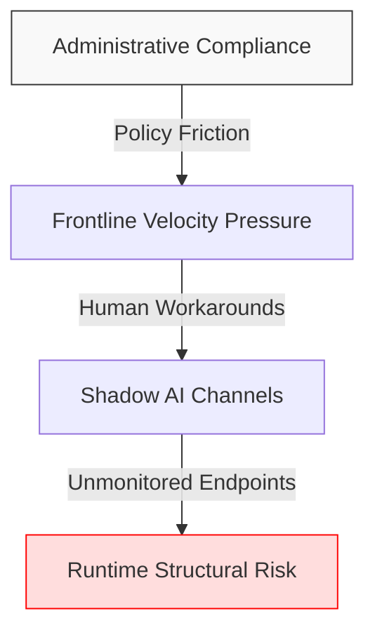
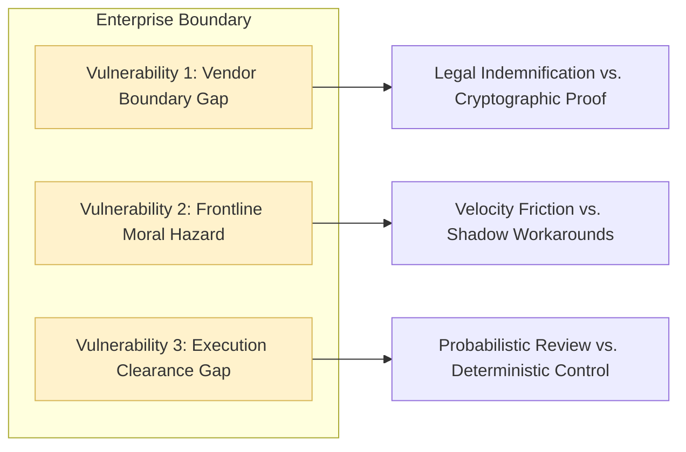
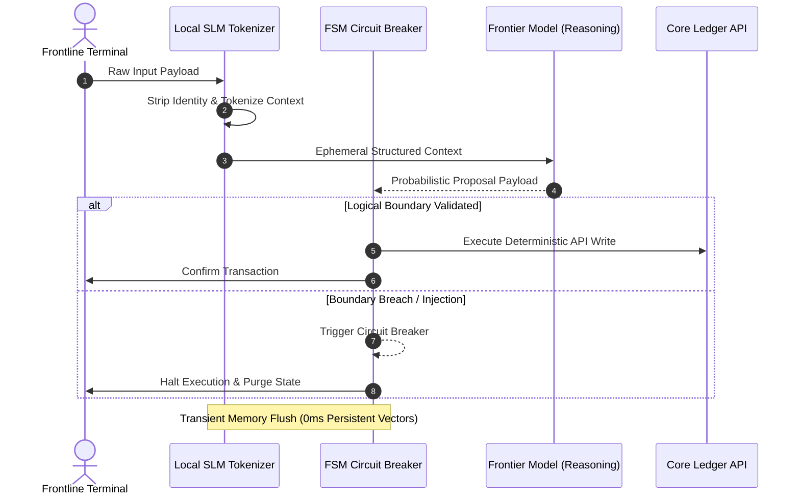

# Enterprise Boundary & Governance Physics
## Deterministic Control for Autonomous Agentic Architecture

> **Target Audience:** C-Suite Executives, Chief Risk Officers, Enterprise AI Architects  
> **Status:** Architecture Whitepaper  
> **Repository Path:** `docs/governance/enterprise-boundary-governance.md`

---

## 1. Executive Summary & Boundary Friction

As enterprises transition from passive Q&A chatbots to autonomous AI agents granted direct API clearances to core ledgers, traditional administrative governance creates a critical operational failure mode.

### The Illusion of Administrative Compliance

Most enterprise AI deployments rely on paper-based risk frameworks, ISO/GDPR vendor certificates, and written usage policies. While these satisfy static legal audits, they provide **zero structural protection** at runtime. When operational velocity directly conflicts with administrative policy, frontline teams systematically adopt workarounds—creating unmonitored shadow AI channels on unmanaged endpoints.

### The Architectural Mandate

True Zero Trust in agentic systems cannot rely on human compliance under financial incentive or secondary probabilistic guardrails. Enterprise governance must evolve from administrative policy to architectural physics—enforcing strict, deterministic system boundaries that absorb operational speed without retaining unmanaged liability.

## 2. System Failure Modes & Risk Analysis

To enforce deterministic controls, enterprise architects must address three distinct systemic boundary vulnerabilities present in modern agentic deployments.

### Critical Boundary Vulnerabilities

| Vulnerability | Administrative Assumption | Architectural Reality | Primary Failure Mode |
| :--- | :--- | :--- | :--- |
| **1. Vendor Boundary Gap** | Third-party SaaS vendor ISO/GDPR certificates guarantee data privacy. | Vendor certificates attest to static cloud isolation, not transit data lineage. | Absence of local Cryptographic State Hash Logging leaves transit data unverified. |
| **2. Frontline Moral Hazard** | Strict operational mandates prevent staff from using unsanctioned external models. | When compliance slows deal closing, teams use shadow AI workarounds. | Administrative policies act as post-incident reprimands rather than preventative physics. |
| **3. Execution Clearance Gap** | Secondary "Guardrail LLMs" create an effective security boundary for agents. | Evaluating probabilistic output with another probabilistic model merely reduces variance. | Elevating statistical predictions into API commands exposes system to injection attacks. |

## 3. Deterministic Governance Architecture

To eliminate runtime risk, the system architecture decouples probabilistic reasoning from deterministic execution authority using three structural mechanisms.

### Core Structural Controls

* **Local Context Tokenisation**: An inline local Small Language Model (SLM) strips sensitive identity markers into ephemeral tokens at the edge before context leaves the terminal boundary.
* **Transient State Flushing**: A Finite State Machine (FSM) purges runtime memory states the microsecond a proposal is evaluated, guaranteeing zero persistent vector residue.
* **Decoupled Execution Authority**: Frontier LLMs generate proposals (probabilistic reasoning), while an external FSM Circuit Breaker validates schema rules and controls core API execution (deterministic governance).

## 4. Architectural Verification Checklist

- [ ] **Cryptographic Data Lineage**: Runtime logs generate state hashes instead of relying on vendor certificates.
- [ ] **Edge Boundary Sanitisation**: Input payload tokenisation occurs local to the client terminal.
- [ ] **Zero-Persistence Memory**: Vector tables operate strictly transient state purges post-execution.
- [ ] **Deterministic Circuit Breaking**: API state changes require hard-coded FSM validation outside the model context.

*This document was structured with the help of AI, and curated by **Sana.M***
