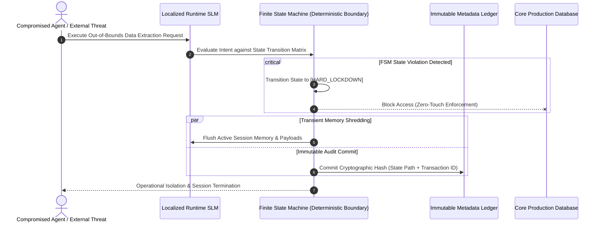

# Beyond the AI Bubble: Intent-Driven Infrastructure & Deterministic Governance

## Executive Summary

The enterprise AI narrative is undergoing a structural correction. Across multinational corporations (MNCs), balance sheets reflect an identical pattern: escalating CapEx, volatile token costs, and compounding operational friction yielding negligible ROI. 

The core bottleneck is not model capability; it is **Architectural Over-Reliance**. 

Forcing domain experts to act as editorial shadows—spending unbillable hours negotiating with probabilistic chat boxes—creates severe enterprise risk. Scaling enterprise AI requires shifting from unconditional model trust to **deterministic structural enclosure**.

---

## Contextual Complexity vs. Deterministic Boundaries

The primary enterprise constraint is not parameter count, but global compliance (ISO 42001, GDPR) and data sovereignty. Plugging probabilistic LLMs directly into legacy infrastructure creates systemic vectors for corporate liability. 

A single boundary failure collapses into regulatory non-compliance. Boardrooms require absolute governance, not creative approximations. Relying on vendor-locked platform guardrails cedes digital sovereignty. Enterprises require an independent, deterministic boundary that isolates probabilistic noise before it touches production databases.

---

## Intent-Driven Infrastructure Topology

To achieve measurable ROI, reasoning orchestration must decouple intelligence from operational execution. The topology divides processing into two distinct layers:

Legacy Policies] ---> (Offline Heavy-Lifting: Foundational Models) ---> [Constraint Rules]
|
[User Intent] --------> (Runtime Enforcement: Localized SLMs) -----------> [FSM Boundary] ---> [Execution / Lockdown]

1. **Offline Heavy-Lifting**: Foundational models operate out-of-band, parsing legacy unstructured policies into machine-readable constraint rules.
2. **Runtime Enforcement**: Localized, low-latency Small Language Models (SLMs) operate caged within a Finite State Machine (FSM) boundary. Any cross-boundary attempt triggers an immediate, hard-coded operational lockdown.

---

## Asymmetric Auditing via Transient Processing

To satisfy stringent data minimization mandates (GDPR) and AI governance standards (ISO 42001), the topology bifurcates payload from state:

* **Transient Payloads**: Localized session memory is cryptographically shredded post-operation. Core data assets remain stationary within enterprise perimeters.
* **Immutable Metadata Ledger**: The governance layer commits an unalterable cryptographic hash of the transaction and FSM state path to an independent ledger. This delivers total process traceability with zero-knowledge retention.

---

## Operational Scenarios & Architectural Sequence

The FSM boundary enforces containment across three primary tail-risk scenarios:

1. **Automated Baseline**: Runtime SLMs map intent directly to the FSM, processing routine transactions within predefined compliance parameters without human overhead.
2. **Context-Aware Interception**: The framework catches critical context gaps (e.g., authorizing CFO is on medical leave) and freezes unauthorized wire transfers prior to database commit.
3. **Exfiltration Containment**: A compromised vendor agent attempts out-of-bounds data extraction. The FSM detects the state violation, triggers an immediate lockdown, and flushes session memory.

### Sequence Diagram: Deterministic FSM Lockdown & Auditing

## Conclusion
Stop waiting for frontier models to fit the enterprise. Sovereign Infrastructure Architecture (SIA) provides the non-intrusive governance layer required to lock down compliance today, enabling the safe deployment of autonomous intelligence tomorrow.

This document was structured with the help of AI, and curated by Sana.M
