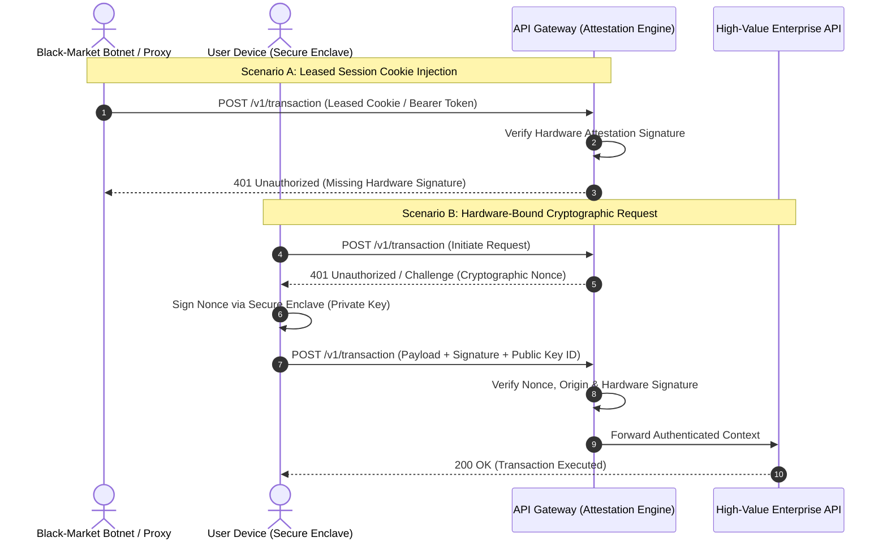

# Section 1: Executive Summary & Systemic Threat Model

## Executive Summary

Modern enterprise security architectures carry a fatal systemic assumption: that end-users will maintain cybersecurity discipline when presented with direct economic incentives. In high-value digital ecosystems, users actively monetise their digital footprints by leasing SMS OTPs, static API keys, and active session cookies to third-party proxy networks and black-market automation brokers.

Relying on cleartext, transferable bearer tokens under high economic incentives creates an unmanaged attack surface. When compromised credentials are fed into botnet networks for automated exploitation, regulatory frameworks no longer classify the resulting breach as "user error." Enterprise platforms are increasingly held liable for **systemic negligence** due to flawed architectural design.

To mitigate this exposure, enterprise architects must decouple authorization from transferable digital artifacts and mathematically anchor execution authority directly to physical hardware.

---

## The Economics of User-Driven Credential Leakage

```text
+-------------------+      Financial Yield      +-----------------------+

|    End User       | ------------------------> | Black-Market Network  |
| (Account Holder)  | <------------------------ |  (Proxy & Botnets)    |
+-------------------+   Leases Session/OTP  +-----------------------+

|                                                 |
| Releases Bearer Token / Cookie                  | Injects Stolen Token
v                                                 v
+-------------------------------------------------------------------+

|                     Enterprise API Gateway                        |
|  (Lacks Hardware Binding -> Grants High-Privilege Execution)      |
+-------------------------------------------------------------------+
```
## Economic Factors & User Behavior

1. **Secondary Market Value**: High-value assets (e.g., restricted access, API quotas, monetary rewards) generate secondary market premiums.
2. **Rational Economic Behavior**: Users trade long-term organizational security for immediate, short-term financial yield.
3. **Execution Delegation**: By voluntarily surrendering session tokens, users effectively delegate root execution privileges to automated threat actors.

---

## Regulatory Risk & Compliance Exposure

Relying on transferable bearer tokens in high-incentive environments directly violates modern cybersecurity mandates:

* **EU DORA (Digital Operational Resilience Act - Articles 9 & 10)**: Mandates robust identification and access management (IAM) frameworks that prevent unauthorized session hijacking and automated credential exploitation.
* **GDPR (Article 32 - Security of Processing)**: Requires state-of-the-art technical measures to guarantee ongoing confidentiality and integrity. Unanchored bearer tokens subject to public leasing schemes fail to meet the threshold for appropriate organizational and technical safeguards.

# Section 2: Hardware-Bound Dynamic Anchoring Architecture

## Architectural Blueprint

To eliminate the risk of session token delegation, the enterprise authorization model must transition from **Possession-Based Access Control (PBAC)** using transferable cleartext tokens to **Hardware-Bound Attestation Control (HBAC)**.

Execution authority is anchored directly to non-transferable physical hardware components—such as device-level Secure Enclaves, TPMs (Trusted Platform Modules), or FIDO2/WebAuthn hardware keys.

``` text

+-----------------------------------------------------------------------------------+
|                                  CLIENT DEVICE                                    |
|                                                                                   |
|  +--------------------+      Signs Challenge       +---------------------------+  |
|  |  Client Application| -------------------------> | Hardware Secure Element   |  |
|  |  (Untrusted Zone)  | <------------------------- | (Private Key Non-Export)  |  |
|  +--------------------+     Asymmetric Signature   +---------------------------+  |
+-----------------------------------------------------------------------------------+
|
| API Request + Attestation Payload + Nonce Signature
v
+-----------------------------------------------------------------------------------+
|                                ENTERPRISE GATEWAY                                 |
|                                                                                   |
|  +-----------------------------------------------------------------------------+  |
|  | Hardware Attestation Engine                                                 |  |
|  | - Verifies Hardware Root of Trust (RoT)                                     |  |
|  | - Validates Asymmetric Cryptographic Signature                              |  |
|  | - Checks Anti-Replay Nonce & Origin Domain                                  |  |
|  +-----------------------------------------------------------------------------+  |
+-----------------------------------------------------------------------------------+
|
| Validated Request (Hardware Authenticated)
v
+-----------------------------------------------------------------------------------+
|                           INTERNAL MICROSERVICES / APIs                           |
+-----------------------------------------------------------------------------------+

```

## Authentication & Authorization Sequence

The following sequence illustrates how the API Gateway rejects compromised or proxy-hijacked requests while validating requests cryptographically bound to hardware.



*** This document was structured with the help of AI, and curated by ***Sana.M***

