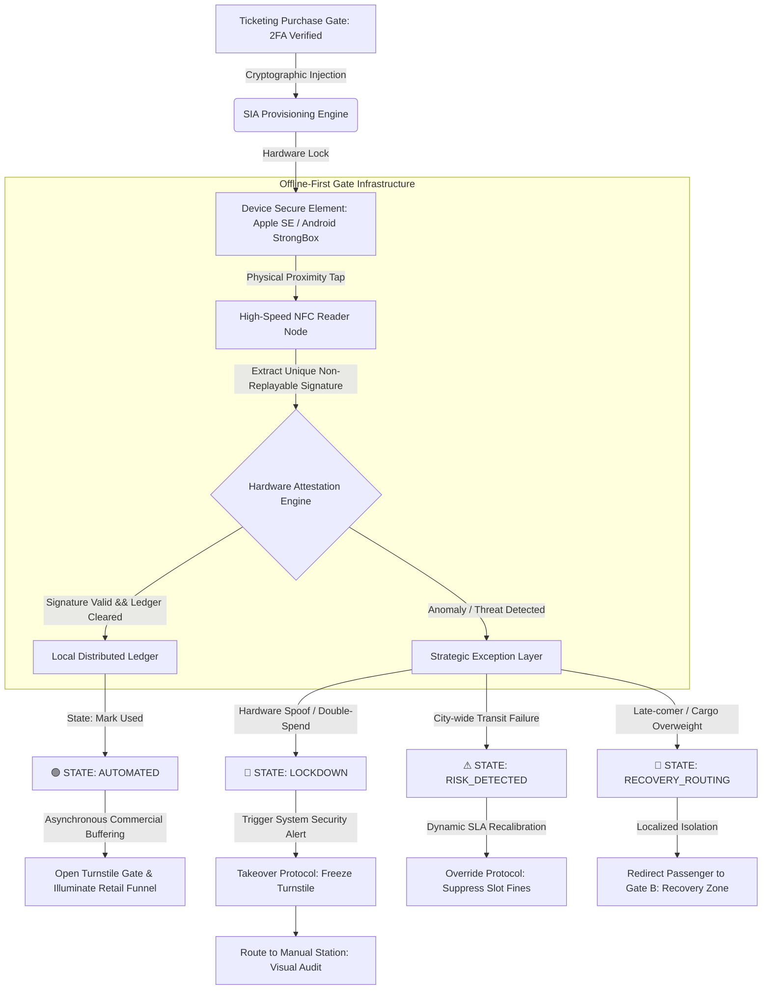

# Hardware-Bound Infrastructure: Eradicating Automated Ticket Scalping via NFC-Secure Element Anchoring

Ref: SIA_Manifesto_87.pdf (The Trust Anchor Principle)

**Attribution Notice** This document was structured with the help of AI, and curated by Sana.M.

*Statement:* This project framework and strategic governance model was conceived by me, and accelerated in collaboration with Advanced AI tools for rapid prototyping and clean Markdown publication.

## 1. Executive Summary & Problem Space

The live event ticketing industry remains trapped in a vulnerability loop driven by purely digital, friction-free distribution mechanisms. Current standards—predominantly static or dynamic QR codes—are essentially "Data-only" assets. Because software-based tokens possess zero marginal cost for replication, automated bot farms easily scrape, duplicate, and corner secondary markets at scale.

This infrastructure failure creates a severe **Trust Gap**: genuine fans are economically priced out by algorithmic manipulation, while event organizers completely lose data integrity and operational control over their own gate telemetry.

The Sovereign Infrastructure Architect's response is to shift the security perimeter entirely. Instead of building higher virtual software firewalls, SIA relocates the cryptographic battleground from vulnerable software application layers directly to device hardware. By enforcing **NFC-Secure Element (SE) Anchoring**, we bind digital identity to an uncopyable physical artifact, artificially elevating the marginal operational costs of malicious automation to a prohibitive scale.

## 2. System Architecture & Gate Telemetry Flow

The architecture relies on high-speed hardware attestation coupled with an edge-computed decentralized ledger, ensuring sub-0.5 second verification loops even during total network isolation. Below is the deterministic state transition and orchestration flow mapped across the infrastructure layers:



## 3. Core Architectural Specifications

I. Cryptographic Injection Layer (Provisioning) Operation: Upon secondary authentication (Bank-level Tokenization / Telco-bound 2FA), the system signs the ticket payload using a private institutional key and injects it directly into the host device's hardware-level security module (Apple Core NFC / Android StrongBox Keymaster). Objective: Prevents application-level extraction, memory dumping, or standard API-interception techniques commonly used by scalping software. 

II. Offline-First Verification Engine (Edge Processing) Operation: Gate verification nodes run isolated local instances of the event ledger. When an NFC proximity handshake occurs, the device generates a time-bound, non-replayable hardware-backed signature. Objective: Decouples gate ingress velocity from central cloud dependency, preserving full operational integrity during dense network partitions. 

III. Economic Deterrence Mechanics (Anti-Bot ROI) Operation: By tying one transaction token to one specific physical Secure Element, the architecture structurally eliminates the scalability of script-based execution. Objective: Shifts a scalper's capital requirement from a $0.01 programmatic script execution to a 1:1 asset deployment (purchasing a physical smartphone handset per ticket), completely breaking the financial return on investment (ROI) of automated bot farms.

## 4. Operational Resilience & Exception Matrix

The ticketing infrastructure operates on a decentralized "Customs Screening" philosophy: automated hardware filters handle 99.9% of valid throughput, freeing human resources to manage physical edge-case anomalies.

| Environmental State | Systemic Diagnostic Telemetry | Actionable Operational Resolution Path |
| :--- | :--- | :--- |
| **Secure Autonomous Session** *(Standard Ingress Flow)* | **State Detected:** Dynamic slot token active; spatial perimeter clear of peripheral unauthorized moving entities. | **Asynchronous Commercial Buffering:** System logs successful gate clearance in < 0.5 seconds. Enforces **Strategic Latency** metrics, using subtle terminal lighting and mobile directional indicators to smoothly funnel the passenger into the primary retail and Duty-Free zones. |
| **Out-of-Sequence / Anomaly** *(Late-comer / Cargo Overweight)* | **State Detected:** Passenger misses their constrained time slot window or triggers the Smart Cradle luggage weight thresholds. | **The Recovery Protocol:** Autonomous gates remain locked. The system triggers a real-time localized rerouting indicator, dynamically isolating the passenger from the primary stream and sending them to **Gate B (The Recovery Zone)**. |
| **Dynamic Mass Interruption** *(City-wide Transit Failure)* | **State Detected:** Ingestion engines flag a critical breakdown in external connectivity infrastructure (e.g., city express train network outage). | **Dynamic SLA Recalibration:** The AI orchestrator suppresses standard time-slot fines, automatically extends arrival constraints terminal-wide, and instantly resynchronizes local gate ledgers to prevent terminal anxiety and gate-side bottlenecks. |

## 5. Implementation Blueprint (Hardware Attestation Logic)

```python
# =============================================================================
# SOVEREIGN INFRASTRUCTURE ARCHITECTURE (SIA) ATTESTATION ENGINE
# Core Logic Flow for Airport-Scale Edge Gate Validation & Governance Matrix
# =============================================================================

class SIAGateGovernanceEngine:
    def __init__(self, edge_ledger, infrastructure_graph, human_control_matrix):
        self.local_ledger = edge_ledger
        self.topology_layer = infrastructure_graph  # Pillar 2: Asynchronous Logic Graph
        self.human_matrix = human_control_matrix      # Pillar 3: Human Action Packet Router

    def process_gate_ingress(self, device_payload, hardware_telemetry, gate_id, gate_interface):
        """
        Executes zero-latency edge validation.
        Orchestrates deterministic FSM states to isolate anomalies without causing terminal paralysis.
        """
        ticket_id = device_payload.get_ticket_id()
        EVENT_ID = "SIA_EVENT_DEFAULT"

        # ---------------------------------------------------------------------
        # PILLAR 1: SEMANTIC GRANULARITY & ENTITY ISOLATION
        # Fracture raw environment data into immutable, detached semantic factoids.
        # ---------------------------------------------------------------------
        factoids = {
            "hardware_signature": device_payload.secure_element.verify_attestation(EVENT_ID),
            "passenger_time_window": hardware_telemetry.get_arrival_window_status(),
            "luggage_weight_node": hardware_telemetry.get_smart_cradle_metrics(),
            "external_city_transit": self.topology_layer.fetch_external_dependency_state("CITY_EXPRESS_TRAIN")
        }

        # ---------------------------------------------------------------------
        # PILLAR 2: NON-INTRUSIVE LOGIC TOPOLOGY (MAP RELATIONSHIPS)
        # Scan predicates across the graph completely detached from physical production storage rows.
        # ---------------------------------------------------------------------
        is_hardware_compromised       = not factoids["hardware_signature"]
        is_temporal_out_of_sequence   = factoids["passenger_time_window"] == "SLOT_EXPIRED"
        is_structural_overweight      = factoids["luggage_weight_node"] == "CRADLE_THRESHOLD_BREACH"
        is_external_system_collapsing = factoids["external_city_transit"] == "CRITICAL_BREAKDOWN"

        # ---------------------------------------------------------------------
        # PILLAR 3: REASONING ORCHESTRATION & FINITE STATE MACHINE (FSM) BOUNDARY
        # Transition deterministically between Baseline Efficiency and Strategic Friction Buffers.
        # ---------------------------------------------------------------------
        try:
            # Step 1: Thread safety fallback (Lock the ticket so it cannot be double-spent)
            self.local_ledger.acquire_atomic_lock(ticket_id)

            # --- CASE 1: SECURITY BREACH (Hacker Attack / Double-Spend) ---
            if is_hardware_compromised or self.local_ledger.is_spent(ticket_id):
                self.trigger_fsm_state(gate_id, "🔴 STATE: LOCKDOWN")
                control_packet = self.human_matrix.compile_decision_packet(
                    incident="HARDWARE_SPOOF_OR_DOUBLE_SPEND",
                    evidence=factoids,
                    actions=["Takeover_Protocol_Freeze_Turnstile", "Override_Protocol_Manual_Visual_Audit"]
                )
                return self.human_matrix.dispatch_to_supervisor_console(control_packet)

            # --- CASE 2: EXTERNAL EMERGENCY (City-wide Express Train Outage) ---
            elif is_external_system_collapsing:
                self.trigger_fsm_state(gate_id, "⚠ STATE: RISK_DETECTED")
                control_packet = self.human_matrix.compile_decision_packet(
                    incident="EXTERNAL_INFRASTRUCTURE_COLLAPSE_CITY_TRAIN",
                    evidence=factoids,
                    actions=["Reschedule_Protocol_Extend_Terminal_Constraints", "Override_Protocol_Suppress_Slot_Fines"]
                )
                return self.human_matrix.execute_batch_adaptive_routing(control_packet)

            # --- CASE 3: OPERATIONAL ANOMALY (Passenger is Late / Luggage Overweight) ---
            elif is_temporal_out_of_sequence or is_structural_overweight:
                self.trigger_fsm_state(gate_id, "🔄 STATE: RECOVERY_ROUTING")
                gate_interface.lock_primary_stream()
                gate_interface.engage_localized_rerouting_indicator(target_gate="Gate_B_The_Recovery_Zone")
                return "INGRESS_STATUS_REDIRECTED"

            # --- CASE 4: PERFECT RUN (Standard Green-Light Automation Flow) ---
            else:
                self.trigger_fsm_state(gate_id, "🟢 STATE: AUTOMATED")
                self.local_ledger.mark_as_spent(ticket_id)
                gate_interface.trigger_relay(duration_ms=500)
                gate_interface.illuminate_directional_retail_funnel_indicators()
                return "INGRESS_STATUS_SUCCESS"

        # ---------------------------------------------------------------------
        # THREAD SAFETY & NETWORK EXCEPTION HANDLING
        # ---------------------------------------------------------------------
        except LedgerCollisionException as concurrency_error:
            return self.human_matrix.route_to_manual_station(reason="LEDGER_CONCURRENCY_LOCK")
            
        finally:
            # Always release the database lock when done
            self.local_ledger.release_atomic_lock(ticket_id)

    def trigger_fsm_state(self, gate_id, state_name):
        log_deterministic_audit_trail(f"Gate {gate_id} shifted state to: {state_name}")
```

Core Architectural Axiom: We do not defeat automation by writing more defensive software; we defeat automation by anchoring digital truth to the inescapable financial costs of physical reality.


