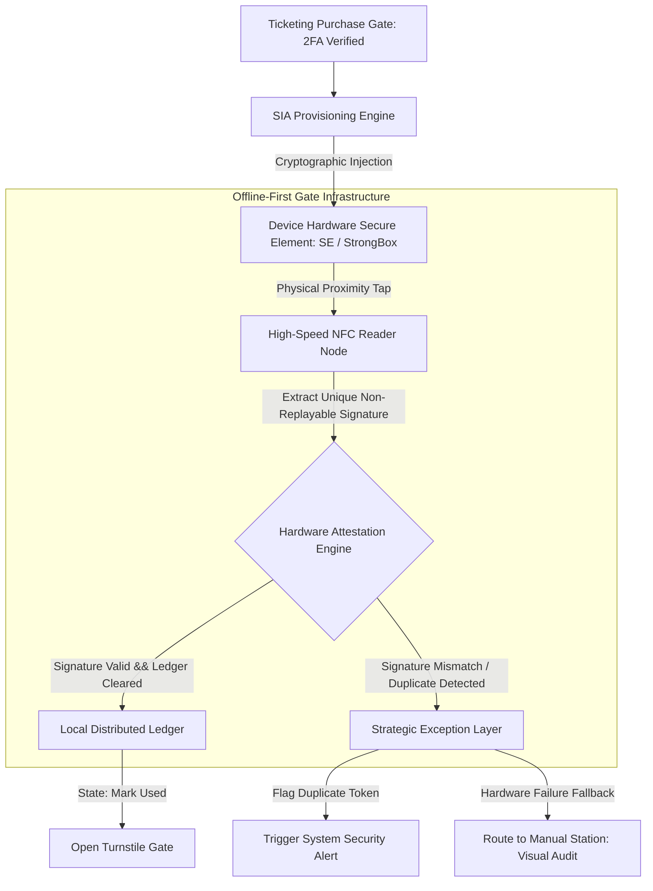

# Hardware-Bound Infrastructure: Eradicating Automated Ticket Scalping via NFC-Secure Element Anchoring
Ref: SIA_Manifesto_87.pdf (The Trust Anchor Principle)

> **Attribution Notice**
> This document was structured with the help of AI, and curated by SanaM.
> 
> *Statement:* This project framework and strategic governance model was conceived by me, and accelerated in collaboration with Advanced AI tools for rapid prototyping and clean Markdown publication.
# Hardware-Bound Infrastructure: Eradicating Automated Ticket Scalping via NFC-Secure Element Anchoring
Ref: SIA_Manifesto_96.pdf

> **Attribution Notice**
> This document was structured with the help of AI, and curated by MSK.

---

## 1. Executive Summary & Problem Space
The live event ticketing industry remains trapped in a vulnerability loop driven by purely digital, friction-free distribution mechanisms. Current standards—predominantly static or dynamic QR codes—are essentially "Data-only" assets. Because software-based tokens possess zero marginal cost for replication, automated bot farms easily scrape, duplicate, and corner secondary markets at scale. 

This infrastructure failure creates a severe Trust Gap: genuine fans are economically priced out by algorithmic manipulation, while event organizers completely lose data integrity and operational control over their own gate telemetry. 

The Sovereign Infrastructure Architecture (SIA) response is to shift the security perimeter entirely. Instead of building higher virtual software firewalls, SIA relocates the cryptographic battleground from vulnerable software application layers directly to device hardware. By enforcing NFC-Secure Element (SE) Anchoring, we bind digital identity to an uncopyable physical artifact, artificially elevating the marginal operational costs of malicious automation to a prohibitive scale.

---

## 2. System Architecture & Gate Telemetry Flow
The architecture relies on high-speed hardware attestation coupled with an edge-computed decentralized ledger, ensuring sub-0.5 second verification loops even during total network isolation.

## 3. Core Architectural Specifications
I. Cryptographic Injection Layer (Provisioning)
Operation: Upon secondary authentication (Bank-level Tokenization / Telco-bound 2FA), the system signs the ticket payload using a private institutional key and injects it directly into the host device’s hardware-level security module (Apple Core NFC / Android StrongBox Keymaster).
Objective: Prevents application-level extraction, memory dumping, or standard API-interception techniques commonly used by scalping software.
II. Offline-First Verification Engine (Edge Processing)
Operation: Gate verification nodes run isolated local instances of the event ledger. When an NFC proximity handshake occurs, the device generates a time-bound, non-replayable hardware-backed signature.
Objective: Decouples gate ingress velocity from central cloud dependency, preserving full operational integrity during dense network partitions.
III. Economic Deterrence Mechanics (Anti-Bot ROI)
Operation: By tying one transaction token to one specific physical Secure Element, the architecture structurally eliminates the scalability of script-based execution.
Objective: Shifts a scalper's capital requirement from a $0.01 programmatic script execution to a 1:1 asset deployment (purchasing a physical smartphone handset per ticket), completely breaking the financial return on investment (ROI) of automated bot farms.

## 4. Operational Resilience & Exception Matrix

| Target Entry State | Diagnostic System Output | Actionable Resolution Path |
| :--- | :--- | :--- |
| **Authenticated Hardware Pass** *(Standard Entry Flow)* | **State Detected:** Proximity signature matches unique hardware block; local ledger registers token as unspent. | **Immediate Autonomous Execution:** System logs the token state change to the edge database, unlocks the turnstile, and clears entry in `< 0.5` seconds. |
| **Cryptographic Replay Attempt** *(Fraud/Duplication Signature)* | **State Detected:** System detects a pre-existing hardware signature or a cluster of synchronized tokens roaming between terminal ranges. | **Automated Containment:** The gate locks down autonomously, flags the specific device ID on the local network, and generates an automated fraud alert package for onsite security teams. |
| **Hardware Failure / Legacy Device** *(Legacy Platform Fallback)* | **State Detected:** User possesses valid purchase ledger entry but device lacks Secure Element compatibility, or hardware is physically damaged. | **Strategic Buffer Isolation:** System routes the user to a dedicated **Manual Station**. Personnel verify proof-of-purchase via registered phone numbers or government IDs, issuing an alternative physical NFC-enabled Smart Card. |

## Implementation Blueprint (Hardware Attestation Logic)
Ref: Pillar 1-3_96.pdf
# =============================================================================
# DETACHED HARDWARE ATTESTATION ENGINE
# Core Logic Flow for Edge Gate Validation under SIA Framework
# =============================================================================

def process_gate_ingress(device_payload, local_ledger, gate_interface):
    """
    Evaluates physical hardware signature against localized edge records.
    Bypasses probabilistic network validation for deterministic edge security.
    """
    ticket_id = device_payload.get_ticket_id()
    
    # Phase 1: Cryptographic Hardware Integrity Verification
    if not device_payload.secure_element.verify_attestation(EVENT_ID):
        log_security_anomaly(ticket_id, "Attestation Failure: Invalid Hardware Layer")
        return redirect_to_manual_counter(reason="UNSUPPORTED_OR_FORGED_HARDWARE")
        
    # Phase 2: Local Ledger Double-Spend Audit (Anti-Replay Loop)
    try:
        local_ledger.acquire_atomic_lock(ticket_id)
        
        if not local_ledger.is_spent(ticket_id):
            # Safe Execution Path
            local_ledger.mark_as_spent(ticket_id)
            gate_interface.trigger_relay(duration_ms=500)
            return INGRESS_STATUS_SUCCESS
        else:
            # Deterministic Fraud Intercept
            trigger_system_alert(ticket_id, severity="CRITICAL", detail="Duplicate Hardware Signature Present")
            return INGRESS_STATUS_REJECTED
            
    except LedgerCollisionException as error:
        return redirect_to_manual_counter(reason="LEDGER_CONCURRENCY_LOCK")
    finally:
        local_ledger.release_atomic_lock(ticket_id)
        #
  Core Architectural Axiom: We do not defeat automation by writing more defensive software; we defeat automation by anchoring digital truth to the inescapable financial costs of physical reality[cite: 1].
