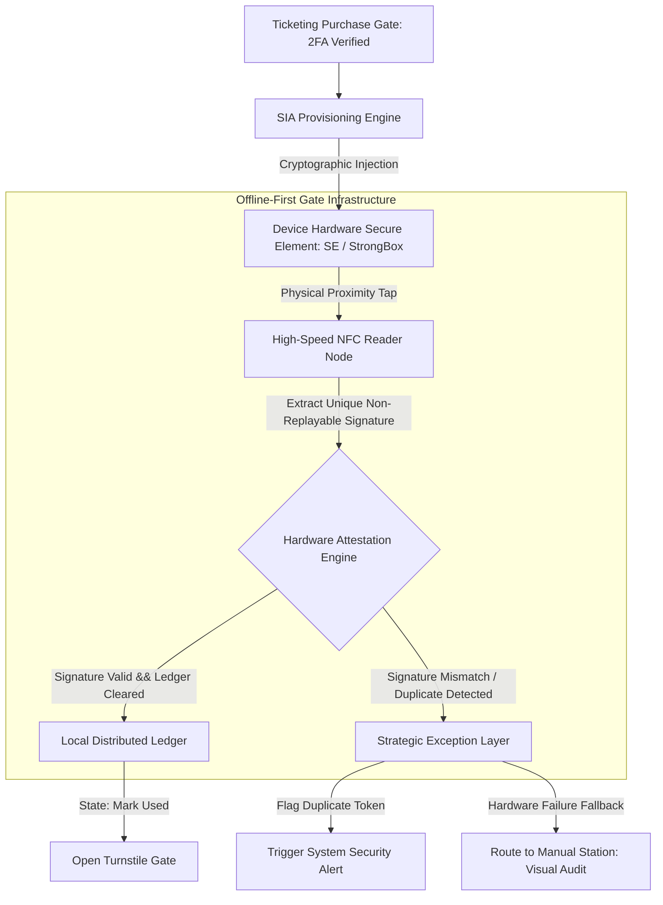

# Hardware-Bound Infrastructure: Eradicating Automated Ticket Scalping via NFC-Secure Element Anchoring
Ref: SIA_Manifesto_87.pdf (The Trust Anchor Principle)

> **Attribution Notice**
> This document was structured with the help of AI, and curated by Sana.M.
> 
> *Statement:* This project framework and strategic governance model was conceived by me, and accelerated in collaboration with Advanced AI tools for rapid prototyping and clean Markdown publication.

---

## 1. Executive Summary & Problem Space
The live event ticketing industry remains trapped in a vulnerability loop driven by purely digital, friction-free distribution mechanisms. Current standards—predominantly static or dynamic QR codes—are essentially "Data-only" assets. Because software-based tokens possess zero marginal cost for replication, automated bot farms easily scrape, duplicate, and corner secondary markets at scale. 

This infrastructure failure creates a severe **Trust Gap**: genuine fans are economically priced out by algorithmic manipulation, while event organizers completely lose data integrity and operational control over their own gate telemetry. 

The Sovereign Infrastructure Architect's response is to shift the security perimeter entirely. Instead of building higher virtual software firewalls, SIA relocates the cryptographic battleground from vulnerable software application layers directly to device hardware. By enforcing **NFC-Secure Element (SE) Anchoring**, we bind digital identity to an uncopyable physical artifact, artificially elevating the marginal operational costs of malicious automation to a prohibitive scale.

---

## 2. System Architecture & Gate Telemetry Flow
The architecture relies on high-speed hardware attestation coupled with an edge-computed decentralized ledger, ensuring sub-0.5 second verification loops even during total network isolation.

## 3. Core Architectural Specifications
I. Cryptographic Injection Layer (Provisioning)
Operation: Upon secondary authentication (Bank-level Tokenization / Telco-bound 2FA), the system signs the ticket payload using a private institutional key and injects it directly into the host device’s hardware-level security module (Apple Core NFC / Android StrongBox Keymaster).
Objective: Prevents application-level extraction, memory dumping, or standard API-interception techniques commonly used by scalping software.
II. Offline-First Verification Engine (Edge Processing)
Operation: Gate verification nodes run isolated local instances of the event ledger. When an NFC proximity handshake occurs, the device generates a time-bound, non-replayable hardware-backed signature.
Objective: Decouples gate ingress velocity from central cloud dependency, preserving full operational integrity during dense network partitions.
III. Economic Deterrence Mechanics (Anti-Bot ROI)
Operation: By tying one transaction token to one specific physical Secure Element, the architecture structurally eliminates the scalability of script-based execution.
Objective: Shifts a scalper's capital requirement from a $0.01 programmatic script execution to a 1:1 asset deployment (purchasing a physical smartphone handset per ticket), completely breaking the financial return on investment (ROI) of automated bot farms.

## 4. Operational Resilience & Exception Matrix
The ticketing infrastructure operates on a decentralized "Customs Screening" philosophy: automated hardware filters handle 99.9% of valid throughput, freeing human resources to manage physical edge-case anomalies.

| Environmental State | Systemic Diagnostic Telemetry | Actionable Operational Resolution Path |
| :--- | :--- | :--- |
| **Secure Autonomous Session** *(Standard Ingress Flow)* | **State Detected:** Dynamic slot token active; spatial perimeter clear of peripheral unauthorized moving entities. | **Asynchronous Commercial Buffering:** System logs successful gate clearance in `< 0.5` seconds. Enforces **Strategic Latency** metrics, using subtle terminal lighting and mobile directional indicators to smoothly funnel the passenger into the primary retail and Duty-Free zones. |
| **Out-of-Sequence / Anomaly** *(Late-comer / Cargo Overweight)* | **State Detected:** Passenger misses their constrained time slot window or triggers the Smart Cradle luggage weight thresholds. | **The Recovery Protocol:** Autonomous gates remain locked. The system triggers a real-time localized rerouting indicator, dynamically isolating the passenger from the primary stream and sending them to **Gate B (The Recovery Zone)**. |
| **Dynamic Mass Interruption** *(City-wide Transit Failure)* | **State Detected:** Ingestion engines flag a critical breakdown in external connectivity infrastructure (e.g., city express train network outage). | **Dynamic SLA Recalibration:** The AI orchestrator suppresses standard time-slot fines, automatically extends arrival constraints terminal-wide, and instantly resynchronizes local gate ledgers to prevent terminal anxiety and gate-side bottlenecks. |

## 5. Implementation Blueprint (Hardware Attestation Logic)
# =============================================================================
# DETACHED HARDWARE ATTESTATION ENGINE
# Core Logic Flow for Edge Gate Validation under SIA Framework
# =============================================================================

def process_gate_ingress(device_payload, local_ledger, gate_interface):
    """
    Evaluates physical hardware signature against localized edge records.
    Bypasses probabilistic network validation for deterministic edge security.
    """
    ticket_id = device_payload.get_ticket_id()
    
    # Phase 1: Cryptographic Hardware Integrity Verification
    if not device_payload.secure_element.verify_attestation(EVENT_ID):
        log_security_anomaly(ticket_id, "Attestation Failure: Invalid Hardware Layer")
        return redirect_to_manual_counter(reason="UNSUPPORTED_OR_FORGED_HARDWARE")
        
    # Phase 2: Local Ledger Double-Spend Audit (Anti-Replay Loop)
    try:
        local_ledger.acquire_atomic_lock(ticket_id)
        
        if not local_ledger.is_spent(ticket_id):
            # Safe Execution Path
            local_ledger.mark_as_spent(ticket_id)
            gate_interface.trigger_relay(duration_ms=500)
            return INGRESS_STATUS_SUCCESS
        else:
            # Deterministic Fraud Intercept
            trigger_system_alert(ticket_id, severity="CRITICAL", detail="Duplicate Hardware Signature Present")
            return INGRESS_STATUS_REJECTED
            
    except LedgerCollisionException as error:
        return redirect_to_manual_counter(reason="LEDGER_CONCURRENCY_LOCK")
    finally:
        local_ledger.release_atomic_lock(ticket_id)
        #
  Core Architectural Axiom: We do not defeat automation by writing more defensive software; we defeat automation by anchoring digital truth to the inescapable financial costs of physical reality.
