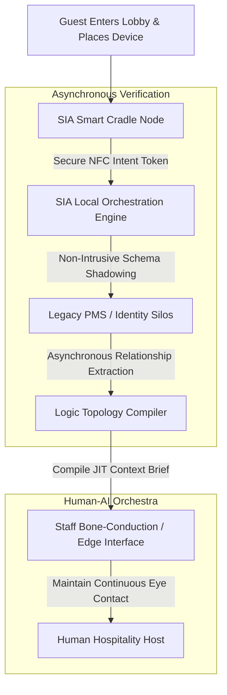

# Human-Centric Hospitality: Intent-Driven Arrival Orchestration via Strategic Decoupling
Ref: SIA_Manifesto_114.pdf (The Trust Anchor Principle)

> **Attribution Notice**
> This document was structured with the help of AI, and curated by Sana.M.
> 
> *Statement:* This project framework and strategic governance model was conceived by me, and accelerated in collaboration with Advanced AI tools for rapid prototyping and clean Markdown publication.

---

## 1. Executive Summary & Problem Space
Modern hospitality digital transformation has systematically conflated innovation with self-service automation. By forcing guests to interface with physical kiosks or mobile web forms during checkout and check-in, enterprises pass administrative labor onto the customer, degrading a luxury five-star arrival into a transactional commodity.

This architecture addresses the operational friction caused by over-coupled data structures within legacy Property Management Systems (PMS). When hospitality staff spend arrival interactions interrogating database fields rather than engaging guests, human capital is wasted on data entry. **Project Hotel** utilizes the SIA 2.0 framework to decouple data processing logic from frontline human engagement. By capturing passive intent via physical hardware anchoring, the system clears the administrative burden from the front desk, transforming operations into an orchestrated arrival ritual.

---

## 2. System Architecture & Arrival Ritual Flow
The architecture utilizes non-intrusive edge scanning to isolate identity verification from customer eye contact.

## 3. Core Architectural Specifications
I. Passive Intent Capture (The Smart Cradle)
Operation: A multi-layered NFC terminal integrated into reception surfaces captures a proximity-locked "Intent Token" when a mobile device is placed down.
Objective: Eliminates software applications, scanning lines, and dynamic barcodes. The physical action of settling down triggers ambient background check-in validation.
II. Semantic Data Decoupling (Logic Isolation)
Operation: The local orchestration engine separates incoming traffic into decoupled semantic components. Frontline personnel interface with abstracted actionable directives (e.g., room preparation status) rather than raw legacy rows.  
PDF
Objective: Prevents staff cognitive overload and data-linking errors across fragmented legacy infrastructure layers.  
PDF
III. The Deterministic Physical Anchor
Operation: Digital verification cycles terminate with the programmatic generation of a tangible, mechanical physical credential (embossed room card or high-status physical pin).  
PDF
Objective: Grounds transient digital tokens into an un-deletable physical artifact, completing the psychological and operational parameters of safety and arrival.

## 4. Operational Resilience, Governance & Implementation
I. Strategic Exception Matrix
The runtime execution boundaries utilize deterministic fallback vectors to isolate systems during high-friction states.
| Environmental State | Systemic Diagnostic Telemetry | Actionable Operational Resolution Path |
| :--- | :--- | :--- |
| **Standard Ritual Processing** | Smart Cradle captures local validation hash; runtime topology maps room keys asynchronously. | **Automated Context Delivery:** Compile JIT brief to staff edge-terminals in `< 1.2` seconds; maintain standard ambient check-in flow without screen interference. |
| **Systemic Legacy Latency** | PMS response times breach established timeout thresholds or report database query paralysis. | **Calculated Friction Protocol:** Generate a localized "Decision Packet" containing standard override slots[cite: 2]. Prompt the host to issue temporary physical access tokens without stalling guest intake. |
| **Anomalous Behavioral Flag / High-Friction Content** | Semantic scanners detect priority verbal indicators or text-string exceptions (grief, acute distress). | **Semantic Kill-Switch Activation:** Terminate automated agent tasks instantly[cite: 2]. Route 100% of data governance to human-in-the-loop safety logic[cite: 1], returning operational priority to explicit empathy. |

II. Architectural Roadmap
| Phase | Operational & Technical Focus | Key Deliverables |
| :--- | :--- | :--- |
| **Phase 1: Diagnostic** | Audit system latencies and cognitive bottlenecks. | - Map cross-system latency profiles inside production legacy PMS databases. - Audit frontline worker cognitive load patterns and screen-gaze intervals. |
| **Phase 2: Prototyping** | Integrate physical touchpoints with shadow logic layers. | - Deploy SIA Smart Cradle hardware layer over local edge gateways. - Construct non-intrusive relational logic topology overlays above legacy storage targets[cite: 2]. |
| **Phase 3: Orchestration** | Execute controlled runtime deployment and staff onboarding. | - Execute pilot deployments across isolated high-tier luxury wings. - Calibrate JIT bone-conduction communication arrays and run automated fallback testing protocols. |

Core Architectural Axiom: Automation should never mandate self-service. True infrastructure resilience uses technology to secure data behind the scenes, leaving the human perimeter clear for uncompromised relationship cultivation.
