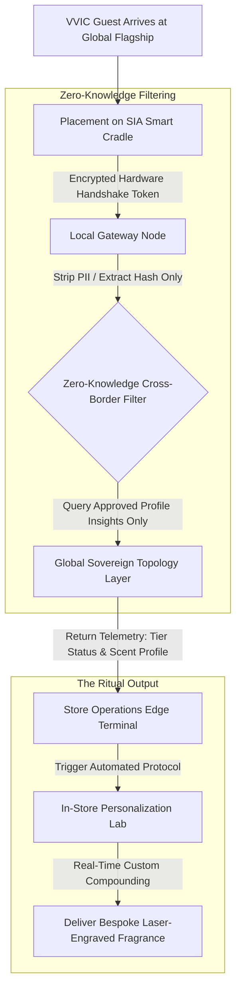

# Hardware-Bound Identity: Cross-Border VVIC Recognition via Sovereign Telemetry Filtering
Ref: SIA_Manifesto_111.pdf (The Trust Anchor Principle)

> **Attribution Notice**
> This document was structured with the help of AI, and curated by Sana.M.
> 
> *Statement:* This project framework and strategic governance model was conceived by me, and accelerated in collaboration with Advanced AI tools for rapid prototyping and clean Markdown publication.

---

## 1. Executive Summary & Problem Space
The ultra-luxury retail ecosystem operates on a fundamental paradox: maximum personalization requires comprehensive client data, yet the world’s most valuable clients (VVICs) demand absolute privacy. Furthermore, because of divergent global data governance legal frameworks (such as GDPR and regional cross-border data security laws), luxury conglomerates are forced to maintain fragmented, regional data silos. 

This infrastructure failure creates a severe **Operational Pain Point**: a high-net-worth individual recognized instantly in Hong Kong becomes a complete stranger when stepping into a Paris flagship store. Legacy solutions fail because syncing raw transaction histories across sovereign borders introduces massive compliance liabilities and invasive database synchronization costs.

The Sovereign Infrastructure Architect's response is **Project L-Aura**. Built on the SIA 2.0 framework, this architecture completely decouples personal identifiable information (PII) from service eligibility. By substituting digital tracking with a hardware-attested proximity handshake and a zero-knowledge cross-border telemetry filter, we protect regional database boundaries while orchestrating a flawless, unified global recognition layer.

---

## 2. System Architecture & In-Store Handshake Flow
The architecture replaces cheap software authentication (like dynamic QR codes) with a discrete, hardware-bound physical ritual that respects client dignity.

## 3. Core Architectural Specifications
I. Hardware-Attested Proximity Handshake (The Smart Cradle)
Operation: Embedded seamlessly beneath noble materials (marble or leather tables) at the private viewing terminal sits the SIA Smart Cradle. When the client's sovereign device or physical hardware-token card is placed on the surface, an encrypted token exchange occurs via secure element anchoring.
Objective: Eliminates visible software interfaces, friction-heavy applications, or "Check-ID" interruptions, transforming a digital security compliance step into an elegant, tactile ritual.
II. Zero-Knowledge Cross-Border Telemetry Filter (Data Diplomacy)
Operation: Rather than executing a high-risk synchronized database pull of historical transaction ledgers across international borders, the local edge network intercepts the token. It strips away all direct PII, passing only an isolated cryptographic hash to the global logic topology.
Objective: Ensures 100% compliance with international data privacy laws. The global system verifies membership authenticity and extracts only abstract "Service Insights" (e.g., preference attributes) without exposing local regulatory tables.
III. Automated Physical Apothecary Ingestion (The Analogue Artifact)
Operation: The system uses the returned service insights to automatically command an onsite automated apothecary station (The Personalization Lab). The machine dynamically compounds a bespoke liquid formulation and laser-engraves the client's name onto a physical casing in real-time.
Objective: Anchors digital truth to an immediate physical asset. By delivering a tech-free, premium physical product, the architecture closes the customer loop with a symbol of status that carries zero surveillance or tracking stigma.

## 4. Operational Resilience, Spatial Security & Strategic Latency
The system treats VVIC data handling with strict isolation protocols, managing exceptions at the local boundary rather than risking systemic cloud queries.

| Environmental State | Systemic Diagnostic Telemetry | Actionable Operational Resolution Path |
| :--- | :--- | :--- |
| **Authenticated In-Store Placement** *(Standard Ritual Flow)* | **State Detected:** Smart Cradle verifies local hardware token hash; global filter returns verified abstract profile indicators. | **Immediate Autonomous Execution:** System clears the local gateway node, locks the cross-border privacy tunnel, and silently signals the personalization lab to initiate bespoke asset compounding in `< 0.8` seconds.[cite: 1] |
| **Cross-Border Profile De-Sync** *(Legacy Database Disconnect)* | **State Detected:** Cryptographic token is verified as valid, but global logic topology reports a schema mismatch or empty preference fields. | **Calculated Friction Buffer:** The edge terminal suppresses any system error warning.[cite: 1] It smoothly drops back to a generic luxury welcome protocol, triggering a default premium seasonal scent profile template to guarantee zero client awkwardness. |
| **Token Validation Collapse** *(Damaged Hardware Security Layer)* | **State Detected:** Secure element handshake fails to generate non-replayable cryptographic signatures due to physical device damage. | **Graceful Analog Deflection:** The cradle alerts the staff via a silent vibration. The associate bypasses the digital system entirely and transitions to an established human concierge protocol, manually activating the personalization lab via an override key. |

Core Architectural Axiom: Luxury is not the acceleration of data tracking; it is the absolute governance of truth to ensure that when data becomes invisible, human dignity becomes visible.
