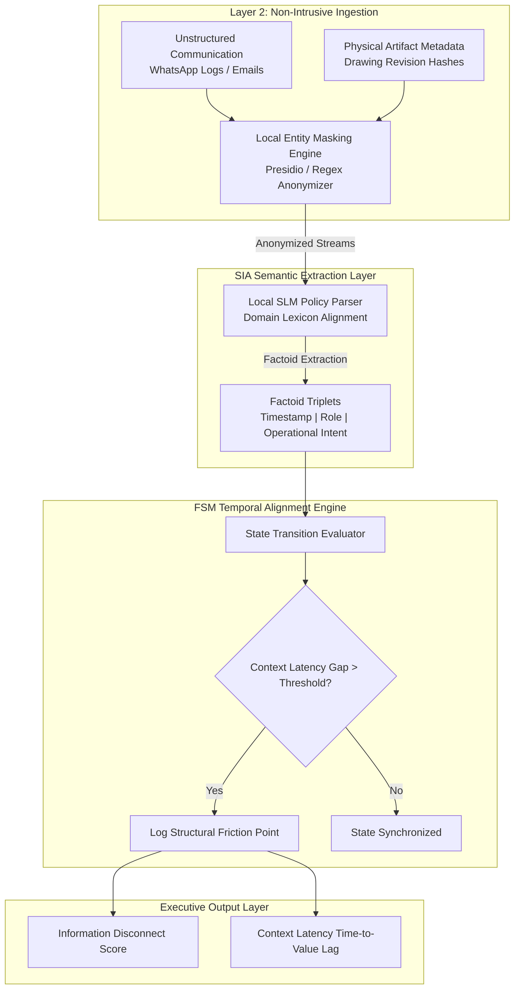

# Module: SIA Shadow Diagnostic Engine

> **Path:** `use-cases/shadow-diagnostic-engine/README.md`  
> **Classification:** Enterprise Architecture Specification & Reference Implementation  
> **Target Audience:** C-Suite Executives, Chief Architects, & Practice Leads  

---

## Executive Overview

High-value enterprise transformations and megaprojects rarely fail due to technical deficiencies or individual execution errors. They collapse under the weight of **Context Latency**—the temporal gap between strategic intent modification and operational field awareness.

In complex, multi-stakeholder ecosystems (such as AEC megaprojects, supply chain shifts, or cross-departmental legacy migrations), communication channels naturally diverge:

* **Strategic Intent Modifications** occur in formal channels (RFIs, formal drawing releases, contract addendums).
* **Operational Execution Realities** occur in informal, high-velocity channels (WhatsApp, site memos, physical printed PDFs).

This divergence creates a critical operational bottleneck: frontline teams execute work based on stale spatial or operational assumptions while formal change orders trickle through administrative layers.

Traditional project management tools attempt to solve this by imposing central dashboards or strict reporting workflows. This creates two critical failure modes:

1. **Adoption Friction & Silo Resistance:** Frontline teams bypass rigid portals and default to unstructured channels.
2. **Terminology Loss:** Architects, MEP Engineers, and Site Contractors speak mutually unintelligible domain dialects ("Design Intent" vs. "Load Clearance" vs. "Constructability").

The **SIA Shadow Diagnostic Engine** provides a zero-risk, non-intrusive diagnostic mechanism. Operating entirely as a **SIA Layer 2 Shadow**, it passively ingests unstructured communication artifacts, applies local entity masking, aligns multi-stakeholder semantics using a Small Language Model (SLM), and deterministically maps temporal gaps using a Finite State Machine (FSM).

---

## Architectural Topology

The engine operates on a non-intrusive, asynchronous pipeline that shadow-reads production artifacts without modifying legacy databases or interfering with active frontline workflows.

### Pipeline Flowchart



## The 1-Week Zero-Risk Shadow Audit Protocol

To diagnose structural friction without triggering organizational defense mechanisms or security reviews, the engine follows a strict 5-day execution protocol.

### Execution Protocol Summary

| Phase | Duration | Scope of Work | Operational Safeguards |
| :--- | :--- | :--- | :--- |
| **Phase 1: Ingestion Setup** | Day 1 | Define target project boundaries (e.g., Stage 0 to Stage 1 Handover). Establish passive ingestion endpoints for export logs. | Read-only access. Zero production schema mutations. |
| **Phase 2: Entity Isolation** | Day 2 | Run local sanitization scripts to strip PII, commercial contract values, and proprietary naming. | 100% on-premises execution. Zero cloud telemetry leakage. |
| **Phase 3: Semantic Extraction** | Day 3–4 | Process anonymized text through the local SLM to extract standardized Factoid Triplets and normalize domain jargon. | Immutable State Hash Logging for auditability. |
| **Phase 4: Latency Analysis** | Day 5 | Execute the FSM state evaluator to cross-reference intent revisions against physical execution logs. | Output generated as quantitative structural metrics. |

## Structural Data Schema

The SIA Shadow Diagnostic Engine enforces deterministic state transitions by parsing unstructured data into structured **Factoid Triplets**. High-level governance is summarized below, followed by the formal JSON Schema specification.

### Executive Schema Summary

| Field | Type | Business Logic & Governance Standard |
| :--- | :--- | :--- |
| `factoid_id` | UUIDv4 | Unique, non-traceable transaction identifier for state auditing. |
| `timestamp_utc` | ISO 8601 | Normalized UTC timestamp to measure precise temporal Context Latency ($\Delta t$). |
| `stakeholder_role` | Enum | Strict role boundary (`ARCHITECT`, `MEP_ENGINEER`, `MAIN_CONTRACTOR`, etc.). |
| `canonical_state_id` | String | Immutable state identifier (e.g., `STATE_STRUCTURAL_LAYOUT_REV_B`). |
| `constraint_signature` | Object | Standardized physical constraints (spatial clearance, drawing revision hash). |

### Factoid Triplet Definition (JSON Schema)

```json
{
  "$schema": "[https://json-schema.org/draft/2020-12/schema](https://json-schema.org/draft/2020-12/schema)",
  "title": "FactoidTriplet",
  "type": "object",
  "properties": {
    "factoid_id": { 
      "type": "string", 
      "format": "uuid" 
    },
    "timestamp_utc": { 
      "type": "string", 
      "format": "date-time" 
    },
    "stakeholder_role": { 
      "type": "string", 
      "enum": ["ARCHITECT", "MEP_ENGINEER", "MAIN_CONTRACTOR", "SUB_CONTRACTOR", "CLIENT"] 
    },
    "canonical_state_id": { 
      "type": "string" 
    },
    "raw_intent_summary": { 
      "type": "string" 
    },
    "constraint_signature": {
      "type": "object",
      "properties": {
        "spatial_clearance_mm": { 
          "type": "integer" 
        },
        "drawing_reference_hash": { 
          "type": "string" 
        }
      }
    }
  },
  "required": ["factoid_id", "timestamp_utc", "stakeholder_role", "canonical_state_id"]
}
```

### Context Latency & Disconnect Metrics

The FSM engine continuously evaluates two primary structural indicators to quantify operational risk and information degradation:

1. **Context Latency Gap ($\Delta t$)**: Measures the temporal lag between formal intent modifications and operational awareness in the field.

$$\text{Context Latency } (\Delta t) = T_{\text{Realized Execution}} - T_{\text{Intent Revision}}$$

2. **Semantic Disconnect Score (SDS)**: Measures the percentage of unaligned domain assertions across cross-functional stakeholder boundaries.

$$\text{Semantic Disconnect Score (SDS)} = \left( 1 - \frac{\text{Shared Canonical Factoids}}{\text{Total Domain Assertions}} \right) \times 100$$

## Reference Implementation & Execution Setup

A zero-dependency reference CLI diagnostic script (`anonymizer_and_parser.py`) and mock dataset (`mock_project_logs.json`) are provided in the `/src` directory to demonstrate local entity masking, factoid extraction, and deterministic context latency computation.

```bash
# Clone the repository
git clone [https://github.com/26200602/SIA-Agentic-AI-Architecture.git](https://github.com/26200602/SIA-Agentic-AI-Architecture.git)
cd SIA-Agentic-AI-Architecture/use-cases/shadow-diagnostic-engine

# Execute the zero-dependency diagnostic CLI
python3 src/anonymizer_and_parser.py --input src/mock_project_logs.json

```

## Sample Executable Output

================================================================================
SIA SHADOW DIAGNOSTIC ENGINE v1.0 | EXECUTION REPORT
================================================================================
[INFO] Local Entity Masking Engine initialized. (Zero Cloud Telemetry)
[INFO] Processing 142 unstructured communication artifacts...
[INFO] Executing SLM Semantic Mapping & FSM State Alignment...

--------------------------------------------------------------------------------
DIAGNOSTIC FINDINGS
--------------------------------------------------------------------------------
Target Scenario       : Stage 0 -> Stage 1 Handover (HVAC Plant Room Layout)
Primary Intent Drift  : Revision C (Architect) vs Revision A (Site Sub-Contractor)

[METRIC 1] Context Latency Gap      : 96.5 Hours
           Origin Intent Modified   : 2026-05-10T08:30:00Z (Email / Attachment)
           Site Realization Aware   : 2026-05-14T09:00:00Z (WhatsApp / Site Photo)

[METRIC 2] Semantic Disconnect Score: 64.2%
           Root Cause Analysis      : Terminology mismatch between MEP Routing Jargon 
                                      and Constructability Clearance Constraints.

[RECOMMENDATION]
Structural Operational Debt detected in Handover Protocol. Do NOT deploy conversational
AI assistants to frontline teams. Restructure the Push-Notification State Boundary
within the Master Project Specification.
================================================================================

## Repository Directory Structure

/use-cases/shadow-diagnostic-engine
├── README.md                      <-- Architecture Specification (This Document)
├── docs/
│   ├── pipeline_topology.png      <-- High-Resolution Architecture Diagram
│   └── 1_week_audit_playbook.md   <-- Detailed C-Suite Advisory Protocol
└── src/
    ├── anonymizer_and_parser.py   <-- Deterministic CLI Diagnostic Script
    └── mock_project_logs.json     <-- Anonymized Multi-Stakeholder Artifacts


