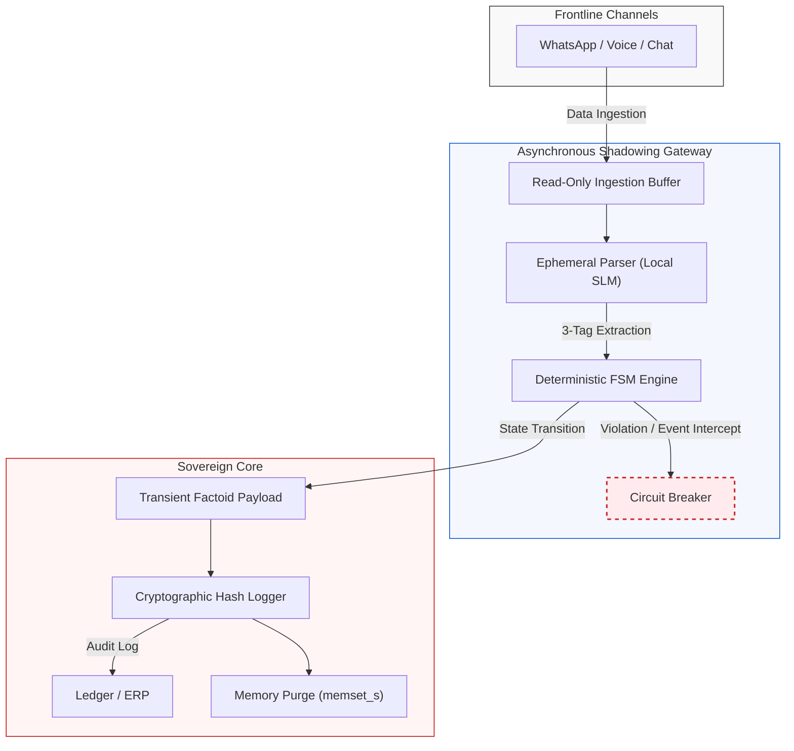

# Vertical Reference Architecture: Human-Centric Field Operations Gateway

> **SIA Pillar 2 Reference Implementation**: Non-Intrusive Event Shadowing & Anti-Surveillance Gatekeeping for Cross-Enterprise Operations.
> 
> **Core Repositories & Execution Anchors**:
> * 📄 **Declarative State Machine Policy**: [fsm_policy.json](https://github.com/26200602/SIA-Agentic-AI-Architecture/blob/main/fsm_policy.json)
> * ⚡ **Deterministic Circuit Breaker Executable**: [sim_poc.py](https://github.com/26200602/SIA-Agentic-AI-Architecture/blob/main/sim_poc.py)
> * 📐 **Core Architecture Blueprint**: [README.md](https://github.com/26200602/SIA-Agentic-AI-Architecture/blob/main/README.md)
---

## Executive Summary

Current enterprise AI deployments in field operations (e.g., Construction EPC, Industrial Maintenance, Supply Chain Logistics) suffer from a fundamental architectural fallacy: **The Illusion of Ambient Surveillance**. Legacy vendors attempt to impose full-screen keylogging, 24/7 video monitoring, or rigid, intrusive mobile apps onto field teams and external contractors. 

This approach fails at the operational edge. Frontline engineers, site managers, and third-party vendors operate in high-friction environments where speed is critical. Mandatory form-filling leads to operational paralysis, while continuous surveillance triggers aggressive passive resistance and breeds dangerous Shadow IT (e.g., unmonitored consumer messaging apps).

The **SIA Shadow Diagnostic Engine** provides an alternative, non-intrusive paradigm. It acts as an asynchronous, read-only event gateway that shadows existing messaging channels (WhatsApp, WeChat, Signal) without altering legacy workflows, requiring app installations, or conducting ambient surveillance. By deploying a **Deterministic Finite State Machine (FSM)** alongside localized **Small Language Models (SLMs)**, the engine captures unstructured site dialogue on-demand, extracts auditable decision factoids, and enforces governance across enterprise boundaries—leaving zero permanent raw text footprints.

---

## Architectural Topology



---

---

## Strategic Mechanics & Operational Pillars

### 1. Anti-Surveillance & Event-Driven Activation
Unlike consumer-grade AI agents that demand full-desktop keylogging or persistent video streams, the Shadow Diagnostic Engine is strictly **Event-Driven and On-Demand**.
* **Zero Ambient Surveillance:** The engine does not record ambient audio, track idle screen time, or inspect private personal traffic.
* **Bounded Interception:** Processing is triggered only when specific operational risk vectors or system keywords (e.g., `Material Substitution`, `Structural Modification`, `Safety Boundary`) are detected in the communication buffer.
* **Privacy Boundary:** Irrelevant dialogue is instantly discarded at the memory buffer stage prior to semantic evaluation.

### 2. Cross-Enterprise Boundary Isolation (Internal vs. External)
Field operations inherently span multiple legal entities: Asset Owners, EPC Contractors, and Sub-Contractors. 
* **Zero Client Footprint:** External vendors interact via their native communication tools. No corporate MDM (Mobile Device Management) or proprietary app installation is forced onto third-party devices.
* **Logical Segregation via 3-Tag Logic:** Incoming unstructured site data is parsed into three isolated tags:
  1. `[Entity_ID]` (Pseudonymized Vendor/Site Identifier)
  2. `[Metric_Factoid]` (e.g., Rebar Gauge changed from 300mm to 400mm)
  3. `[State_Context]` (Current Project Stage)
* Identity is strictly decoupled from operational payload before any cross-boundary analysis occurs.

### 3. Non-Intrusive Legacy Shadowing
The engine operates strictly as a **Read-Only Shadow Layer** on top of existing communication systems and legacy ERPs.
* **Zero Schema Mutation:** Production databases and legacy project management systems remain untouched.
* **Asynchronous Triplet Formation:** Unstructured voice notes and chat images are converted into subject-predicate-object triplets in memory without locking production tables.

### 4. Deterministic FSM Gatekeeping & Memory Zeroization
To eliminate model hallucination in safety-critical operations, execution logic is enforced by a hard deterministic state machine.
* **Circuit Breaker Intercept:** If a field decision violates predefined structural safety parameters or regulatory thresholds, the FSM instantly trips a circuit breaker, halts automated propagation, and flags an explicit exception.
* **Zero-Trace Ephemeral Processing:** Upon transaction finalization, raw chat payloads and intermediate SLM reasoning states are purged from RAM using `memset_s` equivalents. Only a **SHA-256 Immutable State Hash** is retained for audit logging.

---

## Repository Structure & Verification Anchors

```text
shadow-diagnostic-engine/
├── README.md                           # Architecture Specification (This File)
├── fsm_policy.json                     # Declarative State Boundary & Circuit Breaker Rules
└── sim_poc.py                          # Deterministic FSM Interceptor Executable
```

### Declarative Policy Logic (fsm_policy.json)
```json
{
  "DOMAIN": "FIELD_OPERATIONS_CONSTRUCTION",
  "STATES": ["SITE_INSPECTION", "CHANGE_REQUEST", "COMPLIANCE_VERIFIED", "REJECTED_HALT"],
  "ALLOWED_TRANSITIONS": {
    "SITE_INSPECTION": ["CHANGE_REQUEST"],
    "CHANGE_REQUEST": ["COMPLIANCE_VERIFIED", "REJECTED_HALT"]
  },
  "MANDATORY_FACTOIDS": ["SPEC_METRIC", "SAFETY_IMPACT", "AUTHORIZATION_LEVEL"],
  "CIRCUIT_BREAKER_RULES": {
    "UNAUTHORIZED_SPEC_CHANGE": {
      "TRIGGER": "SAFETY_IMPACT == 'HIGH' AND AUTHORIZATION_LEVEL < 3",
      "ACTION": "TRIP_CIRCUIT_BREAKER",
      "EXIT_CODE": "SECURITY_VIOLATION_0x88"
    }
  }
}
```
## Verification & Deployment Strategy

### Local Edge Execution
The lightweight SLM parsing layer runs on localized edge hardware (e.g., T4 GPU or local NPU) to minimize latency (<20ms) and prevent raw data egress to external public clouds.

### Audit Verification
Execute the verification script to test how the FSM interceptor halts out-of-boundary site modification requests in real time:
`python sim_poc.py`

### NLNet Open Standard Alignment
Designed in compliance with NGI (Next Generation Internet) European Digital Sovereignty standards, ensuring non-authorial AI governance, full auditability, and absolute user privacy preservation.
