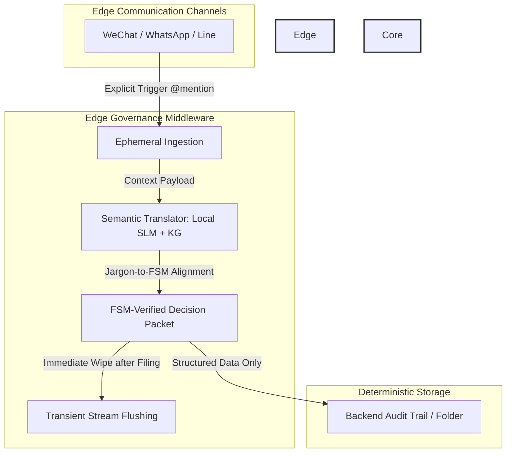

# Shadow Diagnostic Engine

## Executive Brief

In enterprise digital transformation, a persistent chasm exists between official governance models and operational realities. Traditional Enterprise Resource Planning (ERP) systems and Standard Operating Procedures (SOPs) represent the **"Dream Path"**—an idealized, top-down workflow that rarely reflects how mission-critical operations actually unfold. 

In practice, over 90% of critical decision-making, exception handling, and cross-functional orchestration occur within unstructured, decentralized edge communication channels (e.g., WeChat, WhatsApp, Line). Forcing rigid, traditional SOPs onto these frontline workflows breeds operational defiance and leaves executive leadership in a perpetual data blind spot.

The **Shadow Diagnostic Engine** bridges this chasm. Rather than disrupting frontline communication habits or imposing heavy compliance burdens, this engine leverages edge-native architectures to convert chaotic instant messaging into structured, verifiable telemetry—without compromising data sovereignty or employee trust.

## System Architecture

The following diagram illustrates the end-to-end telemetry pipeline, detailing how unstructured edge communications are securely processed and transformed into deterministic operational records.

## Core Diagnostic Mechanisms & Data Sovereignty

To bridge the gap between human-centric operational reality and strict enterprise governance, the engine relies on three core pillars:

1. **Explicit Trigger & Ephemeral Ingestion**: 
   The system remains entirely passive until explicitly invoked via an `@mention` (e.g., `@AIPM`). Upon invocation, it performs a transient capture of the specific conversational context without continuous background surveillance, ensuring total employee trust.

2. **Semantic Translator (Local SLM + Knowledge Graph)**: 
   Frontline teams communicate using natural, unstructured operational jargons. A localized Small Language Model (SLM) integrated with an Enterprise Knowledge Graph automatically translates and maps these variations into standardized **Finite State Machine (FSM) State IDs** without forcing workflow changes.

3. **Deterministic Filing & Transient Flushing**: 
   Once the FSM-verified Decision Packet is securely routed to the core backend or designated audit folder, raw conversational logs are instantly flushed from the memory stream. This guarantees **Zero Data Leakage** while maintaining 100% traceability.

### Data Sovereignty & Compliance Matrix

| Dimension | Traditional Approach | Shadow Diagnostic Engine |
| :--- | :--- | :--- |
| **Frontline Experience** | Rigid SOPs / Heavy Compliance | Natural IM workflows (WeChat, WhatsApp, Line) |
| **Data Retention** | Massive unstructured chat logs | Transient ingestion + FSM-verified packets |
| **Traceability** | Low / Fragmented audit trail | High / Deterministic FSM State tracking |
| **Risk Profile** | High Data Leakage & Surveillance | Zero-Knowledge architecture / High compliance |

---

This document was structured with the help of AI, and curated by Sana.M
