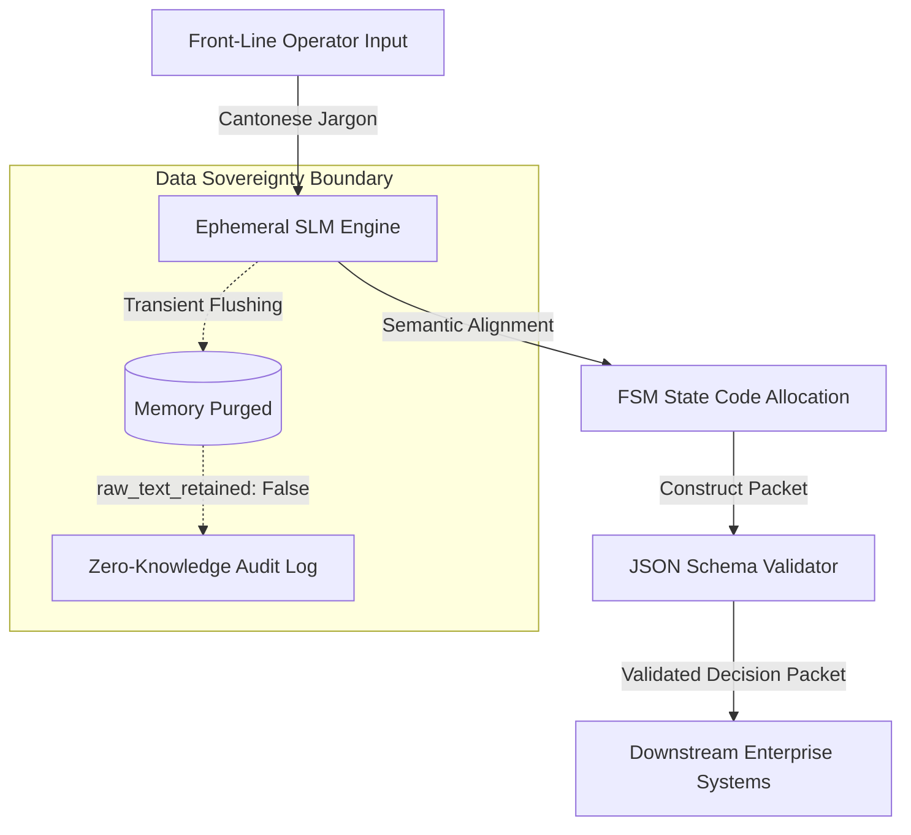
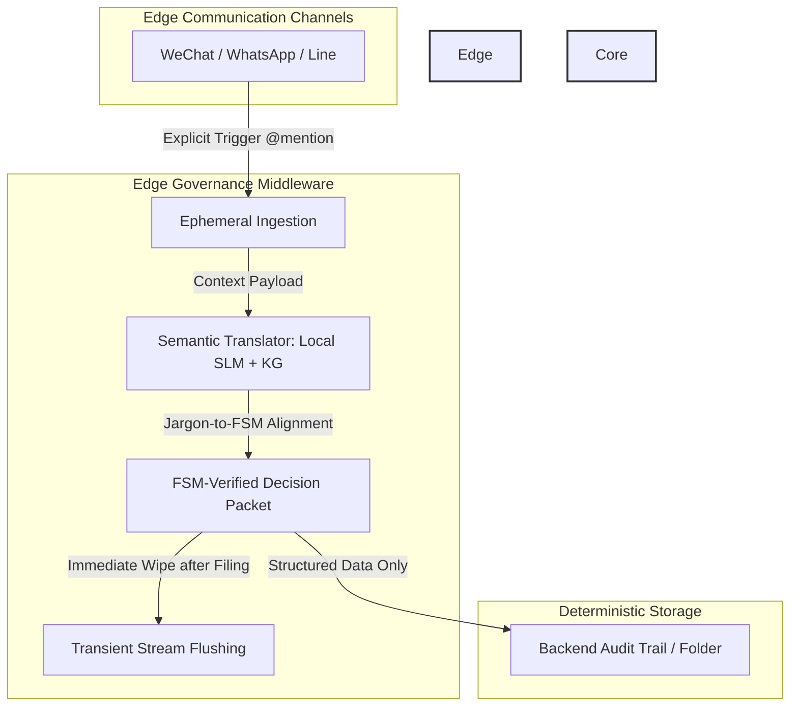

# Use Case: Shadow Diagnostic Engine

## Executive Summary

The **Shadow Diagnostic Engine** addresses a critical challenge in enterprise AI adoption: capturing non-standard, front-line operational knowledge ("shadow workflows") without compromising enterprise data governance or introducing model non-determinism.

### Problem Statement
Front-line personnel frequently rely on informal domain heuristics expressed in local vernacular (e.g., operational Cantonese jargon). Traditional AI deployments either fail to map these unscripted inputs accurately or risk compliance breaches when raw conversational inputs pass unvetted into core systems.

### Architectural Solution
Under the **SIA Framework**, the Shadow Diagnostic Engine enforces a decoupled, zero-trust boundary architecture:
* **Ephemeral SLM Mapping:** Translates unstructured front-line jargon into deterministic Finite State Machine (FSM) state codes.
* **Zero-Knowledge Data Sovereignty:** Executes immediate transient memory flushing (`raw_text_retained = False`) post-translation.
* **Strict Schema Governance:** Enforces Draft-07 JSON Schema validation before any decision packet is transmitted downstream.

## System Architecture & Data Flow

# Key Architectural Controls

## Deterministic Boundary
Ensures state transitions rely strictly on validated FSM state codes (`FSM_ERR_OVERRIDE_001`). This prevents model hallucination in downstream workflows.

## Transient Memory Flushing
Implements zero-knowledge retention by instantly purging unscripted raw text buffers upon state assignment.

## Executable Specification & PoC Assets

To validate the deterministic boundary and zero-knowledge data sovereignty model, an executable proof-of-concept is provided in the [`poc/`](./poc/) directory.

* **Interactive Sandbox:** Run the [`sia_fsm_boundary_sandbox.ipynb`](./poc/sia_fsm_boundary_sandbox.ipynb) notebook in Google Colab to test Cantonese jargon mapping, JSON schema enforcement, and transient flushing.
* **Data Contract:** Inspect [`decision-packet.schema.json`](./poc/decision-packet.schema.json) for the Draft-07 structural specification.
* **Telemetry Event Mock:** View [`mock-telemetry-event.json`](./poc/mock-telemetry-event.json) for a sample validated output.

---

***This document was structured with the help of AI, and curated by Sana.M***

## Core Diagnostic Mechanisms & Data Sovereignty

To bridge the gap between human-centric operational reality and strict enterprise governance, the engine relies on three core pillars:

1. **Explicit Trigger & Ephemeral Ingestion**: 
   The system remains entirely passive until explicitly invoked via an `@mention` (e.g., `@AIPM`). Upon invocation, it performs a transient capture of the specific conversational context without continuous background surveillance, ensuring total employee trust.

2. **Semantic Translator (Local SLM + Knowledge Graph)**: 
   Frontline teams communicate using natural, unstructured operational jargons. A localized Small Language Model (SLM) integrated with an Enterprise Knowledge Graph automatically translates and maps these variations into standardized **Finite State Machine (FSM) State IDs** without forcing workflow changes.

3. **Deterministic Filing & Transient Flushing**: 
   Once the FSM-verified Decision Packet is securely routed to the core backend or designated audit folder, raw conversational logs are instantly flushed from the memory stream. This guarantees **Zero Data Leakage** while maintaining 100% traceability.

### Data Sovereignty & Compliance Matrix

| Dimension | Traditional Approach | Shadow Diagnostic Engine |
| :--- | :--- | :--- |
| **Frontline Experience** | Rigid SOPs / Heavy Compliance | Natural IM workflows (WeChat, WhatsApp, Line) |
| **Data Retention** | Massive unstructured chat logs | Transient ingestion + FSM-verified packets |
| **Traceability** | Low / Fragmented audit trail | High / Deterministic FSM State tracking |
| **Risk Profile** | High Data Leakage & Surveillance | Zero-Knowledge architecture / High compliance |

---

This document was structured with the help of AI, and curated by Sana.M
