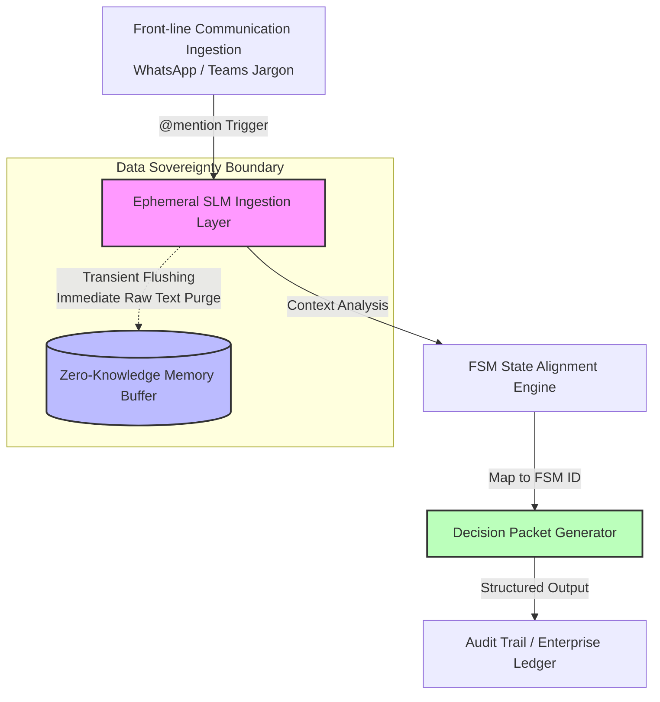

# PoC: FSM-Verified Shadow Diagnostic Engine

[](https://colab.research.google.com/github/26200602/my-colab-poc/blob/main/sia_fsm_boundary_sandbox.ipynb)

## Executive Summary

This Proof of Concept (PoC) serves as an **Executable Specification** for the **Shadow Diagnostic Engine** within the Sovereign Industrial Agentic (SIA) framework. It validates how unstructured operational jargon (e.g., informal chat messages from site supervisors or front-line staff) can be dynamically captured, interpreted by a Small Language Model (SLM), and mapped onto a deterministic Finite State Machine (FSM).

By utilizing **Transient Flushing** and **Zero-Knowledge Data Sovereignty**, this engine extracts structural operational telemetry and context latency without retaining sensitive raw text or introducing persistent privacy risks.

---


## Architectural Workflow

The diagram below illustrates the end-to-end data pipeline from raw message ingestion to FSM verification and immutable audit logging:



---

## Artifacts & Specifications

This PoC directory contains the core data contracts and telemetry schemas used to integrate front-line conversational streams into enterprise governance platforms:

1. **`decision-packet.schema.json`**  
   * **Purpose**: JSON Schema (Draft-07) defining the strict data contract for FSM decision packets.
   * **Key Attributes**: Enforces structured typing for `fsm_state_id`, `context_latency`, and `data_sovereignty` verification flags.

2. **`mock-telemetry-event.json`**  
   * **Purpose**: A real-world instance demonstrating the transformation of informal Cantonese site jargon (`跟口頭指示做住先`) into a validated FSM override code (`FSM_ERR_OVERRIDE_001`).

3. **`sia_fsm_boundary_sandbox.ipynb` (External Link)**  
   * **Purpose**: Interactive Google Colab Sandbox for testing FSM boundary logic and SLM translation accuracy using open-access models.

---

## Execution Guide for Technical Teams

To validate this PoC in a local or cloud environment:

1. **Sandbox Interactive Testing**:
   * Click the **Open in Colab** badge at the top of this document to launch the notebook.
   * Run the cells sequentially using free GPU/T4 runtime resources to observe real-time state extraction.

2. **Schema Verification**:
   * Use standard JSON Schema tools (e.g., `jsonschema` CLI or Python libraries) to validate downstream payloads against `decision-packet.schema.json`.

```bash
# Example validation using Python jsonschema CLI
jsonschema -i mock-telemetry-event.json decision-packet.schema.json

```

---
***This document was structured with the help of AI, and curated by Sana.M***
